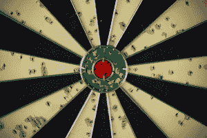
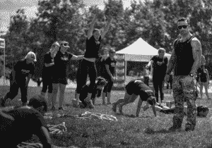

# 过度拟合的简单直觉，或者为什么测试训练数据是一个坏主意

> 原文： [https://machinelearningmastery.com/a-simple-intuition-for-overfitting/](https://machinelearningmastery.com/a-simple-intuition-for-overfitting/)

当您第一次开始机器学习时，您[加载数据集并尝试模型](http://machinelearningmastery.com/how-to-run-your-first-classifier-in-weka/ "How to Run Your First Classifier in Weka")。您可能会想到，为什么我不能仅使用所有数据构建模型并在同一数据集上对其进行评估？

这看似合理。训练模型的更多数据更好，对吧？在同一数据集上评估模型和报告结果将告诉您模型有多好，对吧？

错误。

在这篇文章中，您将发现这种推理的困难，并发展直觉，为什么在看不见的数据上测试模型很重要。

## 在同一数据集上进行训练和测试

如果你有一个数据集，比如[虹膜花数据集](http://en.wikipedia.org/wiki/Iris_flower_data_set)，那个数据集的最佳模型是什么？

鸢尾花
照片来自 [dottieg2007](http://www.flickr.com/photos/dottieg2007/5647202653/sizes/m/) ，保留一些权利

最好的模型是数据集本身。如果您获取给定的数据实例并要求其进行分类，则可以在数据集中查找该实例并每次报告正确的结果。

当您在同一数据集上训练和测试模型时，这是您要解决的问题。

您要求模型对之前“看到”的数据进行预测。用于创建模型的数据。该问题的最佳模型是上述查找模型。

## 描述性模型

在某些情况下，您确实需要训练模型并使用相同的数据集对其进行评估。

您可能希望简化数据中预测变量的解释。例如，您可能需要一组简单的规则或最能描述您收集的观察结果的决策树。

在这种情况下，您正在构建描述性模型。

这些模型非常有用，可以帮助您在项目或业务中更好地理解属性与预测值的关系。您可以使用您拥有的专业知识为结果添加含义。

描述性模型的重要限制是它仅限于描述训练它的数据。您不知道预测模型的准确程度。

## 建模目标函数

考虑一个组合分类问题，其目标是将数据实例分类为红色或绿色。

建模目标函数
照片由 [seantoyer](http://www.flickr.com/photos/seanhobson/4517383187/sizes/l/) 拍摄，保留一些权利。

对于这个问题，假设存在一个完美的模型，或者一个完美的函数，它可以正确地将任何数据实例与域区分为红色或绿色。在特定问题的背景下，完美的区分功能很可能在领域专家的问题领域具有深远的意义。我们想要考虑这一点，并尝试挖掘这一观点。我们希望提供这样的结果。

我们为这个问题制作预测模型时的目标是最好地近似这种完美的辨别功能。

我们使用从域中收集的样本数据构建完美辨别函数的近似值。它不是所有可能的数据，它是所有可能数据的样本或子集。如果我们拥有所有数据，则无需进行预测，因为只需查找答案即可。

我们用来构建我们的近似模型的数据包含其中与理想判别函数有关的结构。数据准备的目标是最好地将该结构暴露给建模算法。数据还包含与辨别功能无关的内容，例如数据选择的偏差和扰乱和隐藏结构的随机噪声。您选择用于近似函数的模型必须导航这些障碍。

该框架有助于我们理解描述性和预测性模型之间的深层差异。

## 描述性与预测性模型

描述性模型仅涉及对观察数据中的结构进行建模。在同一数据集上训练和评估它是有意义的。

预测模型正在尝试一个更加困难的问题，从数据样本中逼近真正的判别函数。我们希望使用不挑选的算法并对我们样本中的所有噪声进行建模。我们确实希望选择超出观察数据的算法。有意义的是，我们只能评估模型从数据样本推广到训练期间之前没有看到的数据的能力。

最佳描述模型对观察到的数据是准确的。最佳预测模型对未观察到的数据是准确的。

## 过度拟合

评估训练数据预测模型的缺陷在于，它没有告诉您模型对新的看不见的数据的概括程度。

选择其在训练数据集上的准确性而不是在未看到的测试数据集上的准确性的模型很可能在看不见的测试数据集上具有较低的准确性。原因是模型不是一般化的。它已经规范了训练数据集中的结构。这被称为[过度拟合](http://en.wikipedia.org/wiki/Overfitting)，它比你想象的更加阴险。

例如，一旦精度停止提高，您可能希望停止训练模型。在这种情况下，训练集的准确性将继续提高，但看不见的数据的准确性开始下降。

你可能会想到自己：“_所以我会训练训练数据集并在我去_时查看测试数据集”。一个好主意，但现在测试数据集不再是看不见的数据，因为它已经涉及并影响了训练数据集。

## 解决过度拟合问题

您必须[在看不见的数据](http://machinelearningmastery.com/how-to-choose-the-right-test-options-when-evaluating-machine-learning-algorithms/ "How To Choose The Right Test Options When Evaluating Machine Learning Algorithms")上测试您的模型以反击过度拟合。

解决过度拟合
照片由 [Adrian Fallace Design＆amp;摄影](http://www.flickr.com/photos/69187071@N02/12688141173/sizes/l/)，保留一些权利。

将数据分成66％/ 34％用于测试数据集的训练是一个良好的开端。使用交叉验证更好，并且使用多次交叉验证更好。您希望花时间并在看不见的数据上获得准确的模型的最佳估计。

您可以通过降低模型的复杂性来提高模型的准确性。

例如，在决策树的情况下，您可以在训练后修剪树（删除叶子）。这将减少特定训练数据集中的专业化数量，并增加对看不见的数据的概括。例如，如果您使用回归，则可以使用正则化来约束训练过程中的复杂性（系数的大小）。

## 摘要

在这篇文章中，您学习了将预测模型的发展作为未知理想辨别函数的近似的重要框架。

在此框架下，您了解到仅仅根据训练数据评估模型是不够的。您了解到，评估预测模型概括能力的最佳和最有意义的方法是在看不见的数据上进行评估。

这种直觉为评估预测模型时测试工具中使用训练/测试分裂测试，交叉验证和理想的多重交叉验证提供了基础。