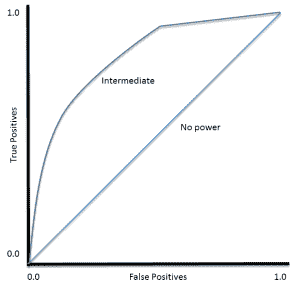

# 用ROC曲线评估和比较分类器表现

> 原文： [https://machinelearningmastery.com/assessing-comparing-classifier-performance-roc-curves-2/](https://machinelearningmastery.com/assessing-comparing-classifier-performance-roc-curves-2/)

最常报告的分类器表现测量是准确度：获得的正确分类的百分比。

该度量具有易于理解的优点，并且使不同分类器的表现比较微不足道，但它忽略了在诚实地评估分类器的表现时应该考虑的许多因素。

## 什么是分类器表现？

分类器表现不仅仅是正确分类的数量。

为了兴趣，考虑筛查相对罕见的病症如宫颈癌的问题，其患病率约为10％（[实际统计](http://www.cancerresearchuk.org/cancer-info/cancerstats/types/cervix/incidence/uk-cervical-cancer-incidence-statistics)）。如果一个懒惰的巴氏涂片筛选器将每个幻灯片归类为“正常”，那么它们的准确度将达到90％。非常令人印象深刻！但是，这个数字完全忽略了这样一个事实，即10％确实患有这种疾病的女性根本没有被诊断出来。

### 一些表现指标

在之前的博客文章中，我们讨论了可用于评估分类器的一些其他表现指标。回顾：

大多数分类器产生分数，然后对其进行阈值处理以确定分类。如果分类器产生的分数在0.0（绝对为负）和1.0（绝对为正）之间，则通常将0.5以上的任何分数视为正数。

但是，应用于数据集的任何阈值（其中PP是阳性群体，NP是阴性群体）将产生真阳性（TP），假阳性（FP），真阴性（TN）和假阴性（FN） （图1）。我们需要一种考虑所有这些数字的方法。

图1.重叠数据集将始终生成误报和否定以及真正的正数和负数

获得所有这些度量的数字后，就可以计算出一些有用的指标。

*   **准确度** =（1 - 误差）=（TP + TN）/（PP + NP）= Pr（C），正确分类的概率。
*   **灵敏度** = TP /（TP + FN）= TP / PP =测试在患病个体群体中检测疾病的能力。
*   **特异性** = TN /（TN + FP）= TN / NP =测试在无病人群中正确排除疾病的能力。

让我们为一些合理的现实世界数字计算这些指标。如果我们有100,000名患者，其中200名（20％）实际上患有癌症，我们可能会看到以下测试结果（表1）：

表1.巴氏涂片筛查的“合理”值的诊断测试表现的图示

对于这些数据：

*   **灵敏度** = TP /（TP + FN）= 160 /（160 + 40）= 80.0％
    **特异性** = TN /（TN + FP）= 69,860 /（69,860 + 29,940）= 70.0％

换句话说，我们的测试将正确识别80％患有该疾病的人，但30％的健康人将错误地测试阳性。通过仅考虑测试的灵敏度（或准确度），可能丢失重要信息。

通过考虑我们错误的结果以及正确的结果，我们可以更深入地了解分类器的表现。

克服必须选择截止的问题的一种方法是以0.0的阈值开始，以便每种情况都被认为是正的。我们正确地对所有阳性病例进行分类，并错误地将所有阴性病例分类。然后，我们将阈值移动到介于0.0和1.0之间的每个值，逐渐减少误报的数量并增加真阳性的数量。

然后可以针对所使用的每个阈值针对FP（1-特异性）绘制TP（灵敏度）。结果图称为接收器工作特性（ROC）曲线（图2）。 ROC曲线被开发用于20世纪50年代雷达回波中的信号检测，并且已经应用​​于广泛的问题。

图2\. ROC曲线的示例

对于完美的分类器，ROC曲线将沿Y轴向上，然后沿X轴向上。没有力量的分类器将位于对角线上，而大多数分类器位于两者之间。

> ROC分析提供了用于选择可能的最优模型并且独立于（并且在指定之前）成本上下文或类分布的情况下丢弃次优模型的工具

- [维基百科有关接收器操作特性的文章](http://en.wikipedia.org/wiki/Receiver_operating_characteristic)

## 使用ROC曲线

### 阈值选择

很明显，ROC曲线可用于选择最大化真阳性的分类器的阈值，同时最小化误报。

然而，不同类型的问题具有不同的最佳分类器阈值。例如，对于癌症筛查测试，我们可能准备忍受相对较高的假阳性率以获得高真阳性，最重要的是识别可能的癌症患者。

然而，对于治疗后的随访测试，可能更需要不同的阈值，因为我们希望最大限度地减少假阴性，我们不想告诉患者他们是否清楚，如果事实并非如此。

### 绩效评估

ROC曲线还使我们能够评估分类器在整个操作范围内的表现。最广泛使用的衡量指标是曲线下面积（AUC）。从图2中可以看出，没有功率，基本上是随机猜测的分类器的AUC是0.5，因为曲线跟随对角线。神秘存在的AUC，完美的分类器，是1.0。大多数分类器的AUC介于这两个值之间。

AUC小于0.5可能表明发生了一些有趣的事情。非常低的AUC可能表明问题已被错误地设置，分类器在数据中找到一个基本上与预期相反的关系。在这种情况下，检查整个ROC曲线可能会给出一些线索：正面和负面是否有错误的标签？

### 分类器比较

AUC可用于比较两个或更多分类器的表现。可以选择单个阈值并且比较该分类器在该点的表现，或者可以通过考虑AUC来比较整体表现。

大多数已发表的报告以绝对值比较AUC：“_分类器1的AUC为0.85，分类器2的AUC为0.79，因此分类器1显然更好_”。然而，可以计算AUC的差异是否具有统计学意义。有关详细信息，请参阅Hanley＆amp; McNeil（1982）的论文如下。

## ROC曲线分析教程

*   [使用SigmaPlot软件生成ROC曲线的教程](http://www.sigmaplot.com/products/sigmaplot/ROC_Curves_Analysis.pdf)（PDF）
*   [TheRMUoHP生物统计资源频道](https://www.youtube.com/watch?v=_2zN2a3MgmU)的SPSS YouTube教程
*   [pROC包的文档](http://cran.r-project.org/web/packages/pROC/pROC.pdf)（PDF）

&lt;iframe allowfullscreen="" frameborder="0" height="281" src="https://www.youtube.com/embed/_2zN2a3MgmU?feature=oembed" width="500"&gt;&lt;/iframe&gt;

## 何时使用ROC曲线分析

在这篇文章中，我使用了一个生物医学的例子，ROC曲线被广泛用于生物医学科学。然而，该技术适用于为每种情况产生分数的任何分类器，而不是二元决策。

神经网络和许多统计算法是适当分类器的示例，而诸如决策树之类的方法则不太适合。只有两种可能结果的算法（例如此处使用的癌症/无癌症例子）最适合这种方法。

可以将任何种类的数据输入适当的分类器中进行ROC曲线分析。

## 进一步阅读

*   关于使用ROC曲线的经典论文，陈旧但仍然非常相关：Hanley，J。A.和B. J. McNeil（1982）。 “[接收器工作特性（ROC）曲线下面积的含义和用途](http://www.med.mcgill.ca/epidemiology/Hanley/software/Hanley_McNeil_Radiology_82.pdf)。”放射学143（1）：29-36。
*   还有一篇很好的，最新的评论文章，主要关注医学诊断：Hajian-Tilaki K.“[接收器操作特性（ROC）曲线分析，用于医疗诊断测试评估](http://www.ncbi.nlm.nih.gov/pmc/articles/PMC3755824/)”。 Caspian Journal of Internal Medicine 2013; 4（2）：627-635。
*   仅仅是为了证明在金融应用中使用ROC曲线：Petro Lisowsky（2010）“[寻求庇护：使用财务报表信息](http://www.researchgate.net/publication/228281204_Seeking_Shelter_Empirically_Modeling_Tax_Shelters_Using_Financial_Statement_Information/file/60b7d51ffaecc015a2.pdf)”对税收避难所进行实证建模。会计评论：2010年9月，卷。 85，第5期，第1693-1720页。