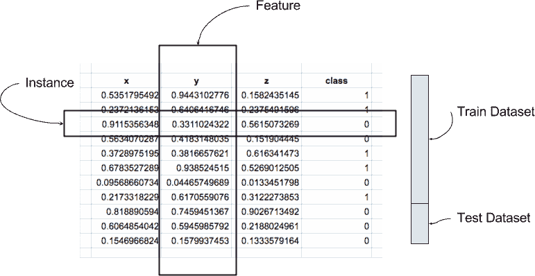

# 数据，学习和建模

> 原文： [https://machinelearningmastery.com/data-learning-and-modeling/](https://machinelearningmastery.com/data-learning-and-modeling/)

机器学习中的关键概念为理解该领域奠定了基础。

在这篇文章中，您将学习在描述数据和数据集时使用的命名法（标准术语）。

您还将学习用于描述数据学习和建模的概念和术语，这些概念和术语将为您在机器学习领域的旅程提供有价值的直觉。

## 数据

机器学习方法从实例中学习。掌握输入数据和描述数据时使用的各种术语非常重要。在本节中，您将学习在引用数据时机器学习中使用的术语。

当我想到数据时，我会想到行和列，比如数据库表或Excel电子表格。这是一种传统的数据结构，是机器学习领域的常见结构。目前不考虑其他数据，如图像，视频和文本，即所谓的非结构化数据。

显示实例，功能和训练测试数据集的数据表

**实例**：单行数据称为实例。这是来自领域的观察。

**功能**：单列数据称为功能。它是观察的一个组成部分，也称为数据实例的属性。一些特征可以是模型的输入（预测变量），而其他特征可以是输出或要预测的特征。

**数据类型**：功能具有数据类型。它们可以是实数或整数值，也可以具有分类或序数值。您可以使用字符串，日期，时间和更复杂的类型，但在使用传统的机器学习方法时，通常会将它们简化为实际值或分类值。

**数据集**：实例集合是一个数据集，在使用机器学习方法时，我们通常需要一些数据集用于不同的目的。

**Training Dataset** ：我们提供给我们的机器学习算法的数据集，用于训练我们的模型。

**测试数据集**：我们用于验证模型准确性但不用于训练模型的数据集。它可以称为验证数据集。

我们可能必须收集实例来形成我们的数据集，或者我们可能会得到一个必须拆分为子数据集的有限数据集。

## 学习

机器学习确实是关于算法的自动学习。

在本节中，我们将考虑一些关于学习的高级概念。

**归纳**：机器学习算法通过一个称为归纳或归纳学习的过程来学习。归纳是一种推理过程，它根据特定信息（训练数据）进行概括（模型）。

**泛化**：需要泛化，因为机器学习算法准备的模型需要根据训练期间未见的特定数据实例进行预测或决策。

**过度学习**：当模型过于仔细地学习训练数据而不进行概括时，这称为过度学习。结果是除了训练数据集之外的数据表现不佳。这也称为过度拟合。

**学习不足**：当模型没有从数据库中学到足够的结构，因为学习过程提前终止，这称为学习不足。结果是良好的泛化，但所有数据（包括训练数据集）的表现都很差。这也称为欠配合。

**在线学习**：在线学习是指在域可用时使用域中的数据实例更新方法。在线学习需要对噪声数据具有鲁棒性的方法，但可以生成与域的当前状态更加一致的模型。

**离线学习**：离线学习是指在预先准备好的数据上创建方法，然后在未观察到的数据上进行操作。由于训练数据的范围是已知的，因此可以控制并且可以仔细调整训练过程。准备好后，模型不会更新，如果域名发生变化，表现可能会下降。

**监督学习**：这是一个学习过程，用于概括需要预测的问题。 “教学过程”将模型的预测与已知答案进行比较，并在模型中进行校正。

**无监督学习**：这是一个学习过程，用于推广数据中不需要预测的结构。识别和利用自然结构以将实例相互关联。

在[机器学习算法](http://machinelearningmastery.com/a-tour-of-machine-learning-algorithms/ "A Tour of Machine Learning Algorithms")上发表之前，我们已经介绍了有监督和无监督学习。这些术语可用于按行为对算法进行分类。

## 造型

由机器学习过程创建的人工制品本身可以被视为一个程序。

**模型选择**：我们可以将模型配置和训练过程视为模型选择过程。每次迭代我们都有一个新模型，我们可以选择使用或修改。甚至机器学习算法的选择也是该模型选择过程的一部分。在针对问题存在的所有可能模型中，所选训练数据集上的给定算法和算法配置将提供最终选择的模型。

**感应偏差**：偏差是对所选模型施加的限制。所有模型都有偏差，这会在模型中引入误差，并且根据定义，所有模型都有误差（它们是观察的概括）。通过模型中的一般化引入偏差，包括模型的配置和生成模型的算法的选择。机器学习方法可以创建具有低偏差或高偏差的模型，并且可以使用策略来减少高偏差模型的偏差。

**模型方差**：方差是模型对训练数据的敏感程度。在数据集上创建模型时，机器学习方法可以具有高或低的方差。减少模型方差的策略是在具有不同初始条件的数据集上多次运行，并将平均精度作为模型表现。

**偏差 - 方差权衡**：模型选择可以被认为是偏差和方差的权衡。低偏差模型将具有高差异并且需要长时间或多次训练以获得可用模型。高偏差模型将具有较低的方差并且将快速训练，但是遭受差的且有限的表现。

## 资源

如果您想深入挖掘，下面是一些资源。

*   Tom Mitchell，[学习概括中存在偏见的需要](http://scholar.google.com/scholar?q=The+need+for+biases+in+learning+generalizations )，1980
*   [了解偏差 - 方差权衡](http://scott.fortmann-roe.com/docs/BiasVariance.html)

这篇文章提供了一个有用的术语表，您可以随时参考这些术语以获得清晰的定义。

是否缺少条款？您是否对所列条款之一有更清晰的描述？发表评论，让我们都知道。