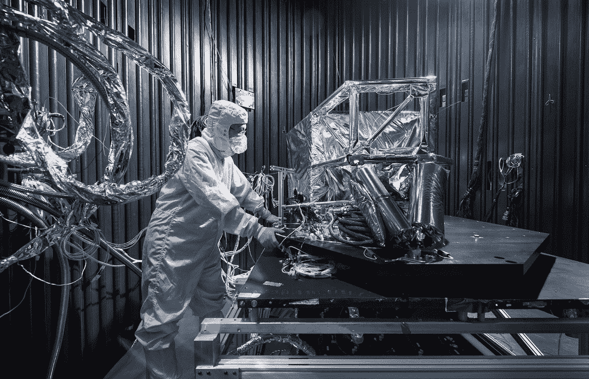

# 如何评估机器学习算法

> 原文： [https://machinelearningmastery.com/how-to-evaluate-machine-learning-algorithms/](https://machinelearningmastery.com/how-to-evaluate-machine-learning-algorithms/)

一旦[定义了您的问题](http://machinelearningmastery.com/how-to-define-your-machine-learning-problem/ "How to Define Your Machine Learning Problem")和[准备好您的数据](http://machinelearningmastery.com/how-to-prepare-data-for-machine-learning/ "How to Prepare Data For Machine Learning")，您需要将机器学习算法应用于数据以解决您的问题。

您可以花费大量时间选择，运行和调整算法。您希望确保有效利用时间来更接近目标。

在这篇文章中，您将逐步完成一个过程，快速测试算法并发现问题中是否存在用于学习算法以及哪些算法有效的结构。

测试线束
照片归属于 [NASA Webb望远镜](http://www.flickr.com/photos/nasawebbtelescope/8721550190/sizes/l/)，部分版权所有

## 测试线束

您需要定义测试工具。测试工具是您将训练和测试算法的数据，以及您将用于评估其表现的表现测量。重要的是要很好地定义测试工具，以便您可以专注于评估不同的算法并深入思考问题。

测试工具的目标是能够快速一致地测试算法，以反映正在解决的问题的公平表示。针对线束测试多种算法的结果将是对各种算法如何针对所选表现度量对问题执行的估计。您将知道哪些算法可能值得调整问题，哪些算法不应该进一步考虑。

结果还将告诉您问题的可学习性。如果各种不同的学习算法大学在这个问题上表现不佳，那么可能表明缺乏可用于学习算法的结构。这可能是因为在所选数据中实际上缺乏可学习的结构，或者它可能是尝试不同变换以将结构暴露给学习算法的机会。

### 表现指标

表现度量是您希望评估问题解决方案的方式。它是您对测试数据集上受过训练的模型所做的预测所做的测量。

表现度量通常专用于您正在使用的问题类，例如分类，回归和聚类。许多标准表现指标将为您提供对您的问题域有意义的分数。例如，分类的分类准确性（总校正校正除以总预测数乘以100将其变为百分比）。

您可能还需要更详细的表现细分，例如，您可能想知道垃圾邮件分类问题的误报，因为好的电子邮件将被标记为垃圾邮件并且无法读取。

有许多标准的表现指标可供选择。您很少需要自己设计一个新的表现指标，因为您通常可以找到或调整一个能够最好地捕获所解决问题要求的指标。查看您发现的类似问题以及用于查看是否可以采用的表现指标。

### 测试和训练数据集

从转换后的数据中，您需要选择一个测试集和一个训练集。将在训练数据集上训练算法，并将针对测试集进行评估。这可能就像选择随机数据分割一样简单（66％用于训练，34％用于测试）或者可能涉及更复杂的采样方法。

训练期间训练的模型不会暴露于测试数据集，并且对该数据集进行的任何预测都被设计为通常指示模型的表现。因此，您需要确保选择数据集代表您正在解决的问题。

### 交叉验证

比使用测试和训练数据集更复杂的方法是使用整个变换数据集来训练和测试给定算法。您可以在测试工具中使用的方法执行此操作称为交叉验证。

它首先涉及将数据集分成多个大小相等的实例组（称为折叠）。然后对所有折叠进行训练，除了遗漏之外的所有折叠，并且在遗漏折叠处测试所准备的模型。重复该过程，以便每个折叠都有机会被遗漏并充当测试数据集。最后，在所有折叠中对表现度量进行平均，以估计算法对问题的能力。

例如，3次交叉验证将涉及3次训练和测试模型：

*   ＃1：在折叠1 + 2上训练，在折叠3上进行测试
*   ＃2：在折叠1 + 3上训练，在折叠2上进行测试
*   ＃3：训练2 + 3折叠，在折叠1上测试

折叠数量可能因数据集的大小而异，但常见数字为3,5,7和10倍。目标是在训练和测试集中的数据大小和表示之间取得良好的平衡。

当您刚入门时，坚持使用简单的训练和测试数据（例如66％/ 34％）并在您更有信心后进行交叉验证。

## 测试算法

当您遇到问题并定义了测试工具时，您很满意，现在是时候检查各种机器学习算法了。抽样检查很有用，因为它可以让您快速查看数据中是否有任何可学习的结构，并估计哪些算法可能对问题有效。

抽样检查还可以帮助您解决测试工具中的任何问题，并确保所选的表现测量是合适的。

最好的第一种抽样检查算法是随机的。插入随机数生成器以生成适当范围内的预测。这应该是您实现的最差的“算法结果”，并且将成为评估所有改进的措施。

选择适合您的问题的5-10种标准算法，并通过测试工具运行它们。通过标准算法，我的意思是流行的方法没有特殊配置。适合您的问题意味着如果您有回归问题，算法可以处理回归。

从我们已经审查过的算法的[分组中选择方法。我喜欢包含多种混合，并且有多种算法类型的10-20种不同的算法。根据我使用的库，我可能会检查50多种流行的方法来快速清除有前景的方法。](http://machinelearningmastery.com/a-tour-of-machine-learning-algorithms/ "A Tour of Machine Learning Algorithms")

如果要运行许多方法，可能必须重新访问数据准备并减小所选数据集的大小。这可能会降低您对结果的信心，因此请使用各种数据集大小进行测试。您可能希望使用较小尺寸的数据集进行算法点检查，并使用更完整的数据集进行算法调整。

## 摘要

在这篇文章中，您了解了设置值得信赖的测试工具的重要性，该测试工具涉及选择测试和训练数据集以及对您的问题有意义的表现测量。

您还了解了使用测试工具对您的问题进行各种机器学习算法的现场检查策略。您发现此策略可以快速突出显示数据集中是否存在可学习的结构（如果不是，您可以重新访问数据准备）以及哪些算法在问题上表现良好（可能是进一步调查和调整的候选者）。

## 资源

如果您希望深入了解此主题，可以从以下资源中了解更多信息。

*   [数据挖掘：实用机器学习工具和技术](http://www.amazon.com/dp/0123748569?tag=inspiredalgor-20)（会员链接），第5章：可信度：评估所学知识
*   [机器学习：神经和统计分类](http://www.amazon.com/dp/8188689734?tag=inspiredalgor-20)（会员链接），第7章：比较方法