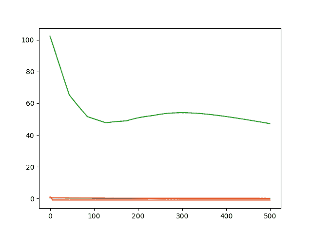
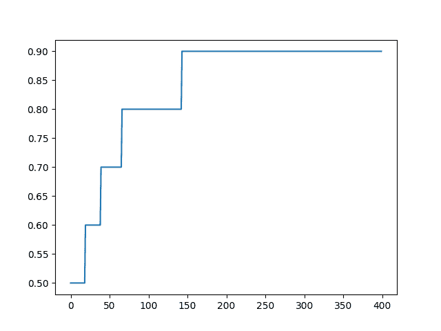
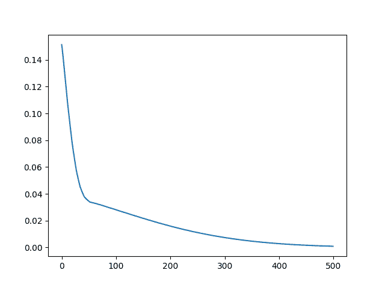

# 如何在 Python 中使用 Keras 进行深度学习的度量

> 原文： [https://machinelearningmastery.com/custom-metrics-deep-learning-keras-python/](https://machinelearningmastery.com/custom-metrics-deep-learning-keras-python/)

Keras 库提供了一种在训练深度学习模型时计算和报告一套标准指标的方法。

除了为分类和回归问题提供标准指标外，Keras 还允许您在训练深度学习模型时定义和报告您自己的自定义指标。如果您想要跟踪在训练期间更好地捕获模型技能的表现度量，这将特别有用。

在本教程中，您将了解如何使用内置指标以及如何在 Keras 中训练深度学习模型时定义和使用您自己的指标。

完成本教程后，您将了解：

*   Keras 指标的工作原理以及在训练模型时如何使用它们。
*   如何使用 Keras 中的回归和分类指标与工作示例。
*   如何使用工作示例在 Keras 中定义和使用您自己的自定义指标。

让我们开始吧。


度量标准以及如何在 Python 中使用 Keras 进行深度学习的自定义度量标准
[Indi Samarajiva](https://www.flickr.com/photos/indi/6901400708/) 的照片，保留一些权利。

## 教程概述

本教程分为 4 个部分;他们是：

1.  Keras Metrics
2.  Keras 回归指标
3.  Keras 分类指标
4.  Keras 的自定义指标

## Keras Metrics

Keras 允许您列出在模型训练期间要监控的指标。

您可以通过指定“ _metrics_ ”参数并为模型上的 _compile（）_ 函数提供函数名称列表（或函数名称别名）来完成此操作。

例如：

```py
model.compile(..., metrics=['mse'])
```

您列出的特定指标可以是 Keras 函数的名称（如 _mean_squared_error_ ）或这些函数的字符串别名（如' _mse_ '）。

度量值记录在训练数据集的每个历元的末尾。如果还提供了验证数据集，则还会为验证数据集计算记录的度量标准。

所有度量都以详细输出和从调用 _fit（）_ 函数返回的历史对象中报告。在这两种情况下，度量函数的名称都用作度量值的键。对于验证数据集的度量标准，将“ _val__ ”前缀添加到密钥。

损失函数和明确定义的 Keras 指标都可用作训练指标。

## Keras 回归指标

以下是您可以在 Keras 中用于回归问题的指标列表。

*   **均方误差**：mean_squared_error，MSE 或 mse
*   **平均绝对误差**：mean_absolute_error，MAE，mae
*   **平均绝对百分比误差**：mean_absolute_percentage_error，MAPE，mape
*   **Cosine Proximity** ：cosine_proximity，余弦

下面的示例演示了这个简单的人为回归问题的 4 个内置回归指标。

```py
from numpy import array
from keras.models import Sequential
from keras.layers import Dense
from matplotlib import pyplot
# prepare sequence
X = array([0.1, 0.2, 0.3, 0.4, 0.5, 0.6, 0.7, 0.8, 0.9, 1.0])
# create model
model = Sequential()
model.add(Dense(2, input_dim=1))
model.add(Dense(1))
model.compile(loss='mse', optimizer='adam', metrics=['mse', 'mae', 'mape', 'cosine'])
# train model
history = model.fit(X, X, epochs=500, batch_size=len(X), verbose=2)
# plot metrics
pyplot.plot(history.history['mean_squared_error'])
pyplot.plot(history.history['mean_absolute_error'])
pyplot.plot(history.history['mean_absolute_percentage_error'])
pyplot.plot(history.history['cosine_proximity'])
pyplot.show()
```

运行该示例将在每个迭代的末尾打印度量标准值。

```py
...
Epoch 96/100
0s - loss: 1.0596e-04 - mean_squared_error: 1.0596e-04 - mean_absolute_error: 0.0088 - mean_absolute_percentage_error: 3.5611 - cosine_proximity: -1.0000e+00
Epoch 97/100
0s - loss: 1.0354e-04 - mean_squared_error: 1.0354e-04 - mean_absolute_error: 0.0087 - mean_absolute_percentage_error: 3.5178 - cosine_proximity: -1.0000e+00
Epoch 98/100
0s - loss: 1.0116e-04 - mean_squared_error: 1.0116e-04 - mean_absolute_error: 0.0086 - mean_absolute_percentage_error: 3.4738 - cosine_proximity: -1.0000e+00
Epoch 99/100
0s - loss: 9.8820e-05 - mean_squared_error: 9.8820e-05 - mean_absolute_error: 0.0085 - mean_absolute_percentage_error: 3.4294 - cosine_proximity: -1.0000e+00
Epoch 100/100
0s - loss: 9.6515e-05 - mean_squared_error: 9.6515e-05 - mean_absolute_error: 0.0084 - mean_absolute_percentage_error: 3.3847 - cosine_proximity: -1.0000e+00
```

然后创建训练时期上的 4 个度量的线图。



用于回归的内置 Keras 度量的线图

注意，使用字符串别名值指定度量[' _mse_ '，' _mae_ '，' _mape_ '，' _cosine_ ' ]并使用其扩展函数名称作为历史对象上的键值引用。

我们还可以使用其扩展名称指定指标，如下所示：

```py
model.compile(loss='mse', optimizer='adam', metrics=['mean_squared_error', 'mean_absolute_error', 'mean_absolute_percentage_error', 'cosine_proximity'])
```

如果将函数名称导入脚本，我们也可以直接指定它们。

```py
from keras import metrics
model.compile(loss='mse', optimizer='adam', metrics=[metrics.mean_squared_error, metrics.mean_absolute_error, metrics.mean_absolute_percentage_error, metrics.cosine_proximity])
```

您还可以将损失函数用作指标。

例如，您可以使用均方对数误差（ _mean_squared_logarithmic_error_ ， _MSLE_ 或 _msle_ ）损失函数作为度量，如下所示：

```py
model.compile(loss='mse', optimizer='adam', metrics=['msle'])
```

## Keras 分类指标

以下是您可以在 Keras 中用于分类问题的指标列表。

*   **二进制准确度**：binary_accuracy，acc
*   **分类准确度**：categorical_accuracy，acc
*   **稀疏分类准确度**：sparse_categorical_accuracy
*   **前 k 个分类准确度**：top_k_categorical_accuracy（要求你指定一个 k 参数）
*   **稀疏顶部 k 分类精度**：sparse_top_k_categorical_accuracy（需要指定 k 参数）

准确性很特殊。

无论您的问题是二元分类还是多类分类问题，您都可以指定' _acc_ '指标来报告准确性。

下面是一个二元分类问题的示例，其中显示了内置的精度指标。

```py
from numpy import array
from keras.models import Sequential
from keras.layers import Dense
from matplotlib import pyplot
# prepare sequence
X = array([0.1, 0.2, 0.3, 0.4, 0.5, 0.6, 0.7, 0.8, 0.9, 1.0])
y = array([0, 0, 0, 0, 0, 1, 1, 1, 1, 1])
# create model
model = Sequential()
model.add(Dense(2, input_dim=1))
model.add(Dense(1, activation='sigmoid'))
model.compile(loss='binary_crossentropy', optimizer='adam', metrics=['acc'])
# train model
history = model.fit(X, y, epochs=400, batch_size=len(X), verbose=2)
# plot metrics
pyplot.plot(history.history['acc'])
pyplot.show()
```

运行该示例报告每个训练时期结束时的准确性。

```py
...
Epoch 396/400
0s - loss: 0.5934 - acc: 0.9000
Epoch 397/400
0s - loss: 0.5932 - acc: 0.9000
Epoch 398/400
0s - loss: 0.5930 - acc: 0.9000
Epoch 399/400
0s - loss: 0.5927 - acc: 0.9000
Epoch 400/400
0s - loss: 0.5925 - acc: 0.9000
```

创建精确度超过迭代的线图。



用于分类的内置 Keras 度量的线图

## Keras 的自定义指标

您还可以定义自己的度量标准，并在调用 _compile（）_ 函数时在“ _metrics_ ”参数的函数列表中指定函数名称。

我经常想要跟踪的度量是均方根误差或 RMSE。

您可以通过检查现有指标的代码来了解如何编写自定义指标。

例如，下面是 Keras 中 [mean_squared_error 损失函数和度量的代码。](https://github.com/fchollet/keras/blob/master/keras/losses.py)

```py
def mean_squared_error(y_true, y_pred):
    return K.mean(K.square(y_pred - y_true), axis=-1)
```

K 是 Keras 使用的后端。

从该示例和损失函数和度量的其他示例，该方法是在后端使用标准数学函数来计算感兴趣的度量。

例如，我们可以编写自定义指标来计算 RMSE，如下所示：

```py
from keras import backend

def rmse(y_true, y_pred):
	return backend.sqrt(backend.mean(backend.square(y_pred - y_true), axis=-1))
```

您可以看到该函数与 MSE 的代码相同，并添加了 _sqrt（）_ 包装结果。

我们可以在我们的回归示例中对此进行如下测试。请注意，我们只是直接列出函数名称，而不是将其作为 Keras 要解析的字符串或别名提供。

```py
from numpy import array
from keras.models import Sequential
from keras.layers import Dense
from matplotlib import pyplot
from keras import backend

def rmse(y_true, y_pred):
	return backend.sqrt(backend.mean(backend.square(y_pred - y_true), axis=-1))

# prepare sequence
X = array([0.1, 0.2, 0.3, 0.4, 0.5, 0.6, 0.7, 0.8, 0.9, 1.0])
# create model
model = Sequential()
model.add(Dense(2, input_dim=1, activation='relu'))
model.add(Dense(1))
model.compile(loss='mse', optimizer='adam', metrics=[rmse])
# train model
history = model.fit(X, X, epochs=500, batch_size=len(X), verbose=2)
# plot metrics
pyplot.plot(history.history['rmse'])
pyplot.show()
```

运行该示例在每个训练时期结束时报告自定义 RMSE 度量标准。

```py
...
Epoch 496/500
0s - loss: 1.2992e-06 - rmse: 9.7909e-04
Epoch 497/500
0s - loss: 1.2681e-06 - rmse: 9.6731e-04
Epoch 498/500
0s - loss: 1.2377e-06 - rmse: 9.5562e-04
Epoch 499/500
0s - loss: 1.2079e-06 - rmse: 9.4403e-04
Epoch 500/500
0s - loss: 1.1788e-06 - rmse: 9.3261e-04
```

在运行结束时，将创建自定义 RMSE 度量标准的折线图。



用于回归的自定义 RMSE Keras 度量的线图

您的自定义度量函数必须在 Keras 内部数据结构上运行，根据所使用的后端可能会有所不同（例如 _tensorflow.python.framework.ops.Tensor_ 使用 tensorflow 时）而不是 raw yhat 和 y 值直接。

出于这个原因，我建议尽可能使用后端数学函数来保持一致性和执行速度。

## 进一步阅读

如果您要深入了解，本节将提供有关该主题的更多资源。

*   [Keras Metrics API 文档](https://keras.io/metrics/)
*   [Keras 指标源代码](https://github.com/fchollet/keras/blob/master/keras/metrics.py)
*   [Keras Loss API 文档](https://keras.io/losses/)
*   [Keras 损耗源代码](https://github.com/fchollet/keras/blob/master/keras/losses.py)

## 摘要

在本教程中，您了解了在训练深度学习模型时如何使用 Keras 指标。

具体来说，你学到了：

*   Keras 指标的工作原理以及如何配置模型以在训练期间报告指标。
*   如何使用 Keras 内置的分类和回归指标。
*   如何在训练深度学习模型的同时有效地定义和报告自己的自定义指标。

你有任何问题吗？
在下面的评论中提出您的问题，我会尽力回答。