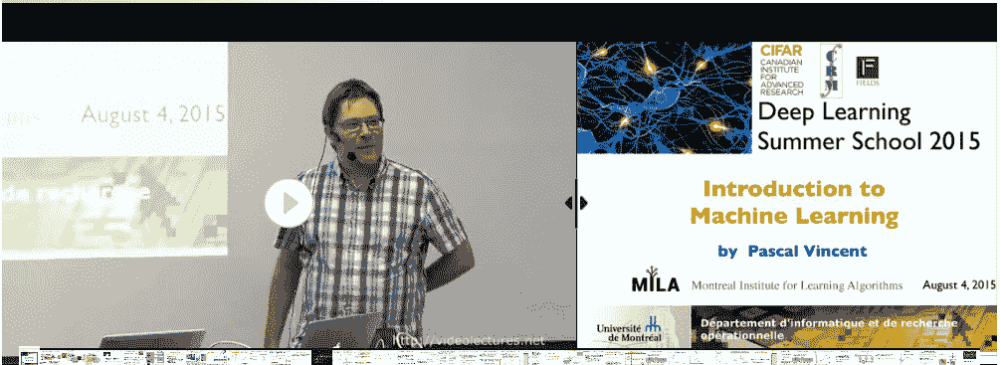

# 深度学习课程

> 原文： [https://machinelearningmastery.com/deep-learning-courses/](https://machinelearningmastery.com/deep-learning-courses/)

深入学习可能很难开始。

值得庆幸的是，许多大学免费开设了深度学习的课程，当您希望更好地理解深度学习的基础时，这可能是一个很好的起点。

在这篇文章中，您将了解关于深度学习的课程，您可以浏览和学习，以发展和巩固您对该领域的理解。

这是一篇很长的文章，可以深入链接到很多视频，你可以收藏，跳转到整个课程的特定目录，而不是选择一门课程并从头至尾完成。

通过我的新书中的几行代码，了解如何为一系列问题的预测建模并开发深度学习模型，总共包括18个分步教程和9个项目。

让我们现在开始吧。

## 概观

我们将快速浏览以下 6 个深度学习课程。

1.  牛津深度学习
2.  谷歌深度学习 Udacity
3.  蒙特利尔深度学习暑期学校
4.  斯坦福大学自然语言处理的深度学习
5.  斯坦福大学视觉识别的卷积神经网络
6.  舍布鲁克大学的神经网络课程

最后还有一个“其他课程”部分，以收集其他视频课程，这些课程并不是不是免费的，而是零散的课程，并且适合更为细分的领域，并不完全适合本摘要评审。

## 课程提示和如何文章使用指南

有很多课程和很多很棒的免费材料。

我最好的建议是：

> 不要选择一门课程并通过从头至尾的方式学习。

这与大多数人的建议相反。

你“认真”并且挑选“最好的”课程学习并完成所有的课程材料的冲动会导致你几乎肯定失败。

材料很难，你需要花时间在每个主题上获得不同的观点。

真正进入这一材料的最好方法是逐个主题地学习，并从所有课程中选取相关介绍，直到你真正理解一个主题，然后再进入下一个主题学习。

您无需了解所有主题，也无需使用单一来源来理解单个主题。

将此页面添加为书签，然后在您需要时浏览，采样并深入了解您需要的材料，同时学习如何使用 [Keras](http://machinelearningmastery.com/tutorial-first-neural-network-python-keras/) 等平台在代码中实现真正的真实深度学习模型。

## 牛津深度学习

这是一个机器学习课程，侧重于 Nando de Freitas 在牛津大学教授的深度学习。

我真的很喜欢这门课程。我在花费了双倍时间观看了所有视频并做了笔记，它提供了良好的理论基础，涵盖了现代深度学习主题，如 LSTM，代码示例显示在 Torch 中。

我注意到教学大纲与实际可用的视频讲座不同，YouTube 播放列表列出了无序的讲座，因此以下是 2015 年视频讲座的顺序：

*   [深度学习讲座 1：简介](https://www.youtube.com/watch?v=PlhFWT7vAEw&list=PLE6Wd9FR--EfW8dtjAuPoTuPcqmOV53Fu&index=16)
*   [深度学习讲座 2：线性模型](https://www.youtube.com/watch?v=DHspIG64CVM&index=5&list=PLE6Wd9FR--EfW8dtjAuPoTuPcqmOV53Fu)
*   [深度学习讲座 3：最大可能性和信息](https://www.youtube.com/watch?v=kPrHqQzCkg0&list=PLE6Wd9FR--EfW8dtjAuPoTuPcqmOV53Fu&index=6)
*   [深度学习第 4 讲：正则化，模型复杂性和数据复杂性（第 1 部分）](https://www.youtube.com/watch?v=VR0W_PNwLGw&index=7&list=PLE6Wd9FR--EfW8dtjAuPoTuPcqmOV53Fu)
*   [深度学习第五讲：正则化，模型复杂性和数据复杂性（第 2 部分）](https://www.youtube.com/watch?v=qz9bKfOqd0Y&index=8&list=PLE6Wd9FR--EfW8dtjAuPoTuPcqmOV53Fu)
*   [深度学习第六讲：优化](https://www.youtube.com/watch?v=0qUAb94CpOw&list=PLE6Wd9FR--EfW8dtjAuPoTuPcqmOV53Fu&index=9)
*   [深度学习第 7 讲：逻辑回归，Torch实现](https://www.youtube.com/watch?v=FYgsztDxSvE&index=11&list=PLE6Wd9FR--EfW8dtjAuPoTuPcqmOV53Fu)
*   [深度学习第 8 讲：模块化反向传播，逻辑回归和Torch](https://www.youtube.com/watch?v=-YRB0eFxeQA&list=PLE6Wd9FR--EfW8dtjAuPoTuPcqmOV53Fu&index=10)
*   [深度学习讲座 9：Torch 中的神经网络和模块化设计](https://www.youtube.com/watch?v=NUKp0c4xb8w&list=PLE6Wd9FR--EfW8dtjAuPoTuPcqmOV53Fu&index=12)
*   [深度学习讲座 10：卷积神经网络](https://www.youtube.com/watch?v=bEUX_56Lojc&index=13&list=PLE6Wd9FR--EfW8dtjAuPoTuPcqmOV53Fu)
*   [深度学习讲座 11：最大边缘学习，转移和记忆网络](https://www.youtube.com/watch?v=jCGplSKrl2Y&index=15&list=PLE6Wd9FR--EfW8dtjAuPoTuPcqmOV53Fu)
*   [深度学习讲座 12：递归神经网络和 LSTM](https://www.youtube.com/watch?v=56TYLaQN4N8&list=PLE6Wd9FR--EfW8dtjAuPoTuPcqmOV53Fu&index=14)
*   [深度学习讲座 13：Alex Graves 关于 RNNs 的设想](https://www.youtube.com/watch?v=-yX1SYeDHbg&index=4&list=PLE6Wd9FR--EfW8dtjAuPoTuPcqmOV53Fu)
*   [深度学习第 14 讲：关于变分自动编码器和图像生成的 Karol Gregor](https://www.youtube.com/watch?v=P78QYjWh5sM&index=3&list=PLE6Wd9FR--EfW8dtjAuPoTuPcqmOV53Fu)
*   [深度学习讲座 15：深度强化学习 - 政策检索](https://www.youtube.com/watch?v=kUiR0RLmGCo&list=PLE6Wd9FR--EfW8dtjAuPoTuPcqmOV53Fu&index=2)
*   [深度学习第 16 讲：强化学习和神经动态规划](https://www.youtube.com/watch?v=dV80NAlEins&index=1&list=PLE6Wd9FR--EfW8dtjAuPoTuPcqmOV53Fu)

对我来说，最重要的课程是 [Alex Graves](http://www.cs.toronto.edu/~graves/) 关于 RNN 的讨论（[第 13 讲](https://www.youtube.com/watch?v=-yX1SYeDHbg&index=4&list=PLE6Wd9FR--EfW8dtjAuPoTuPcqmOV53Fu)），这是一个聪明的人做的伟大的工作，我在观看这个视频的时候正在阅读很多亚历克斯的论文，所以我可能会有偏见。

### 资源

*   [YouTube 播放列表](https://www.youtube.com/playlist?list=PLE6Wd9FR--EfW8dtjAuPoTuPcqmOV53Fu)
*   [课程总结和材料](http://www.cs.ox.ac.uk/teaching/courses/2014-2015/ml/)
*   [Nando de Freitas 主页](http://www.cs.ubc.ca/~nando/)

## 谷歌深度学习 Udacity

这是来自 Udacity 的 [Arpan Chakraborty](https://www.linkedin.com/in/arpan-chakraborty-17688012) 和 Google 的首席科学家 [Vincent Vanhoucke](https://www.linkedin.com/in/vanhoucke) 之间的一个小型课程合作。

该课程是免费的，托管在 Udacity 上，专注于 TensorFlow。它是 Udacity 上托管的[机器学习工程师 Nanodegree 的一小部分](https://www.udacity.com/course/machine-learning-engineer-nanodegree-by-google--nd009)。

您必须注册 Udacity，但一旦您登录，您就可以免费访问此课程。

所有课程视频都在 YouTube 上，但（有意）很难找到不良的命名和链接，如果有人知道所有视频的盗版播放列表，请在评论中发布。

该课程分为 4 课：

*   第 1 课：从机器学习到深度学习
*   第 2 课：深度神经网络
*   第 3 课：卷积神经网络
*   第 4 课：文本和序列的深层模型

该课程很短，但分为许多短视频并且 Udacity 的界面友好， Vincent 似乎出现在我看过的所有视频中（这很棒），视频也显示在 YouTube 界面中。

还有一个讨论表格，您可以通过流畅的[话语软件](https://www.discourse.org/)来提问和回答问题。

我倾向于深入了解我感兴趣的视频，而不是完成整个课程或完成任何课程作业。

### 资源

*   [Udacity 深度学习课程](https://www.udacity.com/course/deep-learning--ud730)
*   [Google 博客上的课程公告](https://research.googleblog.com/2016/01/teach-yourself-deep-learning-with.html)

## 蒙特利尔深度学习暑期学校

2015 年在蒙特利尔大学举办了深度学习暑期学校。

根据该网站，暑期学校的目标是研究生和工业工程师以及已经掌握机器学习基础知识的研究人员。

在从入门材料到最新研究的一系列主题的深度学习领域，至少有自著名研究人员的 30 场演讲（有 30 个视频）。

蒙特利尔深度学习暑期学校

这些视频是真正的宝库，花点时间仔细挑选您的主题。所有视频都在 VideoLectures.net 网站上托管，该网站具有足够好的界面，但不如 YouTube 干净。

许多（所有？）谈话都在视频下方提供了 PDF 幻灯片的下载链接，更多信息可从官方网站的日程页面获得。

以下是讲座主题的完整列表，其中包含视频链接。我试图将相关视频列在一起（例如，第 1 部分，第 2 部分）。

*   [机器学习简介](http://videolectures.net/deeplearning2015_vincent_machine_learning/)
*   [深度学习：理论动机](http://videolectures.net/deeplearning2015_bengio_theoretical_motivations/)
*   [多层神经网络](http://videolectures.net/deeplearning2015_bottou_neural_networks/)
*   [训练深度神经网络](http://videolectures.net/deeplearning2015_larochelle_neural_networks/)
*   [多层神经网络](http://videolectures.net/deeplearning2015_bottou_multilayer_networks/)
*   [深度学习分布估计](http://videolectures.net/deeplearning2015_larochelle_deep_learning/)
*   [无向图形模型](http://videolectures.net/deeplearning2015_courville_graphical_models/)
*   [受限制的玻尔兹曼机器](http://videolectures.net/deeplearning2015_lee_boltzmann_machines/)
*   [在歧管和自动编码器](http://videolectures.net/deeplearning2015_vincent_autoencoders/)
*   [视觉特征：从傅立叶到 Gabor](http://videolectures.net/deeplearning2015_memisevic_fourier_gabor/)
*   [视觉特征 II](http://videolectures.net/deeplearning2015_memisevic_visual_features/)
*   [卷积网络](http://videolectures.net/deeplearning2015_lee_convolutional_networks/)
*   [学习比较](http://videolectures.net/deeplearning2015_taylor_learning_compare/)
*   [NLP 和深度学习 1：人类语言单词向量](http://videolectures.net/deeplearning2015_manning_language_vectors/)
*   [NLP 和深度学习 2：成分深度学习](http://videolectures.net/deeplearning2015_manning_deep_learning/)
*   [使用深度学习看人](http://videolectures.net/deeplearning2015_taylor_deep_learning/)
*   [深度学习](http://videolectures.net/deeplearning2015_salakhutdinov_deep_learning/)
*   [深度学习 2](http://videolectures.net/deeplearning2015_salakhutdinov_deep_learning_2/)
*   [语音识别和深度学习](http://videolectures.net/deeplearning2015_coates_speech_recognition/)
*   [神经网络优化问题教程](http://videolectures.net/deeplearning2015_goodfellow_network_optimization/)
*   [深度学习（希望更快）](http://videolectures.net/deeplearning2015_coates_deep_learning/)
*   [对抗性实例](http://videolectures.net/deeplearning2015_goodfellow_adversarial_examples/)
*   [从语言建模到机器翻译](http://videolectures.net/deeplearning2015_blunsom_machine_translation/)
*   [深 NLP 递归神经网络](http://videolectures.net/deeplearning2015_socher_deep_nlp/)
*   [Deep NLP 应用程序和动态内存网络](http://videolectures.net/deeplearning2015_socher_nlp_applications/)
*   [记忆，阅读和理解](http://videolectures.net/deeplearning2015_blunsom_memory_reading/)
*   [平滑，有限和凸优化深度学习暑期学校](http://videolectures.net/deeplearning2015_schmidt_smooth_finite/)
*   [非平滑，非有限和非凸优化](http://videolectures.net/deeplearning2015_schmidt_nonsmooth_nonfinite/)
*   [变分自动编码器和扩展](http://videolectures.net/deeplearning2015_courville_autoencoder_extension/)
*   [深度生成模型](http://videolectures.net/deeplearning2015_bengio_generative_models/)

选择一个主题并深入学习，效果会非常好！

看起来[会有一个 2016 暑期学校](https://sites.google.com/site/deeplearningsummerschool2016/)，希望会有视频。

### 资源

*   [深度学习暑期学校官方网站](https://sites.google.com/site/deeplearningsummerschool/schedule)
*   [深度学习暑期学校视频](http://videolectures.net/deeplearning2015_montreal/)

## 斯坦福大学自然语言处理的深度学习

这是一个深度学习课程，重点是斯坦福大学 [Richard Socher](http://www.socher.org/) 教授的自然语言处理（NLP）。

一个有趣的说明是，您可以访问 PDF 版本的学生报告，这些工作可能会激发您的灵感或给您提供具有创意的想法。

YouTube 播放列表的文件名称很差，而且有些缺少讲座， 2016 年的视频尚未全部上传。以下是 2015 年讲座和视频链接的列表。只是选择进一个特定主题就轻松多了。

*   [讲座 1：NLP 和深度学习简介](https://www.youtube.com/watch?v=sU_Yu_USrNc&list=PLmImxx8Char8dxWB9LRqdpCTmewaml96q&index=1)
*   [第 2 讲：简单的单词向量表示：word2vec，GloVe](https://www.youtube.com/watch?v=T8tQZChniMk&list=PLmImxx8Char8dxWB9LRqdpCTmewaml96q&index=2)
*   [第 3 讲：高级单词向量表示：语言模型，softmax，单层网络](https://www.youtube.com/watch?v=T1j2Q9_FgTM&list=PLmImxx8Char8dxWB9LRqdpCTmewaml96q&index=3)
*   [第 4 讲：词窗分类和神经网络](https://www.youtube.com/watch?v=MRH9ABxCUZ0&list=PLmImxx8Char8dxWB9LRqdpCTmewaml96q&index=4)
*   [第五讲：项目建议，神经网络和反支柱（全部详细信息）](https://www.youtube.com/watch?v=I2TfdXfSOfc&list=PLmImxx8Char8dxWB9LRqdpCTmewaml96q&index=5)
*   [第六讲：实用技巧：梯度检查，过度拟合，正则化，激活功能，细节](https://www.youtube.com/watch?v=DTbI7XisZcQ&list=PLmImxx8Char8dxWB9LRqdpCTmewaml96q&index=6)
*   [第 7 讲：用于语言建模和其他任务的循环神经网络](https://www.youtube.com/watch?v=rFVYTydGLr4&list=PLmImxx8Char8dxWB9LRqdpCTmewaml96q&index=7)
*   [第 7 讲（8！？）：用于机器翻译的 GRU 和 LSTM](https://www.youtube.com/watch?v=OFCuW8VA7A4&list=PLmImxx8Char8dxWB9LRqdpCTmewaml96q&index=8)
*   [第 9 讲：递归神经网络的解析](https://www.youtube.com/watch?v=DJHvaGU9SW8&list=PLmImxx8Char8dxWB9LRqdpCTmewaml96q&index=9)
*   [第 10 讲：针对不同任务的递归神经网络（例如情绪分析）](https://www.youtube.com/watch?v=sVXp0UwheXw&list=PLmImxx8Char8dxWB9LRqdpCTmewaml96q&index=10)
*   [第 11 讲：期中考试](https://www.youtube.com/watch?v=HYLZCCX4q5o&list=PLmImxx8Char8dxWB9LRqdpCTmewaml96q&index=13)
*   [第 13 讲：用于句子分类的卷积神经网络](https://www.youtube.com/watch?v=EevTPpQvxiU&list=PLmImxx8Char8dxWB9LRqdpCTmewaml96q&index=11)
*   [第 15 讲：DL 在 NLP方面上 的应用](https://www.youtube.com/watch?v=BVbQRrrsJo0&list=PLmImxx8Char8dxWB9LRqdpCTmewaml96q&index=12)
*   [与 Andrew Maas 的客座讲座：语音识别](https://www.youtube.com/watch?v=6D8_4GkEWUg&list=PLmImxx8Char8dxWB9LRqdpCTmewaml96q&index=14)
*   [与杰森韦斯顿的客座讲座：记忆网络](https://www.youtube.com/watch?v=Xumy3Yjq4zk&list=PLmImxx8Char8dxWB9LRqdpCTmewaml96q&index=15)
*   [与 Elliot 英语的客座讲座：高效的实现和 GPU](https://www.youtube.com/watch?v=8Uxe8umUDYA&list=PLmImxx8Char8dxWB9LRqdpCTmewaml96q&index=16)

如果您正在深入学习 NLP，这将是一个非常优秀的领域，这是一个很好的材料。

### 资源

*   [CS224d：自然语言处理的深度学习主页](http://cs224d.stanford.edu/)
*   [课程大纲](http://cs224d.stanford.edu/syllabus.html)
*   [2015 年课程视频播放列表](https://www.youtube.com/playlist?list=PLmImxx8Char8dxWB9LRqdpCTmewaml96q)
*   [2016 年课程视频播放列表](https://www.youtube.com/playlist?list=PLXqezZ11Vm4pzLnhV3bZflqaNNBm9uFUb)

## 斯坦福大学视觉识别的卷积神经网络

本课程重点介绍使用卷积神经网络对计算机视觉应用进行深度学习。

这是斯坦福大学的另一门课程，这次由 Andrej Karpathy 和其他人讲授。

不幸的是，课程视频被删除了，但是一些聪明的人已经找到了将它们放回其他地方的方法。请参阅下面资源部分中的播放列表。

> 我很遗憾地告诉我们，由于法律问题，我们被迫删除了 CS231n 视频，只有25万社会观点提供服务而受益
>
> - Andrej Karpathy（@karpathy） [2016 年 5 月 3 日](https://twitter.com/karpathy/status/727618058471112704)

另一个很棒的课程

以下是 2016 年课程的视频讲座，但我不确定这些链接会持续多长时间，如果链接失效，请发表评论以便于我及时修复链接。

*   [第 1 讲 引言及历史背景](https://www.youtube.com/watch?v=F-g0-6_RRUA&index=1&list=PLLvH2FwAQhnpj1WEB-jHmPuUeQ8mX-XXG)
*   [第 2 讲 数据驱动方法，kNN，线性分类 1](https://www.youtube.com/watch?v=ZM4umP6F1Jc&index=2&list=PLLvH2FwAQhnpj1WEB-jHmPuUeQ8mX-XXG)
*   [第 3 讲 线性分类 2，优化](https://www.youtube.com/watch?v=Q_UWHTY_TEQ&index=4&list=PLLvH2FwAQhnpj1WEB-jHmPuUeQ8mX-XXG)
*   [第 4 讲 反向传播，神经网络 1](https://www.youtube.com/watch?v=jhUZ800C650&index=5&list=PLLvH2FwAQhnpj1WEB-jHmPuUeQ8mX-XXG)
*   [第 5 讲 神经网络第 2 部分](https://www.youtube.com/watch?v=jhUZ800C650&index=5&list=PLLvH2FwAQhnpj1WEB-jHmPuUeQ8mX-XXG)
*   [第 6 讲 神经网络第 3 部分卷入介绍](https://www.youtube.com/watch?v=egPTd9zZzec&index=6&list=PLLvH2FwAQhnpj1WEB-jHmPuUeQ8mX-XXG)
*   [第 7 讲 卷积神经网络](https://www.youtube.com/watch?v=sHyIqu_S5Ks&index=7&list=PLLvH2FwAQhnpj1WEB-jHmPuUeQ8mX-XXG)
*   [第 8 讲 定位和检测](https://www.youtube.com/watch?v=sHyIqu_S5Ks&index=7&list=PLLvH2FwAQhnpj1WEB-jHmPuUeQ8mX-XXG)
*   [第 9 讲 可视化，深度梦想，神经风格，对抗性实例](https://www.youtube.com/watch?v=ASdbG_7KMhc&index=9&list=PLLvH2FwAQhnpj1WEB-jHmPuUeQ8mX-XXG)
*   [讲座 10 回归神经网络，图像字幕，LSTM](https://www.youtube.com/watch?v=R1rXkuJ5w20&index=10&list=PLLvH2FwAQhnpj1WEB-jHmPuUeQ8mX-XXG)
*   [第 11 讲实践中的讲座](https://www.youtube.com/watch?v=G3m6HusAJTg&index=11&list=PLLvH2FwAQhnpj1WEB-jHmPuUeQ8mX-XXG)
*   [第 12 讲深度学习库](https://www.youtube.com/watch?v=b6RntuTiKQo&index=12&list=PLLvH2FwAQhnpj1WEB-jHmPuUeQ8mX-XXG)
*   [第 13 讲分段，软注意，空间变换器](https://www.youtube.com/watch?v=yCrkzVFsEX0&index=13&list=PLLvH2FwAQhnpj1WEB-jHmPuUeQ8mX-XXG)
*   [第 14 讲 视频和无监督学习](https://www.youtube.com/watch?v=k645B_f4a6Y&index=14&list=PLLvH2FwAQhnpj1WEB-jHmPuUeQ8mX-XXG)
*   [第 15 讲 由 Jeff Dean 邀请演讲](https://www.youtube.com/watch?v=qtm4JgbxuEc&index=15&list=PLLvH2FwAQhnpj1WEB-jHmPuUeQ8mX-XXG)

### 资源

*   [用于视觉识别的卷积神经网络主页](http://cs231n.stanford.edu/)
*   [课程大纲](http://cs231n.stanford.edu/syllabus.html)（以及 [2015 年教学大纲](http://cs231n.stanford.edu/syllabus_winter2015.html)）
*   [Archive.org 上的课程视频](https://archive.org/details/cs231n-CNNs)
*   [YouTube 上的课程视频](https://www.youtube.com/playlist?list=PLLvH2FwAQhnpj1WEB-jHmPuUeQ8mX-XXG)
*   [课程示例代码](https://github.com/cs231n/cs231n.github.io)

## 舍布鲁克大学的神经网络课程

这是由魁北克舍布鲁克大学的 Hugo Larochelle 教授的神经网络课程。

有大量的材料，一吨(笑哭)。

视频是一对一而不是讲座，每个主题都有许多小视频，而不是大型的一小时视频信息。

我认为这可能是比传统讲座更好的方式，但我还没有完全尝试并比较，困难的是有 92 个视频（!!!）可供浏览，很难找到要观看的特定视频。

教材包括 10 个主题：

*   主题 1：前馈神经网络
*   主题 2：训练神经网络
*   主题 3：条件随机字段
*   主题 4：训练条件随机字段
*   主题 5：受限制的玻尔兹曼机器
*   主题 6：自动编码器
*   主题 7：深度学习
*   主题 8：稀疏编码
*   主题 9：计算机视觉
*   主题 10：自然语言处理

我的建议是使用主菜单主页浏览主题，然后将这些链接用于特定视频， YouTube 播放列表中有太多视频无法播放和理解，选择的悖论会杀死你。

### 资源

*   [课程主页](http://info.usherbrooke.ca/hlarochelle/neural_networks/content.html)
*   [YouTube 视频播放列表](https://www.youtube.com/playlist?list=PL6Xpj9I5qXYEcOhn7TqghAJ6NAPrNmUBH)

## 其他课程

以下是一些非免费，难以访问或范围较小的视频课程。

*   [CILVR Lab @ NYU](http://cilvr.cs.nyu.edu/doku.php?id=deeplearning:slides:start) 的深度学习课程（断开的链接？）
*   [Udemy](https://www.udemy.com/courses/search/?q=deep+learning&lang=en) 的小型深度学习课程
*   [CMU 的深度学习](http://deeplearning.cs.cmu.edu/)
*   [用于深度学习的 Nvidia 自学课程](https://developer.nvidia.com/deep-learning-courses)
*   [多伦多大学 Coursera 机器学习神经网络](https://www.coursera.org/learn/neural-networks)（太棒了，但不再免费）
    *   **更新**：[您可以在这里免费观看所有视频](https://www.youtube.com/playlist?list=PLoRl3Ht4JOcdU872GhiYWf6jwrk_SNhz9)。
*   [研究生暑期学校：深度学习，特色学习](http://www.ipam.ucla.edu/programs/summer-schools/graduate-summer-school-deep-learning-feature-learning/?tab=schedule)，2012

## 摘要

在这篇文章中，您发现了许多关于深度学习的世界级视频课程，包括理论，理论，计算机视觉，自然语言处理等。

注意这篇文章顶部的建议。

按主题浏览并深入讲座学习，而不要尝试学习整个课程，学习一件事，而不是尝试学习一切。

你可以花点时间，为此页面添加书签，以便您可以方便回来享受学习的乐趣。

你知道我还没有列出其他深度学习的视频课程吗？请在评论中告诉我，我会更新清单。