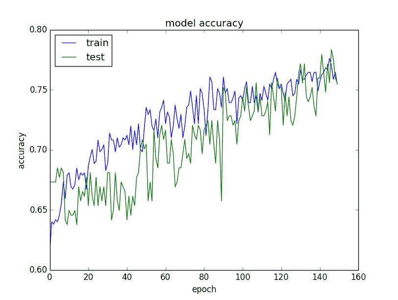
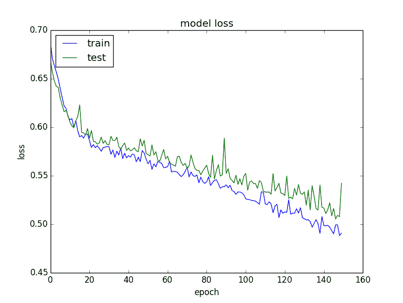

# 在 Keras 展示深度学习模型训练历史

> 原文： [https://machinelearningmastery.com/display-deep-learning-model-training-history-in-keras/](https://machinelearningmastery.com/display-deep-learning-model-training-history-in-keras/)

您可以通过观察他们在训练期间随时间的表现来学习很多关于神经网络和深度学习模型的知识。

Keras 是一个功能强大的 Python 库，它提供了一个简洁的交互方式用来创建深度学习模型，并包含更高技术的 TensorFlow 和 Theano 后端。

在本文中，您将了解如何在使用 Keras 进行 Python 训练期间查看和可视化深度学习模型的性能表现。

让我们开始吧。

*   **2017 年 3 月更新：**更新了 Keras 2.0.2，TensorFlow 1.0.1 和 Theano 0.9.0 **的示例。**
*   **更新 March / 2018** ：添加了备用链接以下载数据集，因为原始图像已被删除。


照片由 [Gordon Robertson](https://www.flickr.com/photos/gordon_robertson/5620659988/) 拍摄，并保留所属权利。

## Keras 中的访问模型训练历史

Keras 提供了在训练深度学习模型时注册回调的功能。

训练所有深度学习模型时注册的默认回调之一是[历史回调](http://keras.io/callbacks/)，它记录每个迭代期间的训练指标，这包括损失和精确性（对于分类问题）以及验证数据集的损失和准确性（如果已设置）。

历史对象从调用返回到用于训练模型的`fit()`函数返回,度量标准存储在返回对象的历史成员中的字典中。

例如，您可以在训练模型后使用以下代码段列出历史记录对象中收集的指标：

```py
# 列出历史对象的所有数据
print(history.history.keys())
```

例如，对于使用验证数据集训练分类问题的模型，这可能会产生以下列表：

```py
['acc', 'loss', 'val_acc', 'val_loss']
```

我们可以使用历史对象中收集的数据来创建绘图。

这些图可以提供有关模型训练的有用信息的指示，例如：

*   整个迭代期间的的收敛速度（曲线坡度）。
*   模型是否已经收敛（平缓的曲线）。
*   模型是否可能过度学习训练数据（验证集曲线的拐点）。

等等。

## 可视化 Keras 中的模型训练历史

我们可以从收集的历史数据中创建图形。

在下面的例子中，我们创建了一个小型网络来模拟皮马印第安人糖尿病二元分类问题。这是一个可从 UCI 机器学习库获得的小型数据集，您可以[下载数据集](http://archive.ics.uci.edu/ml/machine-learning-databases/pima-indians-diabetes/pima-indians-diabetes.data)并将其保存为当前工作目录中的 _pima-indians-diabetes.csv_ （更新：[从此处下载](https://raw.githubusercontent.com/jbrownlee/Datasets/master/pima-indians-diabetes.data.csv)）。

该示例收集从训练模型返回的历史记录并创建两个图表：

1.  训练时期训练和验证数据集的准确性图。
2.  训练和验证数据集在训练时期的损失图。

```py
# 可视化训练历史
from keras.models import Sequential
from keras.layers import Dense
import matplotlib.pyplot as plt
import numpy
# 固定随机种子再现性
seed = 7
numpy.random.seed(seed)
# 加载数据集
dataset = numpy.loadtxt("pima-indians-diabetes.csv", delimiter=",")
# 将数据集划分为输入变量和输出变量
X = dataset[:,0:8]
Y = dataset[:,8]
# 创建模型
model = Sequential()
model.add(Dense(12, input_dim=8, kernel_initializer='uniform', activation='relu'))
model.add(Dense(8, kernel_initializer='uniform', activation='relu'))
model.add(Dense(1, kernel_initializer='uniform', activation='sigmoid'))
# 编译模型
model.compile(loss='binary_crossentropy', optimizer='adam', metrics=['accuracy'])
# 拟合模型
history = model.fit(X, Y, validation_split=0.33, epochs=150, batch_size=10, verbose=0)
# 列出所有的训练历史数据
print(history.history.keys())
# 总结精确度历史
plt.plot(history.history['acc'])
plt.plot(history.history['val_acc'])
plt.title('model accuracy')
plt.ylabel('accuracy')
plt.xlabel('epoch')
plt.legend(['train', 'test'], loc='upper left')
plt.show()
# 总结损失历史
plt.plot(history.history['loss'])
plt.plot(history.history['val_loss'])
plt.title('model loss')
plt.ylabel('loss')
plt.xlabel('epoch')
plt.legend(['train', 'test'], loc='upper left')
plt.show()
```

如下图所示，验证数据集的历史记录按照模型的测试数据集的惯例被标记为测试数据。

从精度图中我们可以看到，由于两个数据集的精度趋势在过去几个训练迭代中仍在上升，因此模型可能可以受到更多的训练，我们还可以看到，两个数据集可比较的技巧，显示了模型尚未过度学习训练数据集。



图：训练和验证数据集的模型精度图

从损失图中我们可以看到，模型在训练和验证数据集（标记测试）上具有可比较的性能，如果这些相互平行图开始一较为一致的分散，这可能是一个模型过早停止训练的信号。



图：关于训练和验证数据集的模型损失图

## 摘要

在这篇文章中，您了解了了在深度学习模型训练过程中收集和检查指标的重要性。

您了解了 Keras 中的历史回调以及它是如何从调用`fit()`函数返回以训练模型的,您学习了如何根据训练期间收集的历史数据创建绘图。

您对模型训练历史或这篇文章有任何疑问吗？在评论中提出您的问题，我会尽力回答。