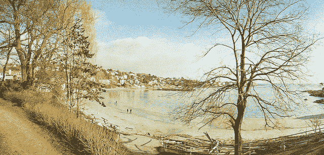
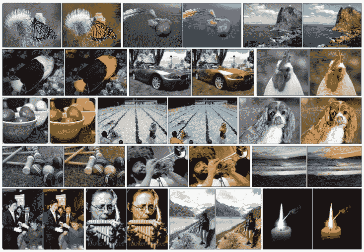
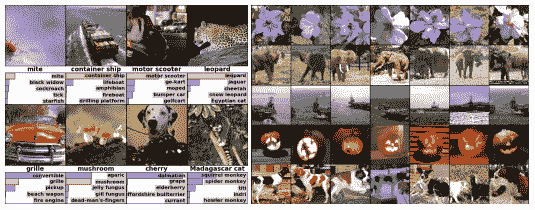
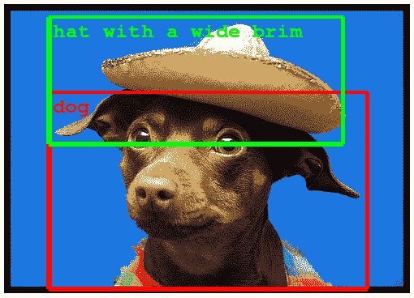
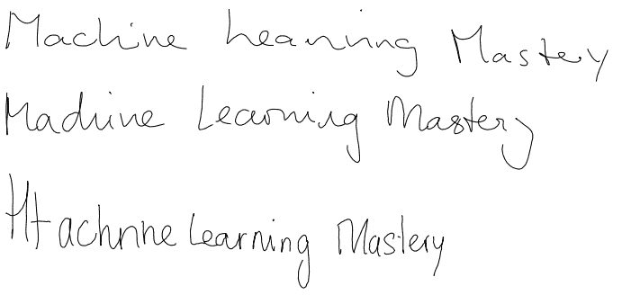
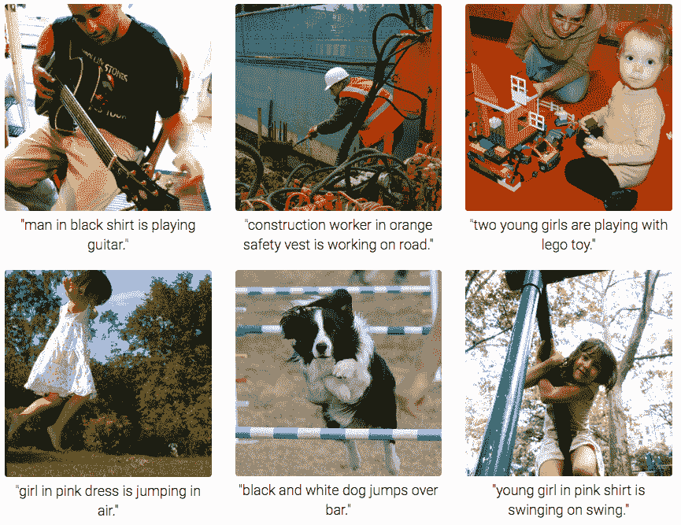
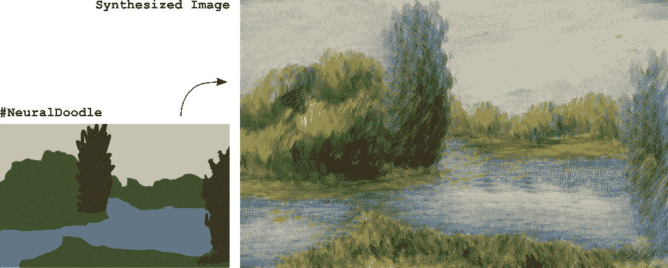

# 8 个深度学习的鼓舞人心的应用

> 原文： [https://machinelearningmastery.com/inspirational-applications-deep-learning/](https://machinelearningmastery.com/inspirational-applications-deep-learning/)

如果说深度学习是在一系列复杂问题中实现最先进的结果，这种说法是有些夸张的。

目前，人工智能，机器学习和深度学习方面有在很多问题得处理上取得了令人兴奋的结果，这也是进入一些真正强大的技术底层的绝佳机会。

我努力说服朋友，同事和学生开始深入学习，如上所述的大胆陈述是不够的。它需要故事，图片和研究论文。

在这篇文章中，您将了解一些深度学习方面近期令人激动的应用，这些应用能够有效激励您深入了解深度学习。

开始深度学习并不一定意味着去研究未来2-3年的方程，这只可能意味着[下载 Keras 并开始在 5 分钟内运行你的第一个模型](http://machinelearningmastery.com/tutorial-first-neural-network-python-keras/)。开始应用深度学习，构建事物，并将其转化为系统和代码，这是一件令人兴奋的事情。

最近，我一直想写这篇文章，让我们开始吧!

照片由 [Nick Kenrick](https://www.flickr.com/photos/zedzap/12093300505/) 提供，并保留所属权利。

## 概述

以下是我们将在本文中看到的具体示例列表。

并非所有的示例都是需要“黄金时间”的准备的技术，但可以保证，它们都是一些令你激动的的例子。

如果你已经深入了解了一些深度学习的知识，那么这些例子似乎会有一些简单，但是，事实上，在更广法的范围内，这些例子仍然令人印象深刻

坦率地说，对于像我这样的老 AI 黑客，认为其中的一些例子在未来几十年不可能得到解决，但是深度学习的出现啪啪打脸！

我将重点放在视觉示例上，因为我们可以查看屏幕截图和视频以立即了解算法的作用，但是自然语言中包含文本和音频数据的示例（如果没有更多的话）的数量就不多了。

本篇文章中，我们会了解以下示例：

1.  黑白图像的着色。
2.  为无声电影添加声音。
3.  自动机器翻译。
4.  照片中的物体分类。
5.  自动手写生成。
6.  字符文本生成。
7.  图像标题生成。
8.  自动游戏。

## 1.黑白图像的自动着色

图像着色是向黑白照片添加颜色的问题。

传统上这是[手工完成](https://en.wikipedia.org/wiki/Hand-colouring_of_photographs)，因为这是一项艰巨的任务。

深度学习可用于在照片中使用对象及其背景信息来为图像着色，就像人类操作员一样会解决问题。

令人印象深刻的视觉壮举。

此功能利用了为ImageNet训练并被选为图像着色问题的高质量和超大型卷积神经网络。

通常，该方法涉及使用非常大的卷积神经网络和监督层，其通过添加颜色来重建图像。

黑白照片的着色
图片取自 [Richard Zhang，Phillip Isola 和 Alexei A. Efros](http://richzhang.github.io/colorization/) 。

令人印象深刻的是，相同的方法可用于着色黑白电影的静止帧

### 进一步阅读

*   [自动着色](http://tinyclouds.org/colorize/)
*   [灰度图像自动着色](https://news.developer.nvidia.com/automatic-image-colorization-of-grayscale-images/)

### 文件

*   [深色着色](http://www.cs.cityu.edu.hk/~qiyang/publications/iccv-15.pdf) [pdf]，2015
*   [彩色图像着色](http://arxiv.org/pdf/1603.08511.pdf)[pdf]([网站](http://richzhang.github.io/colorization/)，2016
*   [自动着色的学习表示](http://arxiv.org/pdf/1603.06668.pdf) [pdf]（[网站](http://people.cs.uchicago.edu/~larsson/colorization/)），2016
*   [深度卷积神经网络的图像着色](http://cs231n.stanford.edu/reports2016/219_Report.pdf) [pdf]，2016

## 2.自动为无声电影添加声音

在此任务中，系统必须合成声音以匹配静音视频。

该系统使用 1000 个视频示例进行训练，其中鼓棒的声音撞击不同的表面并产生不同的声音。深度学习模型将视频帧与预先重新录制的声音数据库相关联，以便选择与场景中发生的最佳匹配的声音。

然后使用图像测试设置评估系统，其中人类必须确定哪个视频具有真实或假（合成）声音。

卷积神经网络和 LSTM 递归神经网络能实现非常酷的应用。

### 进一步阅读

*   [人工智能产生逼真的愚弄人类的声音](http://news.mit.edu/2016/artificial-intelligence-produces-realistic-sounds-0613)
*   [机器可以产生愚弄人类的声音效果](https://www.engadget.com/2016/06/13/machines-can-generate-sound-effects-that-fool-humans)

### 文件

*   [视觉指示声音](http://arxiv.org/pdf/1512.08512.pdf)（[网页](http://vis.csail.mit.edu/)），2015

## 3.自动机器翻译

这是一种给定的单词，短语或句子在一种语言中，自动将其翻译成另一种语言的任务。

自动机器翻译已经存在了很长时间，但深度学习在两个特定领域取得了最佳成果：

*   文本的自动翻译。
*   图像的自动翻译。

可以在不对序列进行任何预处理的情况下执行文本转换，从而允许算法学习单词之间的依赖关系以及它们与新语言的映射，通常使用大型 LSTM 递归神经网络的堆叠网络来执行该转换。

正如您所料，卷积神经网络用于识别具有字母的图像以及字母在场景中的位置，识别后，可以将它们转换为文本，翻译并使用翻译后的文本重新创建图像，这通常被称为即时视觉翻译。

即时视觉翻译
即时视觉翻译示例，取自 [Google 博客](https://research.googleblog.com/2015/07/how-google-translate-squeezes-deep.html)。

### 进一步阅读

在这个例子中很难找到好的资源，如果你知道的话，可以发表评论。

*   [谷歌翻译如何将深度学习压缩到手机上](https://research.googleblog.com/2015/07/how-google-translate-squeezes-deep.html)

### 文件

*   [用神经网络进行序列学习的序列](http://arxiv.org/pdf/1409.3215v3.pdf) [pdf]，2014
*   [使用 RNN 编码器 - 解码器进行统计机器翻译的学习短语表示](http://arxiv.org/pdf/1406.1078v3.pdf) [pdf]，2014
*   [机器翻译中的深度神经网络：概述](http://www.nlpr.ia.ac.cn/cip/ZongPublications/2015/IEEE-Zhang-8-5.pdf) [pdf]，2015

## 4.照片中的物体分类和检测

该任务需要将照片内的对象分类为一组先前已知的对象之一。

使用非常大的卷积神经网络，已经在该问题的基准示例上获得了最新的结果，关于ImageNet分类问题AlexNet的结果，Alex Krizhevsky等人在此问题上取得了突破。

使用深度卷积神经网络从 [ImageNet 分类中获取的对象分类示例](http://www.cs.toronto.edu/~fritz/absps/imagenet.pdf)

该任务的更复杂的变体是物体检测涉及具体识别照片场景内的一个或多个物体并在它们周围画出边框。

Photogaphs 中的物体检测示例
取自 [Google 博客](https://research.googleblog.com/2014/09/building-deeper-understanding-of-images.html)。

### 进一步阅读

*   [加深对图像的理解](https://research.googleblog.com/2014/09/building-deeper-understanding-of-images.html)
*   [AlexNet](https://github.com/BVLC/caffe/tree/master/models/bvlc_alexnet)
*   [ConvNetJS：CIFAR-10 演示](http://cs.stanford.edu/people/karpathy/convnetjs/demo/cifar10.html)

### 文件

*   [具有深度卷积神经网络的 ImageNet 分类](http://www.cs.toronto.edu/~fritz/absps/imagenet.pdf) [pdf]，2012
*   [基于深度卷积神经网络的图像分类的一些改进](http://arxiv.org/pdf/1312.5402v1.pdf) [pdf]，2013
*   [使用深度神经网络的可扩展物体检测](http://www.cv-foundation.org/openaccess/content_cvpr_2014/papers/Erhan_Scalable_Object_Detection_2014_CVPR_paper.pdf) [pdf]，2013
*   [用于物体检测的深度神经网络](http://papers.nips.cc/paper/5207-deep-neural-networks-for-object-detection.pdf) [pdf]，2013

## 5.自动手写生成

这是给定一个手写示例语料库，为给定的单词或短语生成新的手写字体的任务。

手写体是作为创建手写样本时笔使用的坐标序列提供的，从该语料库中学习笔移动和字母之间的关系，可以生成新的示例。

令人着迷的是，可以学习不同的风格，然后模仿，我很乐意看到这项工作与一些法医手写分析专业知识相结合。

自动手写生成示例

### 进一步阅读

*   [交互式手写生成演示](http://www.cs.toronto.edu/~graves/handwriting.html)

### 文件

*   [使用递归神经网络生成序列](http://arxiv.org/pdf/1308.0850v5.pdf) [pdf]，2013

## 6.自动文本生成

这是一项学习了文本语料库，并且从该模型逐字或逐字符地生成新文本的任务。

该模型能够学习如何拼写，标点，形成感知，甚至捕捉语料库中文本的样式。

大型递归神经网络用于学习输入字符串序列中的项之间的关系，然后生成文本。最近，LSTM 循环神经网络使用基于字符的模型在这个问题上取得了巨大的成功，并且该模型一次生成一个字符。

Andrej Karpathy 在他关于该主题的热门博客文章中提供了许多例子，包括：

*   保罗格雷厄姆散文
*   莎士比亚
*   维基百科文章（包括标记）
*   代数几何（带 LaTeX 标记）
*   Linux 源代码
*   宝贝名字

莎士比亚的自动文本生成示例
摘自 [Andrej Karpathy 博客文章](http://karpathy.github.io/2015/05/21/rnn-effectiveness/)

### 进一步阅读

*   [回归神经网络的不合理有效性](http://karpathy.github.io/2015/05/21/rnn-effectiveness/)
*   [使用递归神经网络自动生成 Clickbait](https://larseidnes.com/2015/10/13/auto-generating-clickbait-with-recurrent-neural-networks/)

### 文件

*   [使用递归神经网络生成文本](http://www.cs.utoronto.ca/~ilya/pubs/2011/LANG-RNN.pdf) [pdf]，2011
*   [使用递归神经网络生成序列](http://arxiv.org/pdf/1308.0850v5.pdf) [pdf]，2013

## 7.图像自动生成标题

自动生成图像标题是给定图像内容，系统必须生成描述图像内容的标题的任务。

2014 年，深度学习算法爆炸式增长，在此问题上取得了令人印象深刻的成果，利用顶级模型的工作进行目标分类和照片中的目标检测。

一旦您可以检测照片中的对象并为这些对象生成标签，您就会发现下一步是将这些标签转换为连贯的句子描述图像内容。

这是那些让我震惊不已的结果之一。 确实非常令人印象深刻。

通常，该系统涉及使用非常大的卷积神经网络用于照片中的物体检测，然后使用像 LSTM 那样的递归神经网络将标签生成连贯的句子。

自动图像标题生成
样本取自 [Andrej Karpathy，李飞飞](http://cs.stanford.edu/people/karpathy/deepimagesent/)

这些技术也已扩展为自动生成视频标题。

### 进一步阅读

*   [一张图片胜过一千个（连贯的）字：构建图像的自然描述](https://research.googleblog.com/2014/11/a-picture-is-worth-thousand-coherent.html)
*   [自动图像字幕的快速进展](https://blogs.technet.microsoft.com/machinelearning/2014/11/18/rapid-progress-in-automatic-image-captioning/)

### 文件

*   [用于生成图像描述的深层视觉语义对齐](http://cs.stanford.edu/people/karpathy/cvpr2015.pdf) [pdf]（[和网站](http://cs.stanford.edu/people/karpathy/deepimagesent/)），2015
*   [用多模式回归神经网络解释图像](http://arxiv.org/pdf/1410.1090v1.pdf) [pdf，2014]
*   [用于视觉识别和描述的长期循环卷积网络](http://arxiv.org/pdf/1411.4389v4.pdf) [pdf]，2014
*   [用多模态神经语言模型统一视觉语义嵌入](http://arxiv.org/pdf/1411.2539v1.pdf) [pdf]，2014
*   [序列到序列 - 视频到文本](http://arxiv.org/pdf/1505.00487v3.pdf) [pdf]，2015

## 8.自动游戏

这是一个模型学习如何仅根据屏幕上的像素来玩电脑游戏的任务。

这是一个深度强化模型的领域非常困难的任务，并且 [DeepMind](https://en.wikipedia.org/wiki/Google_DeepMind) （现在是谷歌的一部分）因实现该问题的突破性进展而闻名。

这项工作得到了扩展，并在谷歌 DeepMind 的 [AlphaGo](https://en.wikipedia.org/wiki/AlphaGo) 中达到顶峰，该游戏在 Go 游戏中击败了世界大师。

### 进一步阅读

*   [深层强化学习](https://www.deepmind.com/blog)
*   [DeepMind YouTube 频道](https://www.youtube.com/channel/UCP7jMXSY2xbc3KCAE0MHQ-A)
*   [深度学习演示](https://cs.stanford.edu/people/karpathy/convnetjs/demo/rldemo.html)
*   [DeepMind 的 AI 现在是 Atari 游戏专业版](http://www.wired.co.uk/article/google-deepmind-atari)

### 文件

*   [使用深度强化学习](http://arxiv.org/pdf/1312.5602v1.pdf) [pdf]，2013 年播放 Atari
*   [通过深度强化学习](http://www.nature.com/nature/journal/v518/n7540/full/nature14236.html)进行人类控制，2015 年
*   [用深度神经网络和树搜索](http://www.nature.com/nature/journal/v529/n7587/full/nature16961.html)掌握 Go 游戏，2016

## 其他例子

以下是上面列出的一些其他示例。

*   自动语音识别。
    *   [用于语音识别中声学建模的深度神经网络](http://static.googleusercontent.com/media/research.google.com/en//pubs/archive/38131.pdf) [pdf]，2012
*   自动语音理解。
    *   [采用递归神经网络进行端到端语音识别](http://www.jmlr.org/proceedings/papers/v32/graves14.pdf) [pdf]，2014
*   自动将注意力集中在图像中的目标上。
    *   [视觉注意的复发模型](http://arxiv.org/pdf/1406.6247v1.pdf) [pdf]，2014
*   自动回答有关照片中对象的问题。
    *   [探索图像问答的模型和数据](http://arxiv.org/pdf/1505.02074v4.pdf) [pdf]，2015
*   自动将手稿转换为照片。
    *   [卷积手稿反演](https://arxiv.org/abs/1606.03073) [pdf]，2016
*   从粗略手稿自动创建风格化图像。
    *   [神经涂鸦](https://github.com/alexjc/neural-doodle)

从草图自动创建样式图像
由 [NeuralDoodle](https://github.com/alexjc/neural-doodle) 提供图像

## 更多资源

有很多很棒的资源，会谈和更多帮助你对深度学习的能力和潜力感到兴奋。

以下是一些额外的资源，可以帮助您激动。

*   [深度学习的不合理效果](https://www.youtube.com/watch?v=sc-KbuZqGkI)，Yann LeCun 在 2014 年的演讲
*   [令人敬畏的深度视觉](https://github.com/kjw0612/awesome-deep-vision)顶级深度学习计算机视觉论文列表
*   [可以学习的计算机的精彩和恐怖的含义](https://www.youtube.com/watch?v=t4kyRyKyOpo)，Jeremy Howard 的 TED 演讲
*   [哪种算法取得了最佳效果](http://rodrigob.github.io/are_we_there_yet/build/)，计算机视觉数据集的最佳结果列表
*   [神经网络如何真正起作用](https://www.youtube.com/watch?v=l2dVjADTEDU)，Geoffrey Hinton 2016

## 摘要

在这篇文章中，您了解了 8 个深度学习应用程序，旨在激励您能够深入了解深度学习。

这种展示而不是说出的方法有望突破夸张，使您对深度学习技术的当前和未来功能有一个更清晰的了解。

您是否知道这里没有列出任何深度学习的鼓舞人心的例子？ 在评论中让我知道。