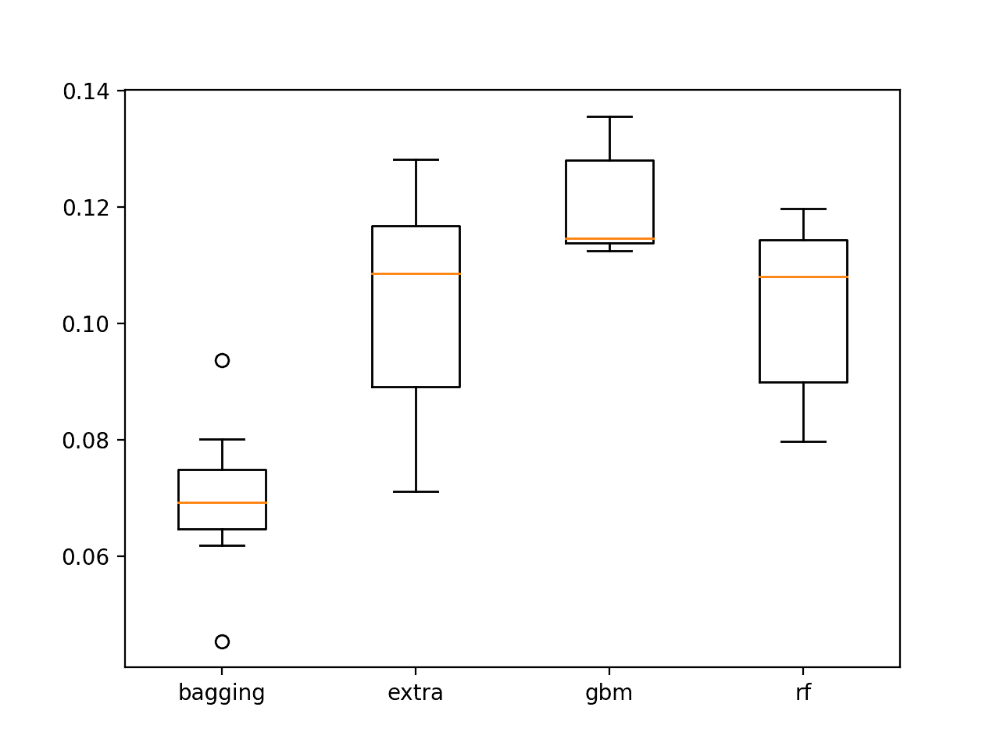
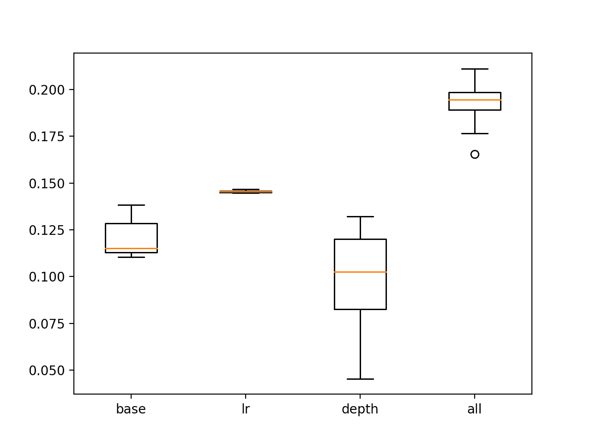

# 如何建立预测大气污染日的概率预测模型

> 原文： [https://machinelearningmastery.com/how-to-develop-a-probabilistic-forecasting-model-to-predict-air-pollution-days/](https://machinelearningmastery.com/how-to-develop-a-probabilistic-forecasting-model-to-predict-air-pollution-days/)

空气污染的特点是地面臭氧浓度。

根据风速和温度等气象测量结果，可以预测明天地面臭氧是否会达到足够高的水平，以发布公共空气污染预警。

这是用于时间序列分类数据集的标准机器学习数据集的基础，简称为“_ 臭氧预测问题 _”。该数据集描述了休斯顿地区七年来的气象观测以及臭氧水平是否高于临界空气污染水平。

在本教程中，您将了解如何探索这些数据并开发概率预测模型，以预测德克萨斯州休斯顿的空气污染。

完成本教程后，您将了解：

*   如何加载和准备臭氧日标准机器学习预测建模问题。
*   如何开发一个天真的预测模型，并使用 Brier 技能分数评估预测。
*   如何使用决策树集合开发技巧模型，并通过成功模型的超参数调整进一步提高技能。

让我们开始吧。


如何建立预测空气污染日的概率预测模型
照片由 [paramita](https://www.flickr.com/photos/parramitta/6715213551/) ，保留一些权利。

## 教程概述

本教程分为五个部分;他们是：

1.  臭氧预测问题
2.  加载和检查数据
3.  朴素预测模型
4.  集合树预测模型
5.  调整梯度提升

## 臭氧预测问题

空气污染的特征在于地面臭氧的高度测量，通常被称为“[不良臭氧](https://en.wikipedia.org/wiki/Tropospheric_ozone)”，以区​​别于高层大气中的臭氧。

臭氧预测问题是时间序列分类预测问题，其涉及预测第二天是否将是高空气污染日（臭氧日）。气象组织可以利用臭氧日的预测来警告公众，使他们能够采取预防措施。

该数据集最初由 Kun Zhang 等人研究。他们在 2006 年的论文“[预测偏差随机臭氧天数：分析和解决方案](https://ieeexplore.ieee.org/abstract/document/4053100/)”，然后在他们的后续报告中再次提到“[预测偏差随机臭氧天：分析，解决方案及其他](https://link.springer.com/article/10.1007/s10115-007-0095-1) “。

这是一个具有挑战性的问题，因为高臭氧水平的物理机制是（或没有）被完全理解，这意味着预测不能像其他气象预报一样基于物理模拟，如温度和降雨量。

该数据集被用作开发预测模型的基础，该模型使用一系列可能与预测臭氧水平相关或可能不相关的变量，此外还有少数已知与所涉及的实际化学过程相关的变量。

> 然而，环境科学家普遍认为，目前从未探索过的大量其他特征在建立高度精确的臭氧预测模型中非常有用。然而，鲜为人知的是这些特征究竟是什么以及它们如何在臭氧形成中实际相互作用。 [...]今天的环境科学都没有知道如何使用它们。这为数据挖掘提供了绝佳的机会

- [预测偏差随机臭氧天数：分析和解决方案](https://ieeexplore.ieee.org/abstract/document/4053100/)，2006 年。

在随后的一天预测高水平的地面臭氧是一个具有挑战性的问题，已知其具有随机性。这意味着预计会出现预测错误。因此，希望概率地对预测问题进行建模并预测臭氧日的概率，或者在前一天或几天给出观察结果。

该数据集包含七年的每日气象变量观测值（1998-2004 或 2,536 天）以及是否有臭氧日，在美国德克萨斯州的休斯顿，加尔维斯顿和布拉佐里亚地区进行。

每天共观察到 72 个变量，其中许多被认为与预测问题相关，其中 10 个已根据物理学确认为相关。

> [...]这 72 个特征中只有大约 10 个特征已经被环境科学家证实是有用和相关的，并且关于其他 60 个特征的相关性，既没有经验也没有理论信息。然而，空气质量控制科学家长期以来一直在猜测这些特征中的一些可能是有用的，但是无法发展理论或使用模拟来证明其相关性。

- [预测偏差随机臭氧天数：分析和解决方案](https://ieeexplore.ieee.org/abstract/document/4053100/)，2006 年。

有 24 个变量跟踪每小时风速，另外 24 个变量跟踪一天中每小时的温度。数据集的两个版本可用于度量的不同平均周期，特别是 1 小时和 8 小时。

似乎缺少并可能有用的是每天观察到的臭氧，而不是二氧化硫臭氧日/非臭氧日。参数模型中使用的其他度量也不可用。

有趣的是，基于“[开发臭氧预测计划指南](https://nepis.epa.gov/Exe/ZyPURL.cgi?Dockey=2000D6KP.TXT)”，1999 年 EPA 指南中的描述，使用参数臭氧预测模型作为基线。该文件还描述了验证臭氧预报系统的标准方法。

总之，这是一个具有挑战性的预测问题，因为：

*   存在大量变量，其重要性通常是未知的。
*   输入变量及其相互关系可能会随时间而变化。
*   对于需要处理的许多变量缺少观察结果。
*   非臭氧日（非事件）远远超过臭氧日（事件），使得这些类别高度不平衡。

## 加载和检查数据

该数据集可从 UCI 机器学习库获得。

*   [臭氧水平检测数据集](https://archive.ics.uci.edu/ml/datasets/ozone+level+detection)

我们只会查看本教程中的 8 小时数据。下载“ _eighthr.data_ ”并将其放在当前的工作目录中。

检查数据文件，我们可以看到不同尺度的观察结果。

```
1/1/1998,0.8,1.8,2.4,2.1,2,2.1,1.5,1.7,1.9,2.3,3.7,5.5,5.1,5.4,5.4,4.7,4.3,3.5,3.5,2.9,3.2,3.2,2.8,2.6,5.5,3.1,5.2,6.1,6.1,6.1,6.1,5.6,5.2,5.4,7.2,10.6,14.5,17.2,18.3,18.9,19.1,18.9,18.3,17.3,16.8,16.1,15.4,14.9,14.8,15,19.1,12.5,6.7,0.11,3.83,0.14,1612,-2.3,0.3,7.18,0.12,3178.5,-15.5,0.15,10.67,-1.56,5795,-12.1,17.9,10330,-55,0,0.
1/2/1998,2.8,3.2,3.3,2.7,3.3,3.2,2.9,2.8,3.1,3.4,4.2,4.5,4.5,4.3,5.5,5.1,3.8,3,2.6,3,2.2,2.3,2.5,2.8,5.5,3.4,15.1,15.3,15.6,15.6,15.9,16.2,16.2,16.2,16.6,17.8,19.4,20.6,21.2,21.8,22.4,22.1,20.8,19.1,18.1,17.2,16.5,16.1,16,16.2,22.4,17.8,9,0.25,-0.41,9.53,1594.5,-2.2,0.96,8.24,7.3,3172,-14.5,0.48,8.39,3.84,5805,14.05,29,10275,-55,0,0.
1/3/1998,2.9,2.8,2.6,2.1,2.2,2.5,2.5,2.7,2.2,2.5,3.1,4,4.4,4.6,5.6,5.4,5.2,4.4,3.5,2.7,2.9,3.9,4.1,4.6,5.6,3.5,16.6,16.7,16.7,16.8,16.8,16.8,16.9,16.9,17.1,17.6,19.1,21.3,21.8,22,22.1,22.2,21.3,19.8,18.6,18,18,18.2,18.3,18.4,22.2,18.7,9,0.56,0.89,10.17,1568.5,0.9,0.54,3.8,4.42,3160,-15.9,0.6,6.94,9.8,5790,17.9,41.3,10235,-40,0,0.
...
```

浏览文件，例如到 2003 年初，我们可以看到缺少的观察值标有“？”值。

```
...
12/29/2002,?,?,?,?,?,?,?,?,?,?,?,?,?,?,?,?,?,?,?,?,?,?,?,?,?,?,?,?,?,?,?,?,?,?,?,?,?,?,?,?,?,?,?,?,?,?,?,?,?,?,?,?,11.7,0.09,5.59,3.79,1578,5.7,0.04,1.8,4.8,3181.5,-13,0.02,0.38,2.78,5835,-31.1,18.9,10250,-25,0.03,0.
12/30/2002,?,?,?,?,?,?,?,?,?,?,?,?,?,?,?,?,?,?,?,?,?,?,?,?,?,?,?,?,?,?,?,?,?,?,?,?,?,?,?,?,?,?,?,?,?,?,?,?,?,?,?,?,10.3,0.43,3.88,9.21,1525.5,1.8,0.87,9.17,9.96,3123,-11.3,0.03,11.23,10.79,5780,17,30.2,10175,-75,1.68,0.
12/31/2002,?,?,?,?,?,?,?,?,?,?,?,?,?,?,?,?,?,?,?,?,?,?,?,?,?,?,?,?,?,?,?,?,?,?,?,?,?,?,?,?,?,?,?,?,?,?,?,?,?,?,?,?,8.5,0.96,6.05,11.18,1433,-0.85,0.91,7.02,6.63,3014,-16.2,0.05,15.77,24.38,5625,31.15,48.75,10075,-100,0.05,0.
1/1/2003,?,?,?,?,?,?,?,?,?,?,?,?,?,?,?,?,?,?,?,?,?,?,?,?,?,?,7.2,5.7,4.5,4,3.6,3.3,3.1,3.2,6.7,11.1,13.8,15.8,17.2,18.6,20,21.1,21.5,20.4,19.1,17.8,17.4,16.9,16.6,14.9,21.5,12.6,6.4,0.6,12.91,-10.17,1421.5,1.95,0.55,11.97,-7.78,3006.5,-14.1,0.44,20.42,-13.31,5640,2.9,30.5,10095,35,0,0.
...
```

首先，我们可以使用 [read_csv（）函数](https://pandas.pydata.org/pandas-docs/stable/generated/pandas.read_csv.html)将数据作为 Pandas DataFrame 加载。没有数据头，我们可以解析第一列中的日期并将它们用作索引;下面列出了完整的示例。

```
# load and summarize
from pandas import read_csv
from matplotlib import pyplot
# load dataset
data = read_csv('eighthr.data', header=None, index_col=0, parse_dates=True, squeeze=True)
print(data.shape)
# summarize class counts
counts = data.groupby(73).size()
for i in range(len(counts)):
	percent = counts[i] / data.shape[0] * 100
	print('Class=%d, total=%d, percentage=%.3f' % (i, counts[i], percent))
```

运行该示例确认有 2,534 天的数据和 73 个变量。

我们还可以看到阶级不平衡的性质，其中 93％以上的日子是非臭氧日，约 6％是臭氧日。

```
(2534, 73)
Class=0, total=2374, percentage=93.686
Class=1, total=160, percentage=6.314
```

我们还可以在七年内创建输出变量的线图，以了解臭氧天数是否发生在一年中的任何特定时间。

```
# load and plot output variable
from pandas import read_csv
from matplotlib import pyplot
# load dataset
data = read_csv('eighthr.data', header=None, index_col=0, parse_dates=True, squeeze=True)
# plot the output variable
pyplot.plot(data.index, data.values[:,-1])
pyplot.show()
```

运行该示例将创建七年内输出变量的线图。

我们可以看到，每年中期都有臭氧天集群：北半球夏季或温暖的月份。


输出变量的线图超过 7 年

通过简要回顾一下观察结果，我们可以得到一些关于如何准备数据的想法：

*   缺少数据需要处理。
*   最简单的框架是根据今天的观察结果预测明天的臭氧日。
*   温度可能与季节或一年中的时间相关，可能是一个有用的预测指标。
*   数据变量可能需要缩放（标准化），甚至可能需要标准化，具体取决于所选的算法。
*   预测概率将提供比预测类值更多的细微差别。
*   也许我们可以使用五年（约 72％）来训练模型并在剩余的两年内测试它（约 28％）

我们可以执行一些最小的数据准备。

下面的示例加载数据集，用 0.0 替换缺失的观测值，将数据构建为监督学习问题（明天根据今天的观察结果预测臭氧），并根据大量天数将数据分成火车和测试集。两年。

您可以探索替换缺失值的替代方法，例如输入平均值。此外，2004 年是一个闰年，因此将数据分成火车和测试集并不是一个干净的 5 - 2 年分裂，但是对于本教程来说足够接近。

```
# load and prepare
from pandas import read_csv
from matplotlib import pyplot
from numpy import array
from numpy import hstack
from numpy import savetxt
# load dataset
data = read_csv('eighthr.data', header=None, index_col=0, parse_dates=True, squeeze=True)
values = data.values
# replace missing observations with 0
values[values=='?'] = 0.0
# frame as supervised learning
supervised = list()
for i in range(len(values) - 1):
	X, y = values[i, :-1], values[i + 1, -1]
	row = hstack((X,y))
	supervised.append(row)
supervised = array(supervised)
# split into train-test
split = 365 * 2
train, test = supervised[:-split,:], supervised[-split:,:]
train, test = train.astype('float32'), test.astype('float32')
print(train.shape, test.shape)
# save prepared datasets
savetxt('train.csv', train, delimiter=',')
savetxt('test.csv', test, delimiter=',')
```

运行该示例将列车和测试集保存为 CSV 文件，并汇总两个数据集的形状。

```
(1803, 73) (730, 73)
```

## 朴素预测模型

一个天真的模型可以预测每天臭氧日的概率。

这是一种天真的方法，因为它不使用除事件基本速率之外的任何信息。在气象预报的验证中，这被称为气候预报。

我们可以从训练数据集中估计臭氧日的概率，如下所示。

```
# load datasets
train = loadtxt('train.csv', delimiter=',')
test = loadtxt('test.csv', delimiter=',')
# estimate naive probabilistic forecast
naive = sum(train[:,-1]) / train.shape[0]
```

然后，我们可以预测测试数据集中每天臭氧日的初始概率。

```
# forecast the test dataset
yhat = [naive for _ in range(len(test))]
```

一旦我们有了预测，我们就可以对其进行评估。

评估概率预测的有用措施是 [Brier 评分](https://en.wikipedia.org/wiki/Brier_score)。该分数可以被认为是来自预期概率（0％或 1％）的预测概率（例如 5％）的均方误差。它是测试数据集中每天发生的错误的平均值。

我们感兴趣的是最小化 Brier 分数，较小的值更好，例如更小的错误。

我们可以使用 scikit-learn 库中的 [brier_score_loss（）函数](http://scikit-learn.org/stable/modules/generated/sklearn.metrics.brier_score_loss.html)来评估预测的 Brier 分数。

```
# evaluate forecast
testy = test[:, -1]
bs = brier_score_loss(testy, yhat)
print('Brier Score: %.6f' % bs)
```

对于熟练的模型，它必须具有比天真预测的分数更好的分数。

我们可以通过计算基于天真预测标准化 Brier 分数（BS）的 Brier 技能分数（BSS）来证明这一点。

我们预计天真预报的计算 BSS 将为 0.0。展望未来，我们有兴趣最大化此分数，例如较大的 BSS 分数更好。

```
# calculate brier skill score
bs_ref = bs
bss = (bs - bs_ref) / (0 - bs_ref)
print('Brier Skill Score: %.6f' % bss)
```

下面列出了幼稚预测的完整示例。

```
# naive prediction method
from sklearn.metrics import brier_score_loss
from numpy import loadtxt
# load datasets
train = loadtxt('train.csv', delimiter=',')
test = loadtxt('test.csv', delimiter=',')
# estimate naive probabilistic forecast
naive = sum(train[:,-1]) / train.shape[0]
print(naive)
# forecast the test dataset
yhat = [naive for _ in range(len(test))]
# evaluate forecast
testy = test[:, -1]
bs = brier_score_loss(testy, yhat)
print('Brier Score: %.6f' % bs)
# calculate brier skill score
bs_ref = bs
bss = (bs - bs_ref) / (0 - bs_ref)
print('Brier Skill Score: %.6f' % bss)
```

运行这个例子，我们可以看到臭氧日的天真概率甚至约为 7.2％。

使用基本费率作为预测会导致 Brier 技能为 0.039，预期 Brier 技能得分为 0.0（忽略该符号）。

```
0.07265668330560178
Brier Score: 0.039232
Brier Skill Score: -0.000000
```

我们现在准备探索一些机器学习方法，看看我们是否可以为此预测添加技能。

请注意，原始论文使用精确度和直接召回来评估方法的技巧，这是一种用于方法之间直接比较的令人惊讶的方法。

也许您可以探索的替代措施是 ROC 曲线下的面积（ROC AUC）。绘制最终模型的 ROC 曲线将允许模型的操作者选择阈值，该阈值提供真正的正（命中）和误报（误报）速率之间的期望平衡水平。

## 集合树预测模型

原始论文报告了袋装决策树的一些成功。

> 尽管我们对归纳学习器的选择是非穷尽的，但本文已经表明，归纳学习可以作为臭氧水平预测的一种选择方法，而基于集合的概率树提供比现有方法更好的预测（更高的召回率和精确度）。

- [预测偏差随机臭氧天数：分析和解决方案](https://ieeexplore.ieee.org/abstract/document/4053100/)，2006 年。

出于以下几个原因，这并不奇怪：

*   袋装决策树不需要任何数据缩放。
*   Bagged 决策树自动执行一种功能部分，忽略不相关的功能。
*   袋装决策树预测合理校准的概率（例如，与 SVM 不同）。

这表明在测试机器学习算法时，这是一个很好的起点。

我们可以通过现场检查 scikit-learn 库中标准集合树方法样本的表现来快速入门，其默认配置和树数设置为 100。

具体来说，方法：

*   袋装决策树（BaggingClassifier）
*   额外树木（ExtraTreesClassifier）
*   随机梯度提升（GradientBoostingClassifier）
*   随机森林（RandomForestClassifier）

首先，我们必须将训练和测试数据集分成输入（X）和输出（y）组件，以便我们可以拟合 sklearn 模型。

```
# load datasets
train = loadtxt('train.csv', delimiter=',')
test = loadtxt('test.csv', delimiter=',')
# split into inputs/outputs
trainX, trainy, testX, testy = train[:,:-1],train[:,-1],test[:,:-1],test[:,-1]
```

我们还需要 Brier 分数进行天真的预测，以便我们能够正确计算新模型的 Brier 技能分数。

```
# estimate naive probabilistic forecast
naive = sum(train[:,-1]) / train.shape[0]
# forecast the test dataset
yhat = [naive for _ in range(len(test))]
# calculate naive bs
bs_ref = brier_score_loss(testy, yhat)
```

我们可以一般地评估单个 scikit-learn 模型的技能。

下面定义名为 _evaluate_once（）_ 的函数，该函数适合并评估给定的已定义和配置的 scikit-learn 模型并返回 Brier 技能分数（BSS）。

```
# evaluate a sklearn model
def evaluate_once(bs_ref, template, trainX, trainy, testX, testy):
	# fit model
	model = clone(template)
	model.fit(trainX, trainy)
	# predict probabilities for 0 and 1
	probs = model.predict_proba(testX)
	# keep the probabilities for class=1 only
	yhat = probs[:, 1]
	# calculate brier score
	bs = brier_score_loss(testy, yhat)
	# calculate brier skill score
	bss = (bs - bs_ref) / (0 - bs_ref)
	return bss
```

集合树是一种随机机器学习方法。

这意味着当相同模型的相同配置在相同数据上训练时，它们将做出不同的预测。为了纠正这个问题，我们可以多次评估给定模型，例如 10 次，并计算每次运行的平均技能。

下面的函数将评估给定模型 10 次，打印平均 BSS 分数，并返回分数的总体用于分析。

```
# evaluate an sklearn model n times
def evaluate(bs_ref, model, trainX, trainy, testX, testy, n=10):
	scores = [evaluate_once(bs_ref, model, trainX, trainy, testX, testy) for _ in range(n)]
	print('>%s, bss=%.6f' % (type(model), mean(scores)))
	return scores
```

我们现在准备评估一套集合决策树算法。

下面列出了完整的示例。

```
# evaluate ensemble tree methods
from numpy import loadtxt
from numpy import mean
from matplotlib import pyplot
from sklearn.base import clone
from sklearn.metrics import brier_score_loss
from sklearn.ensemble import BaggingClassifier
from sklearn.ensemble import ExtraTreesClassifier
from sklearn.ensemble import GradientBoostingClassifier
from sklearn.ensemble import RandomForestClassifier

# evaluate a sklearn model
def evaluate_once(bs_ref, template, trainX, trainy, testX, testy):
	# fit model
	model = clone(template)
	model.fit(trainX, trainy)
	# predict probabilities for 0 and 1
	probs = model.predict_proba(testX)
	# keep the probabilities for class=1 only
	yhat = probs[:, 1]
	# calculate brier score
	bs = brier_score_loss(testy, yhat)
	# calculate brier skill score
	bss = (bs - bs_ref) / (0 - bs_ref)
	return bss

# evaluate an sklearn model n times
def evaluate(bs_ref, model, trainX, trainy, testX, testy, n=10):
	scores = [evaluate_once(bs_ref, model, trainX, trainy, testX, testy) for _ in range(n)]
	print('>%s, bss=%.6f' % (type(model), mean(scores)))
	return scores

# load datasets
train = loadtxt('train.csv', delimiter=',')
test = loadtxt('test.csv', delimiter=',')
# split into inputs/outputs
trainX, trainy, testX, testy = train[:,:-1],train[:,-1],test[:,:-1],test[:,-1]
# estimate naive probabilistic forecast
naive = sum(train[:,-1]) / train.shape[0]
# forecast the test dataset
yhat = [naive for _ in range(len(test))]
# calculate naive bs
bs_ref = brier_score_loss(testy, yhat)
# evaluate a suite of ensemble tree methods
scores, names = list(), list()
n_trees=100
# bagging
model = BaggingClassifier(n_estimators=n_trees)
avg_bss = evaluate(bs_ref, model, trainX, trainy, testX, testy)
scores.append(avg_bss)
names.append('bagging')
# extra
model = ExtraTreesClassifier(n_estimators=n_trees)
avg_bss = evaluate(bs_ref, model, trainX, trainy, testX, testy)
scores.append(avg_bss)
names.append('extra')
# gbm
model = GradientBoostingClassifier(n_estimators=n_trees)
avg_bss = evaluate(bs_ref, model, trainX, trainy, testX, testy)
scores.append(avg_bss)
names.append('gbm')
# rf
model = RandomForestClassifier(n_estimators=n_trees)
avg_bss = evaluate(bs_ref, model, trainX, trainy, testX, testy)
scores.append(avg_bss)
names.append('rf')
# plot results
pyplot.boxplot(scores, labels=names)
pyplot.show()
```

运行该示例总结了 10 次运行中平均每个模型的平均 BSS。

鉴于算法的随机性，您的具体结果可能会有所不同，但趋势应该相同。

从平均 BSS 分数来看，它表明额外的树木，随机梯度增强和随机森林模型是最熟练的。

```
><class 'sklearn.ensemble.bagging.BaggingClassifier'>, bss=0.069762
><class 'sklearn.ensemble.forest.ExtraTreesClassifier'>, bss=0.103291
><class 'sklearn.ensemble.gradient_boosting.GradientBoostingClassifier'>, bss=0.119803
><class 'sklearn.ensemble.forest.RandomForestClassifier'>, bss=0.102736
```

绘制每个模型的分数的盒子和须状图。

他们所有跑步的所有模型都显示出天真预测的技巧（正分数），这是非常令人鼓舞的。

额外树木，随机梯度提升和随机森林的 BSS 分数的分布看起来都令人鼓舞。



测试集上的集合决策树 BSS 分数的框和胡须图

## 调整梯度提升

鉴于随机梯度增强看起来很有希望，有必要探讨是否可以通过某些[参数调整](http://scikit-learn.org/stable/modules/generated/sklearn.ensemble.GradientBoostingClassifier.html)进一步提升模型的表现。

有许多参数可以调整模型，但调整模型的一些好的启发式方法包括：

*   降低学习率（ _learning_rate_ ），同时增加决策树的数量（ _n_estimators_ ）。
*   增加决策树的最大深度（ _max_depth_ ），同时减少可用于拟合树的样本数（_ 样本 _）。

我们可以根据这些原则检查一些参数，而不是网格搜索值。如果您有时间和计算资源，可以自己探索这些参数的网格搜索。

我们将比较 GBM 模型的四种配置：

*   **基线**：如前一节测试的那样（ _learning_rate_ = 0.1， _n_estimators_ = 100，_ 子样本 _ = 1.0， _max_depth_ = 3）
*   **lr** ，学习率较低且树木较多（ _learning_rate_ = 0.01， _n_estimators_ = 500，_ 子样本 _ = 1.0， _max_depth_ = 3）
*   **深度**，最大树深度增加，数据集采样量减少（ _learning_rate_ = 0.1， _n_estimators_ = 100，_ 子样本 _ = 0.7， _max_depth_ =）
*   **所有**，所有修改。

下面列出了完整的示例。

```
# tune the gbm configuration
from numpy import loadtxt
from numpy import mean
from matplotlib import pyplot
from sklearn.base import clone
from sklearn.metrics import brier_score_loss
from sklearn.ensemble import BaggingClassifier
from sklearn.ensemble import ExtraTreesClassifier
from sklearn.ensemble import GradientBoostingClassifier
from sklearn.ensemble import RandomForestClassifier

# evaluate a sklearn model
def evaluate_once(bs_ref, template, trainX, trainy, testX, testy):
	# fit model
	model = clone(template)
	model.fit(trainX, trainy)
	# predict probabilities for 0 and 1
	probs = model.predict_proba(testX)
	# keep the probabilities for class=1 only
	yhat = probs[:, 1]
	# calculate brier score
	bs = brier_score_loss(testy, yhat)
	# calculate brier skill score
	bss = (bs - bs_ref) / (0 - bs_ref)
	return bss

# evaluate an sklearn model n times
def evaluate(bs_ref, model, trainX, trainy, testX, testy, n=10):
	scores = [evaluate_once(bs_ref, model, trainX, trainy, testX, testy) for _ in range(n)]
	print('>%s, bss=%.6f' % (type(model), mean(scores)))
	return scores

# load datasets
train = loadtxt('train.csv', delimiter=',')
test = loadtxt('test.csv', delimiter=',')
# split into inputs/outputs
trainX, trainy, testX, testy = train[:,:-1],train[:,-1],test[:,:-1],test[:,-1]
# estimate naive probabilistic forecast
naive = sum(train[:,-1]) / train.shape[0]
# forecast the test dataset
yhat = [naive for _ in range(len(test))]
# calculate naive bs
bs_ref = brier_score_loss(testy, yhat)
# evaluate a suite of ensemble tree methods
scores, names = list(), list()
# base
model = GradientBoostingClassifier(learning_rate=0.1, n_estimators=100, subsample=1.0, max_depth=3)
avg_bss = evaluate(bs_ref, model, trainX, trainy, testX, testy)
scores.append(avg_bss)
names.append('base')
# learning rate
model = GradientBoostingClassifier(learning_rate=0.01, n_estimators=500, subsample=1.0, max_depth=3)
avg_bss = evaluate(bs_ref, model, trainX, trainy, testX, testy)
scores.append(avg_bss)
names.append('lr')
# depth
model = GradientBoostingClassifier(learning_rate=0.1, n_estimators=100, subsample=0.7, max_depth=7)
avg_bss = evaluate(bs_ref, model, trainX, trainy, testX, testy)
scores.append(avg_bss)
names.append('depth')
# all
model = GradientBoostingClassifier(learning_rate=0.01, n_estimators=500, subsample=0.7, max_depth=7)
avg_bss = evaluate(bs_ref, model, trainX, trainy, testX, testy)
scores.append(avg_bss)
names.append('all')
# plot results
pyplot.boxplot(scores, labels=names)
pyplot.show()
```

运行该示例为每个配置打印 10 个运行的平均每个模型的 BSS。

结果表明，单独学习率和树木数量的变化引起了对默认配置的一些提升。

结果还表明，包含每个变化的“所有”配置导致最佳平均 BSS。

```
><class 'sklearn.ensemble.gradient_boosting.GradientBoostingClassifier'>, bss=0.119972
><class 'sklearn.ensemble.gradient_boosting.GradientBoostingClassifier'>, bss=0.145596
><class 'sklearn.ensemble.gradient_boosting.GradientBoostingClassifier'>, bss=0.095871
><class 'sklearn.ensemble.gradient_boosting.GradientBoostingClassifier'>, bss=0.192175
```

创建来自每个配置的 BSS 分数的框和胡须图。我们可以看到包含所有更改的配置明显优于基线模型和其他配置组合。

也许通过对模型进行微调的参数可以获得进一步的收益。



调谐 GBM 模型的框和胡须图显示测试集上的 BSS 分数

有必要掌握论文中描述的参数模型以及使用它所需的数据，以便将其技能与最终模型的技能进行比较。

## 扩展

本节列出了一些扩展您可能希望探索的教程的想法。

*   探索使用前几天观察结果的模型框架。
*   探索使用 ROC 曲线图和 ROC AUC 测量的模型评估。
*   网格搜索梯度提升模型参数，并可能探索其他实现，如 XGBoost。

如果你探索任何这些扩展，我很想知道。

## 进一步阅读

如果您希望深入了解，本节将提供有关该主题的更多资源。

*   [臭氧水平检测数据集，UCI 机器学习库](https://archive.ics.uci.edu/ml/datasets/ozone+level+detection)。
*   [预测偏差随机臭氧天数：分析和解决方案](https://ieeexplore.ieee.org/abstract/document/4053100/)，2006 年。
*   [预测有偏差的随机臭氧天数：分析，解决方案以及](https://link.springer.com/article/10.1007/s10115-007-0095-1)，2008 年。
*   [CAWCR 验证页面](http://www.cawcr.gov.au/projects/verification/)
*   维基百科上的[接收器操作特性](https://en.wikipedia.org/wiki/Receiver_operating_characteristic)

## 摘要

在本教程中，您了解了如何开发概率预测模型来预测德克萨斯州休斯顿的空气污染。

具体来说，你学到了：

*   如何加载和准备臭氧日标准机器学习预测建模问题。
*   如何开发一个天真的预测模型，并使用 Brier 技能分数评估预测。
*   如何使用决策树集合开发技巧模型，并通过成功模型的超参数调整进一步提高技能。

你有任何问题吗？
在下面的评论中提出您的问题，我会尽力回答。