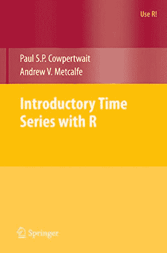
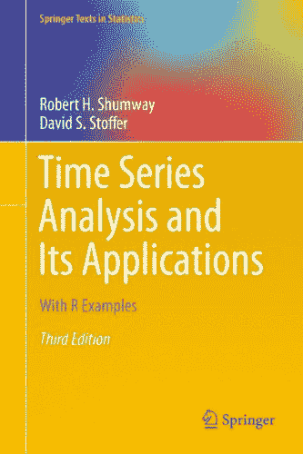
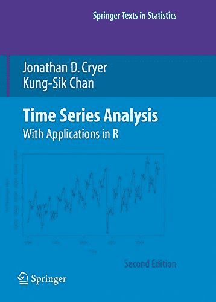
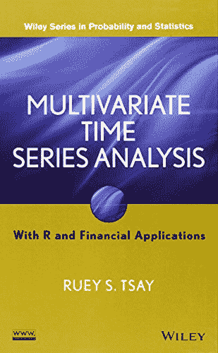
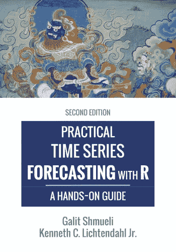

# R 的时间序列预测热门书籍

> 原文： [https://machinelearningmastery.com/books-on-time-series-forecasting-with-r/](https://machinelearningmastery.com/books-on-time-series-forecasting-with-r/)

时间序列预测是一个难题。

与分类和回归不同，时间序列数据还增加了时间维度，其强加了观察的排序。这会将行转换为需要仔细和特定处理的序列。

在这篇文章中，您将发现 R 中时间序列分析和预测的顶级书籍。这些书籍将提供您开始处理自己的时间序列预测建模问题所需的资源。

本文中涉及的 5 本顶级书籍包括：

1.  [R](http://www.amazon.com/dp/0387886974?tag=inspiredalgor-20) 的入门时间序列。
2.  [时间序列分析及其应用：R 实例](http://www.amazon.com/dp/144197864X?tag=inspiredalgor-20)。
3.  [时间序列分析：应用于 R](http://www.amazon.com/dp/0387759581?tag=inspiredalgor-20) 。
4.  [多变量时间序列分析：R 和金融应用](http://www.amazon.com/dp/1118617908?tag=inspiredalgor-20)。
5.  [R 实用时间序列预测：动手指南](http://www.amazon.com/dp/0997847913?tag=inspiredalgor-20)。

您在 R 列表中最喜欢的时间系列是否在此列表中丢失？
请在评论中告诉我。

让我们潜入。

## 要注意的时间序列主题

在我们开始之前，一本关于时间序列的好书取决于你在寻找什么。

我不知道任何书籍真正关注时间序列本身的机器学习。相反，关于时间序列分析和预测的书籍侧重于涵盖一套经典方法，例如：

*   回归模型。
*   ARIMA 模型。
*   光谱分析模型。
*   国家空间模型。

书籍还可能涵盖更多现代技术，例如：

*   重采样技术。
*   分类时间序列分析。
*   多变量光谱方法。
*   长记忆模型。
*   非线性模型
*   GARCH 模型。
*   ARMAX 型号。

在选择理想的时间序列预测书时，这些都是值得注意的好主题。

## 1.带 R 的入门时间序列

[点击了解更多信息。](http://www.amazon.com/dp/0387886974?tag=inspiredalgor-20)

[R](http://www.amazon.com/dp/0387886974?tag=inspiredalgor-20) 的入门时间序列假设您已完成第一年的统计学课程。

使用基于教程的方法，该方法侧重于给定的时间序列预测问题，分解为以下部分：

1.  问题的动机。
2.  型号说明。
3.  合成数据的模型演示。
4.  模型适用于历史案例研究数据。

涵盖了模型的数学，但可以忽略关注如何应用模型。

以下是目录列表。

1.  时间序列数据
2.  关联
3.  预测策略
4.  基本随机模型
5.  回归
6.  固定模型
7.  非平稳模型
8.  长记忆过程
9.  光谱分析
10.  系统识别
11.  多变量模型
12.  状态空间模型

本书的数据集，勘误表和源代码可以从[本书的主页](http://www.maths.adelaide.edu.au/andrew.metcalfe/)下载。

以下是亚马逊对该书的评论摘录：

> 这是对 R 中时间序列分析的精彩介绍，适用于所有使用 R 的读者。与大多数统计书相比，它并没有假设广泛的数学背景。相反，它是一个非常循序渐进的教学文本，适合悠闲自学。数学是针对每个主题简要和适当地介绍的，但进步和理解并不依赖于深入吸收它们。例如，适用于使用 R 的社会科学家，生态学家，公共政策研究人员等。

- [坐在西雅图](https://www.amazon.com/gp/review/R2PKVUTT8ERMT5)

## 2.时间序列分析及其应用

[点击了解更多信息。](http://www.amazon.com/dp/144197864X?tag=inspiredalgor-20)

[时间序列分析及其应用：以 R 为例](http://www.amazon.com/dp/144197864X?tag=inspiredalgor-20)是一本关于时间序列的本科生和研究生课程的教科书。它假设了一些回归分析背景和一些数学统计背景。

它假设了回归分析的一些背景，以及数学统计的一些经验。

本书的结构使理论和应用分离，使本书对不同的受众有用，如本科生和研究生。

这是一本受欢迎的书，已经有 4 个版本。

以下是目录列表。

1.  时间序列的特征
2.  时间序列回归和探索性数据分析
3.  ARIMA 模型
4.  光谱分析和滤波
5.  其他时域主题
6.  状态空间模型
7.  频域统计方法

该书的补充信息可以从[本书的网页](http://www.stat.pitt.edu/stoffer/tsa4/)下载。

以下是亚马逊对本书的评论片段。

> 本书涵盖了时间序列分析的所有主要领域，如 ARIMA，GARCH 和 ARMAX 模型以及光谱分析，它做得非常好。对于初学者（具有一些统计背景），大多数解释都足够清楚，并附有有效的例子（在很多时间序列文本中似乎都省略了这些例子）。

- [Genevieve Hayes](https://www.amazon.com/review/R1JVOG4WI8IC7A)

## 3.时间序列分析：应用于 R

[点击了解更多信息。](http://www.amazon.com/dp/0387759581?tag=inspiredalgor-20)

[时间序列分析：在 R](http://www.amazon.com/dp/0387759581?tag=inspiredalgor-20) 中的应用旨在涵盖时间序列模型理论及其在 R 中的应用。

本书旨在用作一学期的大学课程，并假设应用统计学的背景，侧重于多元线性回归和一些微积分。虽然附录中对一些统计概念进行了审查。

以下是目录列表。

1.  介绍
2.  基础概念
3.  趋势
4.  固定时间序列的模型
5.  非平稳时间序列的模型
6.  型号规格
7.  参数估计
8.  模型诊断
9.  预测
10.  季节性模特
11.  时间序列回归模型
12.  异方差的时间序列模型
13.  光谱分析简介
14.  估计频谱
15.  门槛模型

书中使用的源代码和数据集可以从[本书的网站](http://homepage.divms.uiowa.edu/~kchan/TSA.htm)下载。

以下是来自亚马逊的评论的片段。

> 写得很好，易于理解。但它是一本基础/初级教科书。如果我自己学习时间序列并希望使用 R 语言，我会先阅读本书

- [J. Gangolly](https://www.amazon.com/review/R3NGPC8FQKZFCW)

## 4.多变量时间序列分析

[点击了解更多](http://www.amazon.com/dp/1118617908?tag=inspiredalgor-20)

[多变量时间序列分析：R 和金融应用](http://www.amazon.com/dp/1118617908?tag=inspiredalgor-20)基于作者 30 年的教学和研究多变量时间序列分析。

本书旨在作为时间序列研究生课程和时间序列本科统计课程的参考。它确实假设熟悉单变量时间序列。

以下是目录列表。

1.  多元线性时间序列
2.  平稳向量自回归时间序列
3.  向量自回归移动平均时间序列
4.  VARMA 模型的结构规范
5.  单位根非平稳过程
6.  因子模型和选定主题
7.  多元波动率模型

本书中使用的功能和数据可在 [MST R 包](https://cran.r-project.org/web/packages/MTS/index.html)中找到。源代码和数据可以从[书的主页](http://faculty.chicagobooth.edu/ruey.tsay/teaching/mtsbk/)下载。

以下是本书亚马逊评论的摘录。

> 主题的呈现顺序是合理的。我喜欢作者立即开始使用更通用的向量/矩阵方法，并且不会浪费时间介绍单变量时间序列所构成的“特殊情况”，因为这本书对于尚未进行过的学生来说将非常困难。暴露于单变量案件。实际上，假定了对高级数学主题（例如无限阶矩阵多项式）的熟悉程度。我也很喜欢证据主要出现在章节末尾，并且作者维护着一个带有勘误列表的网页。

- [明迪](https://www.amazon.com/review/R3I8UOIKLLNBPU)

## 5.用 R 实际时间序列预测

[点击了解更多](http://www.amazon.com/dp/0997847913?tag=inspiredalgor-20)

[R 实用时间序列预测：实践指南](http://www.amazon.com/dp/0997847913?tag=inspiredalgor-20)专注于实践时间序列教学定量预测。

本书旨在用作一个学期长的本科或研究生课程，用于时间序列预测。

以下是目录列表。

1.  接近预测
2.  时间序列数据
3.  绩效评估
4.  预测方法：概述
5.  平滑方法
6.  回归模型：趋势和季节性
7.  回归模型：自相关和外部信息
8.  预测二元结果
9.  神经网络
10.  沟通与维护
11.  案例

包括数据集和源代码在内的更多信息可以在[本书的主页](http://www.forecastingbook.com/)上找到。

以下是亚马逊评论的片段：

> 对于那些希望对时间序列建模进行温和介绍的人来说真的很有吸引力：它涵盖了所有基础（平滑器，ARIMA 等），比较了不同方法的优缺点，讨论了验证和测试，包括示例代码，以便您可以立即开始，并有足够的数学符号来简化方法的描述。它简洁而不是愚蠢。对于它的成本，你真的不能在这里出错。

- [Stijn Debrouwere](https://www.amazon.com/review/RH26OFT7VU95Q)

## 摘要

在这篇文章中，您发现了 5 本关于时间序列分析和预测的顶级书籍。

您现在有资源为您自己的时间序列预测建模问题提供最佳预测方法。

**你应该买哪本书？**

查看目录并选择您认为最适合您的背景和需求的书籍。

### 我的精选

就我个人而言，我拿起这两本书：

*   [R](http://www.amazon.com/dp/0387886974?tag=inspiredalgor-20) 入门时间序列
*   [R 实用时间序列预测：动手指南](http://www.amazon.com/dp/0997847913?tag=inspiredalgor-20)

你选了哪些书？

**你有没看过这篇文章中分享的一本书？**
发表评论并分享您对它的看法。