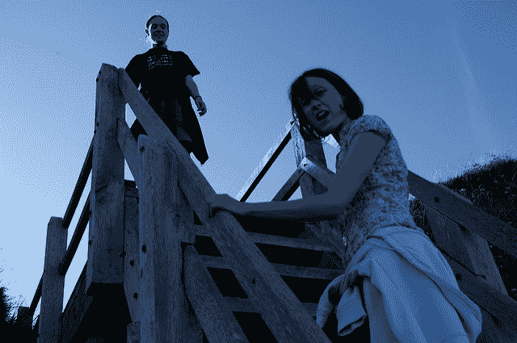

# 多步时间序列预测的 4 种策略

> 原文： [https://machinelearningmastery.com/multi-step-time-series-forecasting/](https://machinelearningmastery.com/multi-step-time-series-forecasting/)

通常讨论时间序列预测，其中仅需要一步预测。

当你需要预测未来的多个时间步骤时呢？

预测未来的多个时间步骤称为多步时间序列预测。您可以使用四种主要策略进行多步预测。

在这篇文章中，您将发现多步骤时间序列预测的四种主要策略。

阅读这篇文章后，你会知道：

*   一步和多步时间序列预测之间的差异。
*   多步预测的传统直接和递归策略。
*   用于多步预测的较新的直接递归混合和多输出策略。

让我们开始吧。

*   **更新 May / 2018** ：修正了直接策略示例中的拼写错误。



多步时间序列预测的策略
照片由 [debs-eye](https://www.flickr.com/photos/debbcollins/1570696682/) 拍摄，保留一些权利。

## 多步预测

通常，时间序列预测描述了在下一个时间步骤预测观测值。

这称为一步预测，因为只预测一个时间步长。

存在一些时间序列问题，其中必须预测多个时间步长。与一步预测相比，这些被称为多步或多步时间序列预测问题。

例如，鉴于过去 7 天观察到的温度：

```py
Time,	Temperature
1,		56
2,		50
3,		59
4,		63
5,		52
6,		60
7,		55
```

单步预测仅需要在时间步骤 8 进行预测。

多步骤可能需要对接下来的两天进行预测，如下所示：

```py
Time,	Temperature
8,		?
9,		?
```

至少有四种常用的策略可用于制定多步骤预测。

他们是：

1.  直接多步预测策略。
2.  递归多步预测策略。
3.  直接递归混合多步预测策略。
4.  多输出预测策略。

让我们依次仔细研究每种方法。

## 1.直接多步预测策略

直接方法涉及为每个预测时间步骤开发单独的模型。

在预测接下来两天的温度的情况下，我们将开发一个用于预测第 1 天温度的模型和用于预测第 2 天温度的单独模型。

例如：

```py
prediction(t+1) = model1(obs(t-1), obs(t-2), ..., obs(t-n))
prediction(t+2) = model2(obs(t-2), obs(t-3), ..., obs(t-n))
```

每个时间步长具有一个模型是增加的计算和维护负担，尤其是当预测的时间步数增加超过平凡时。

因为使用了单独的模型，这意味着没有机会对预测之间的依赖关系建模，例如第 2 天的预测依赖于第 1 天的预测，这通常是时间序列中的情况。

## 2.递归多步预测

递归策略涉及多次使用一步模型，其中先前时间步长的预测被用作用于对随后的时间步长进行预测的输入。

在预测未来两天的温度的情况下，我们将开发一步预测模型。然后该模型将用于预测第 1 天，然后该预测将用作观察输入以便预测第 2 天。

例如：

```py
prediction(t+1) = model(obs(t-1), obs(t-2), ..., obs(t-n))
prediction(t+2) = model(prediction(t+1), obs(t-1), ..., obs(t-n))
```

因为预测被用于代替观察，所以递归策略允许预测误差累积，使得表现可以随着预测时间范围的增加而迅速降低。

## 3.直接递归混合策略

直接和递归策略可以结合起来，提供两种方法的好处。

例如，可以为要预测的每个时间步骤构建单独的模型，但是每个模型可以使用由先前时间步长的模型做出的预测作为输入值。

我们可以看到这可能如何用于预测接下来两天的温度，其中使用了两个模型，但第一个模型的输出用作第二个模型的输入。

例如：

```py
prediction(t+1) = model1(obs(t-1), obs(t-2), ..., obs(t-n))
prediction(t+2) = model2(prediction(t+1), obs(t-1), ..., obs(t-n))
```

结合递归和直接策略可以帮助克服每个策略的局限性。

## 4.多输出策略

多输出策略涉及开发一个能够以一次性方式预测整个预测序列的模型。

在预测接下来两天的温度的情况下，我们将开发一个模型并用它来预测接下来的两天作为一个操作。

例如：

```py
prediction(t+1), prediction(t+2) = model(obs(t-1), obs(t-2), ..., obs(t-n))
```

多输出模型更复杂，因为它们可以学习输入和输出之间以及输出之间的依赖结构。

更复杂可能意味着他们训练较慢并需要更多数据以避免过度拟合问题。

## 进一步阅读

请参阅以下资源，以进一步阅读多步骤预测。

*   [时间序列预测的机器学习策略](http://link.springer.com/chapter/10.1007%2F978-3-642-36318-4_3)，2013
*   [递归和直接多步预测：两全其美](http://robjhyndman.com/papers/rectify.pdf)，2012 [PDF]

## 摘要

在这篇文章中，您发现了可用于进行多步时间序列预测的策略。

具体来说，你学到了：

*   如何在直接策略中训练多个并行模型或在递归策略中重用一步模型。
*   如何在混合策略中结合直接和递归策略的最佳部分。
*   如何使用多输出策略以一次性方式预测整个预测序列。

您对多步骤时间序列预测或此帖子有任何疑问吗？在下面的评论中提出您的问题，我会尽力回答。