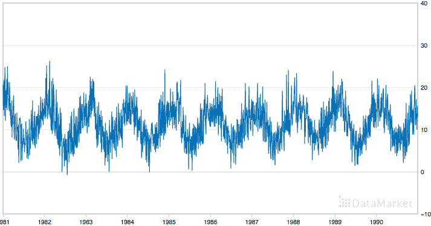

# 如何在 Python 中规范化和标准化时间序列数据

> 原文： [https://machinelearningmastery.com/normalize-standardize-time-series-data-python/](https://machinelearningmastery.com/normalize-standardize-time-series-data-python/)

如果您的时间序列数据具有一致的比例或分布，则某些机器学习算法将获得更好的表现。

可用于一致地重新缩放时间序列数据的两种技术是规范化和标准化。

在本教程中，您将了解如何将规范化和标准化重新缩放应用于 Python 中的时间序列数据。

完成本教程后，您将了解：

*   使用标准化的数据的规范化和期望的局限性。
*   需要什么参数以及如何手动计算标准化和标准化值。
*   如何使用 Python 中的 scikit-learn 来标准化和标准化您的时间序列数据。

让我们开始吧。


如何在 Python 中标准化和标准化时间序列数据
照片由 [Sage Ross](https://www.flickr.com/photos/ragesoss/5773993299/) 拍摄，保留一些权利。

## 最低每日温度数据集

该数据集描述了澳大利亚墨尔本市 10 年（1981-1990）的最低日常温度。

单位为摄氏度，有 3,650 个观测值。数据来源被称为澳大利亚气象局。

下面是前 5 行数据的示例，包括标题行。

```py
"Date","Temperatures"
"1981-01-01",20.7
"1981-01-02",17.9
"1981-01-03",18.8
"1981-01-04",14.6
"1981-01-05",15.8
```

下面是从数据市场获取的整个数据集的图表。



最低每日温度

该数据集显示了一个强大的季节性组件，并具有良好，细粒度的细节。

[在此处下载并了解有关数据集的更多信息](https://datamarket.com/data/set/2324/daily-minimum-temperatures-in-melbourne-australia-1981-1990)。

本教程假定数据集位于当前工作目录中，文件名为“ **daily-minimum-temperature-in-me.csv** ”。

**注意**：下载的文件包含一些问号（“？”）字符，必须先将其删除才能使用数据集。在文本编辑器中打开文件并删除“？”字符。同时删除文件中的任何页脚信息。

## 标准化时间序列数据

归一化是对原始范围内的数据进行重新缩放，以使所有值都在 0 和 1 的范围内。

当你的时间序列数据具有不同尺度的输入值时，归一化可能是有用的，甚至在某些机器学习算法中也是必需的。对于算法，例如 k-最近邻，它使用距离计算和线性回归和人工神经网络可能需要归一化。重量输入值。

标准化要求您知道或能够准确估计最小和最大可观察值。您可以从可用数据中估算这些值。如果您的时间序列趋势向上或向下，估计这些预期值可能会很困难，并且规范化可能不是用于解决问题的最佳方法。

值按如下标准化：

```py
y = (x - min) / (max - min)
```

其中最小值和最大值与值 **x** 归一化有关。

例如，对于温度数据，我们可以将最小和最大可观察值猜测为 30 和-10，这些值大大超过和低估。然后我们可以将 18.8 之类的任何值标准化，如下所示：

```py
y = (x - min) / (max - min)
y = (18.8 - -10) / (30 - -10)
y = 28.8 / 40
y = 0.72
```

您可以看到，如果提供的 **x** 值超出最小值和最大值的范围，则结果值将不在 0 和 1 的范围内。您可以先检查这些观察结果进行预测并从数据集中删除它们或将它们限制为预定义的最大值或最小值。

您可以使用 scikit-learn 对象 [MinMaxScaler](http://scikit-learn.org/stable/modules/generated/sklearn.preprocessing.MinMaxScaler.html) 来规范化数据集。

_MinMaxScaler_ 和其他重新缩放技术的良好实践用法如下：

1.  **使用可用的训练数据**调整定标器。对于归一化，这意味着训练数据将用于估计最小和最大可观察值。这是通过调用 _fit（）_ 函数来完成的，
2.  **将比例应用于训练数据**。这意味着您可以使用标准化数据来训练模型。这是通过调用 _transform（）_ 函数来完成的
3.  **将比例应用于前进的数据**。这意味着您可以在将来准备要预测的新数据。

如果需要，可以反转变换。这对于将预测转换回其原始比例以进行报告或绘图非常有用。这可以通过调用 _inverse_transform（）_ 函数来完成。

以下是标准化每日最低温度数据集的示例。

缩放器要求将数据作为行和列的矩阵提供。加载的时间序列数据作为 Pandas _ 系列 _ 加载。然后必须将其重新整形为具有 3,650 行的一列矩阵。

然后使用重新整形的数据集来拟合缩放器，对数据集进行归一化，然后反转归一化变换以再次显示原始值。

```py
# Normalize time series data
from pandas import Series
from sklearn.preprocessing import MinMaxScaler
# load the dataset and print the first 5 rows
series = Series.from_csv('daily-minimum-temperatures-in-me.csv', header=0)
print(series.head())
# prepare data for normalization
values = series.values
values = values.reshape((len(values), 1))
# train the normalization
scaler = MinMaxScaler(feature_range=(0, 1))
scaler = scaler.fit(values)
print('Min: %f, Max: %f' % (scaler.data_min_, scaler.data_max_))
# normalize the dataset and print the first 5 rows
normalized = scaler.transform(values)
for i in range(5):
	print(normalized[i])
# inverse transform and print the first 5 rows
inversed = scaler.inverse_transform(normalized)
for i in range(5):
	print(inversed[i])
```

运行该示例将从已加载的数据集中打印前 5 行，以其标准化形式显示相同的 5 个值，然后使用逆变换将值返回其原始比例。

我们还可以看到数据集的最小值和最大值分别为 0 和 26.3。

```py
Date
1981-01-01 20.7
1981-01-02 17.9
1981-01-03 18.8
1981-01-04 14.6
1981-01-05 15.8
Name: Temp, dtype: float64
Min: 0.000000, Max: 26.300000
[ 0.78707224]
[ 0.68060837]
[ 0.7148289]
[ 0.55513308]
[ 0.60076046]
[ 20.7]
[ 17.9]
[ 18.8]
[ 14.6]
[ 15.8]
```

还有另一种类型的重新缩放对于超出预期值范围的新值更加稳健;这称为标准化。我们接下来会看一下。

## 标准化时间序列数据

标准化数据集涉及重新调整值的分布，以便观察值的平均值为 0，标准差为 1。

这可以被认为是减去平均值或使数据居中。

与标准化一样，当您的时间序列数据具有不同比例的输入值时，标准化可能是有用的，甚至在某些机器学习算法中也是必需的。

标准化假定您的观察结果符合高斯分布（钟形曲线），具有良好的平均值和标准偏差。如果不满足此期望，您仍然可以标准化时间序列数据，但可能无法获得可靠的结果。

这包括支持向量机，线性和逻辑回归等算法，以及其他假设或使用高斯数据提高表现的算法。

标准化要求您知道或能够准确估计可观察值的均值和标准差。您可以从训练数据中估算这些值。

值标准化如下：

```py
y = (x - mean) / standard_deviation
```

_ 表示 _ 的计算方法如下：

```py
mean = sum(x) / count(x)
```

_standard_deviation_ 计算如下：

```py
standard_deviation = sqrt( sum( (x - mean)^2 ) / count(x))
```

例如，我们可以绘制最低每日温度数据集的直方图，如下所示：

```py
from pandas import Series
from matplotlib import pyplot
series = Series.from_csv('daily-minimum-temperatures-in-me.csv', header=0)
series.hist()
pyplot.show()
```

运行代码会给出以下图表，该图表显示数据集的高斯分布，如标准化所假设的那样。


最低每日温度直方图

我们可以估计平均温度为 10，标准偏差约为 5.使用这些值，我们可以将数据集中的第一个值标准化为 20.7，如下所示：

```py
y = (x - mean) / standard_deviation
y = (20.7 - 10) / 5
y = (10.7) / 5
y = 2.14
```

数据集的均值和标准差估计值对于新数据可能比最小值和最大值更稳健。

您可以使用 scikit-learn 对象 [StandardScaler](http://scikit-learn.org/stable/modules/generated/sklearn.preprocessing.StandardScaler.html) 标准化数据集。

以下是标准化每日最低温度数据集的示例。

```py
# Standardize time series data
from pandas import Series
from sklearn.preprocessing import StandardScaler
from math import sqrt
# load the dataset and print the first 5 rows
series = Series.from_csv('daily-minimum-temperatures-in-me.csv', header=0)
print(series.head())
# prepare data for standardization
values = series.values
values = values.reshape((len(values), 1))
# train the standardization
scaler = StandardScaler()
scaler = scaler.fit(values)
print('Mean: %f, StandardDeviation: %f' % (scaler.mean_, sqrt(scaler.var_)))
# standardization the dataset and print the first 5 rows
normalized = scaler.transform(values)
for i in range(5):
	print(normalized[i])
# inverse transform and print the first 5 rows
inversed = scaler.inverse_transform(normalized)
for i in range(5):
	print(inversed[i])
```

运行该示例将打印数据集的前 5 行，打印标准化的相同值，然后以原始比例打印值。

我们可以看到估计的平均值和标准偏差分别为 11.1 和 4.0。

```py
Date
1981-01-01 20.7
1981-01-02 17.9
1981-01-03 18.8
1981-01-04 14.6
1981-01-05 15.8
Name: Temp, dtype: float64
Mean: 11.177753, StandardDeviation: 4.071279
[ 2.33888328]
[ 1.65113873]
[ 1.87219948]
[ 0.84058266]
[ 1.13533032]
[ 20.7]
[ 17.9]
[ 18.8]
[ 14.6]
[ 15.8]
```

## 摘要

在本教程中，您了解了如何在 Python 中规范化和标准化时间序列数据。

具体来说，你学到了：

*   一些机器学习算法在建模时表现更好甚至需要重新调整数据。
*   如何手动计算规范化和标准化所需的参数。
*   如何使用 Python 中的 scikit-learn 对时间序列数据进行标准化和标准化。

您对重新缩短时间序列数据或此帖子有任何疑问吗？
在评论中提出您的问题，我会尽力回答。