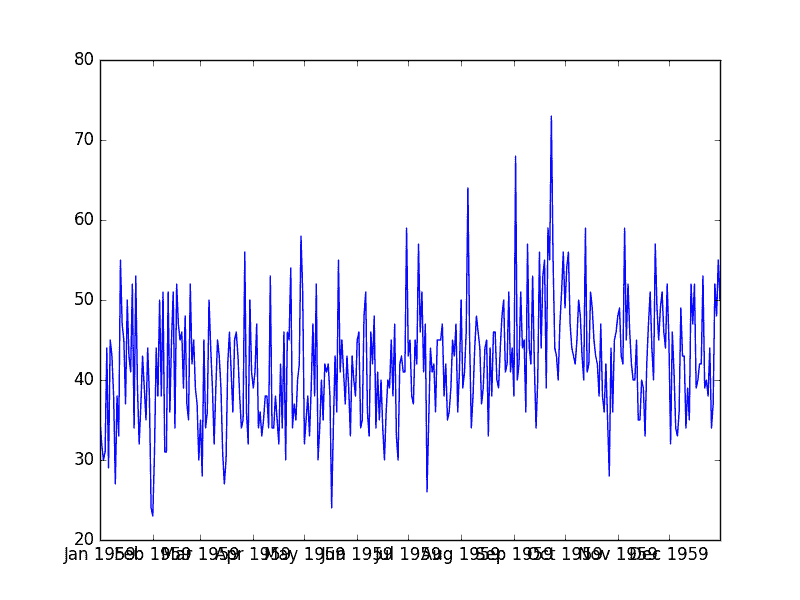

# 如何在 Python 中保存 ARIMA 时间序列预测模型

> 原文： [https://machinelearningmastery.com/save-arima-time-series-forecasting-model-python/](https://machinelearningmastery.com/save-arima-time-series-forecasting-model-python/)

自回归整合移动平均模型（ARIMA）是一种流行的时间序列分析和预测线性模型。

[statsmodels 库](http://statsmodels.sourceforge.net/)提供了用于 Python 的 ARIMA 实现。 ARIMA 模型可以保存到文件中，以便以后用于对新数据进行预测。当前版本的 statsmodels 库中存在一个错误，该错误会阻止加载已保存的模型。

在本教程中，您将了解如何诊断和解决此问题。

让我们开始吧。


如何在 Python 中保存 ARIMA 时间序列预测模型
照片由 [Les Chatfield](https://www.flickr.com/photos/elsie/15583121591/) 保留，保留一些权利。

## 每日女性出生数据集

首先，让我们看一下标准时间序列数据集，我们可以用它来理解 statsmodels ARIMA 实现的问题。

这个每日女性出生数据集描述了 1959 年加利福尼亚州每日女性出生的数量。

单位是计数，有 365 个观测值。数据集的来源归功于 Newton（1988）。

[您可以从 DataMarket 网站](https://datamarket.com/data/set/235k/daily-total-female-births-in-california-1959)了解更多信息并下载数据集。

下载数据集并将其放在当前工作目录中，文件名为“ _daily-total-female-births.csv_ ”。

下面的代码片段将加载并绘制数据集。

```py
from pandas import Series
from matplotlib import pyplot
series = Series.from_csv('daily-total-female-births.csv', header=0)
series.plot()
pyplot.show()
```

运行该示例将数据集作为 Pandas Series 加载，然后显示数据的线图。



每日总女性出生情节

## Python 环境

确认您使用的是 [statsmodels 库](http://statsmodels.sourceforge.net/)的最新版本。

你可以通过运行下面的脚本来做到这一点：

```py
import statsmodels
print('statsmodels: %s' % statsmodels.__version__)
```

运行脚本应生成显示 statsmodels 0.6 或 0.6.1 的结果。

```py
statsmodels: 0.6.1
```

您可以使用 Python 2 或 3。

**更新**：我可以确认 statsmodels 0.8 中仍然存在故障并导致错误消息：

```py
AttributeError: 'ARIMA' object has no attribute 'dates'
```

## ARIMA 模型保存 Bug

我们可以在 Daily Female Births 数据集上轻松训练 ARIMA 模型。

下面的代码片段在数据集上训练 ARIMA（1,1,1）。

[model.fit（）](http://statsmodels.sourceforge.net/stable/generated/statsmodels.tsa.arima_model.ARIMA.fit.html#statsmodels.tsa.arima_model.ARIMA.fit)函数返回一个 [ARIMAResults](http://statsmodels.sourceforge.net/stable/generated/statsmodels.tsa.arima_model.ARIMAResults.html) 对象，我们可以在其上调用 [save（）](http://statsmodels.sourceforge.net/stable/generated/statsmodels.tsa.arima_model.ARIMAResults.save.html)将模型保存到文件和 [load（）](http://statsmodels.sourceforge.net/stable/generated/statsmodels.tsa.arima_model.ARIMAResults.load.html) 以后加载它。

```py
from pandas import Series
from statsmodels.tsa.arima_model import ARIMA
from statsmodels.tsa.arima_model import ARIMAResults
# load data
series = Series.from_csv('daily-total-female-births.csv', header=0)
# prepare data
X = series.values
X = X.astype('float32')
# fit model
model = ARIMA(X, order=(1,1,1))
model_fit = model.fit()
# save model
model_fit.save('model.pkl')
# load model
loaded = ARIMAResults.load('model.pkl')
```

运行此示例将训练模型并将其保存到文件中没有问题。

尝试从文件加载模型时将报告错误。

```py
Traceback (most recent call last):
  File "...", line 16, in <module>
    loaded = ARIMAResults.load('model.pkl')
  File ".../site-packages/statsmodels/base/model.py", line 1529, in load
    return load_pickle(fname)
  File ".../site-packages/statsmodels/iolib/smpickle.py", line 41, in load_pickle
    return cPickle.load(fin)
TypeError: __new__() takes at least 3 arguments (1 given)
```

具体来说，注意这一行：

```py
TypeError: __new__() takes at least 3 arguments (1 given)
```

到目前为止一切顺利，我们如何解决它？

## ARIMA 模型保存 Bug 解决方法

Zae Myung Kim 于 2016 年 9 月发现了这个错误，并报告了这个错误。

你可以在这里读到所有和它有关的：

*   [BUG：实现 __getnewargs __（）方法取消](https://github.com/statsmodels/statsmodels/pull/3217)

发生该错误是因为 [pickle](https://docs.python.org/2/library/pickle.html) （用于序列化 Python 对象的库）所需的函数尚未在 statsmodels 中定义。

必须在保存之前在 ARIMA 模型中定义函数 [__getnewargs__](https://docs.python.org/2/library/pickle.html#object.__getnewargs__) ，该函数定义构造对象所需的参数。

我们可以解决这个问题。修复涉及两件事：

1.  定义适合 ARIMA 对象的 ___getnewargs___ 函数的实现。
2.  将新功能添加到 ARIMA。

值得庆幸的是，Zae Myung Kim 在他的错误报告中提供了该函数的示例，因此我们可以直接使用它：

```py
def __getnewargs__(self):
	return ((self.endog),(self.k_lags, self.k_diff, self.k_ma))
```

Python 允许我们[猴子补丁](https://en.wikipedia.org/wiki/Monkey_patch)一个对象，甚至像 statsmodels 这样的库。

我们可以使用赋值在现有对象上定义新函数。

我们可以为 ARIMA 对象上的 ___getnewargs___ 函数执行此操作，如下所示：

```py
ARIMA.__getnewargs__ = __getnewargs__
```

下面列出了使用 Monkey 补丁在 Python 中训练，保存和加载 ARIMA 模型的完整示例：

```py
from pandas import Series
from statsmodels.tsa.arima_model import ARIMA
from statsmodels.tsa.arima_model import ARIMAResults

# monkey patch around bug in ARIMA class
def __getnewargs__(self):
	return ((self.endog),(self.k_lags, self.k_diff, self.k_ma))
ARIMA.__getnewargs__ = __getnewargs__

# load data
series = Series.from_csv('daily-total-female-births.csv', header=0)
# prepare data
X = series.values
X = X.astype('float32')
# fit model
model = ARIMA(X, order=(1,1,1))
model_fit = model.fit()
# save model
model_fit.save('model.pkl')
# load model
loaded = ARIMAResults.load('model.pkl')
```

现在运行该示例成功加载模型而没有错误。

## 摘要

在这篇文章中，您了解了如何解决 statsmodels ARIMA 实现中的一个错误，该错误阻止您在文件中保存和加载 ARIMA 模型。

你发现了如何编写一个猴子补丁来解决这个 bug，以及如何证明它确实已被修复。

您是否在项目中使用此解决方法？
请在下面的评论中告诉我。