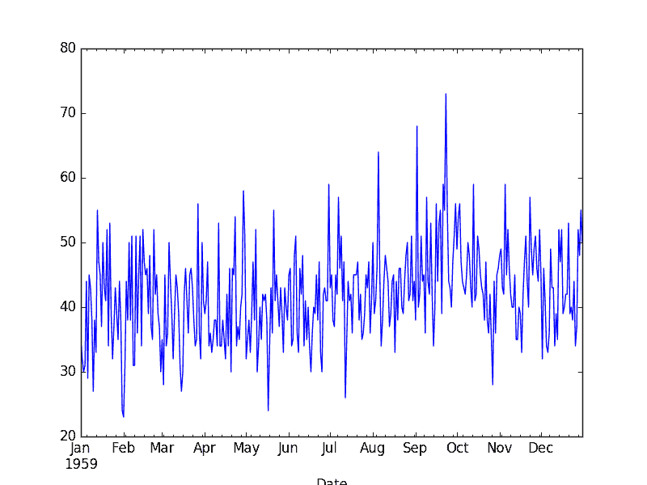
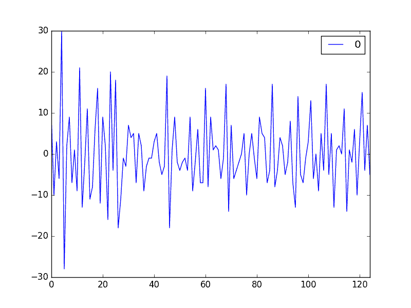
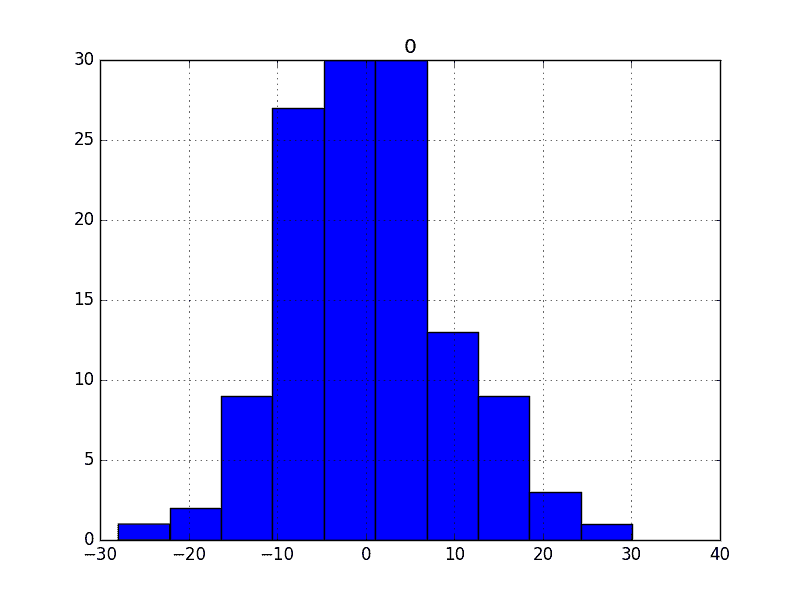
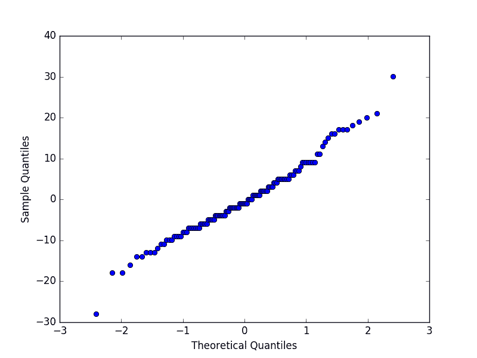
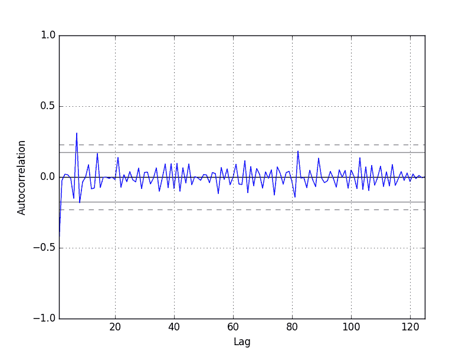

# 如何用 Python 可视化时间序列残差预测错误

> 原文： [https://machinelearningmastery.com/visualize-time-series-residual-forecast-errors-with-python/](https://machinelearningmastery.com/visualize-time-series-residual-forecast-errors-with-python/)

时间序列回归问题的预测误差称为残差或残差。

仔细探索时间序列预测问题中的残差可以告诉您很多关于您的预测模型，甚至建议改进。

在本教程中，您将了解如何从时间序列预测中可视化残差。

完成本教程后，您将了解：

*   如何创建和查看残余错误随时间变化的线图。
*   如何查看残差图分布的摘要统计和图表。
*   如何探讨残差的相关结构。

让我们开始吧。

## 剩余预测错误

时间序列预测问题的预测误差称为残差或残差。

剩余误差计算为预期结果减去预测，例如：

```py
residual error = expected - forecast
```

或者，更简洁，并使用标准术语：

```py
e = y - yhat
```

我们经常停在那里并总结模型的技巧作为此错误的摘要。

相反，我们可以在所有预测中收集这些个别残差，并使用它们来更好地理解预测模型。

通常，在探索残差时，我们正在寻找模式或结构。模式的标志表明错误不是随机的。

我们期望残差是随机的，因为这意味着模型已经捕获了所有结构，剩下的唯一错误是无法建模的时间序列中的随机波动。

模式或结构的标志表明模型可以捕获并使用更多信息来进行更好的预测。

在我们开始探索在残差中寻找模式的不同方法之前，我们需要上下文。在下一节中，我们将查看一个数据集和一个简单的预测方法，我们将使用它们来生成本教程中要探索的残差。

## 每日女性出生数据集

该数据集描述了 1959 年加利福尼亚州每日女性出生人数。

单位是计数，有 365 个观测值。数据集的来源归功于牛顿，1988 年。

[在此处下载并了解有关数据集的更多信息](https://datamarket.com/data/set/235k/daily-total-female-births-in-california-1959)。

下载数据集并将其放在当前工作目录中，文件名为“ _daily-total-female-births.csv_ ”。

以下是从 CSV 加载每日女性出生数据集的示例。

```py
from pandas import Series
from matplotlib import pyplot
series = Series.from_csv('daily-total-female-births.csv', header=0)
print(series.head())
series.plot()
pyplot.show()
```

运行该示例将打印加载文件的前 5 行。

```py
Date
1959-01-01 35
1959-01-02 32
1959-01-03 30
1959-01-04 31
1959-01-05 44
Name: Births, dtype: int64
```

数据集也以随时间变化的观察线图显示。



每日女性出生数据集

### 持久性预测模型

我们可以做的最简单的预测是预测上一个时间步骤中发生的事情将与下一个时间步骤中发生的情况相同。

这称为“_ 朴素预测 _”或持久性预测模型。

我们可以在 Python 中实现持久性模型。

加载数据集后，它被定性为监督学习问题。创建数据集的滞后版本，其中先前时间步长（t-1）用作输入变量，下一时间步骤（t + 1）用作输出变量。

```py
# create lagged dataset
values = DataFrame(series.values)
dataframe = concat([values.shift(1), values], axis=1)
dataframe.columns = ['t-1', 't+1']
```

接下来，数据集分为训练集和测试集。共有 66％的数据用于训练，其余 34％用于测试集。持久性模型不需要训练;这只是一种标准的测试工具方法。

拆分后，列车和测试装置将分为输入和输出组件。

```py
# split into train and test sets
X = dataframe.values
train_size = int(len(X) * 0.66)
train, test = X[1:train_size], X[train_size:]
train_X, train_y = train[:,0], train[:,1]
test_X, test_y = test[:,0], test[:,1]
```

通过预测输出值（ _y_ ）作为输入值（ _x_ ）的副本来应用持久性模型。

```py
# persistence model
predictions = [x for x in test_X]
```

然后将残余误差计算为预期结果（ _test_y_ ）和预测（_ 预测 _）之间的差异。

```py
# calculate residuals
residuals = [test_y[i]-predictions[i] for i in range(len(predictions))]
```

该示例将所有这些放在一起，并为我们提供了一组残余预测错误，我们可以在本教程中探讨这些错误。

```py
from pandas import Series
from pandas import DataFrame
from pandas import concat
series = Series.from_csv('daily-total-female-births.csv', header=0)
# create lagged dataset
values = DataFrame(series.values)
dataframe = concat([values.shift(1), values], axis=1)
dataframe.columns = ['t-1', 't+1']
# split into train and test sets
X = dataframe.values
train_size = int(len(X) * 0.66)
train, test = X[1:train_size], X[train_size:]
train_X, train_y = train[:,0], train[:,1]
test_X, test_y = test[:,0], test[:,1]
# persistence model
predictions = [x for x in test_X]
# calculate residuals
residuals = [test_y[i]-predictions[i] for i in range(len(predictions))]
residuals = DataFrame(residuals)
print(residuals.head())
```

运行该示例将打印预测残差的前 5 行。

```py
0   9.0
1 -10.0
2   3.0
3  -6.0
4  30.0
```

## 剩余线图

第一个图是将残差预测误差随时间变化作为线图。

我们期望该图在 0 的值附近是随机的，并且不显示任何趋势或循环结构。

剩余错误数组可以包装在 Pandas DataFrame 中并直接绘制。下面的代码提供了一个示例。

```py
from pandas import Series
from pandas import DataFrame
from pandas import concat
from matplotlib import pyplot
series = Series.from_csv('daily-total-female-births.csv', header=0)
# create lagged dataset
values = DataFrame(series.values)
dataframe = concat([values.shift(1), values], axis=1)
dataframe.columns = ['t-1', 't+1']
# split into train and test sets
X = dataframe.values
train_size = int(len(X) * 0.66)
train, test = X[1:train_size], X[train_size:]
train_X, train_y = train[:,0], train[:,1]
test_X, test_y = test[:,0], test[:,1]
# persistence model
predictions = [x for x in test_X]
# calculate residuals
residuals = [test_y[i]-predictions[i] for i in range(len(predictions))]
residuals = DataFrame(residuals)
# plot residuals
residuals.plot()
pyplot.show()
```

运行该示例显示了剩余时间序列的看似随机的图。

如果我们确实看到趋势，季节性或循环结构，我们可以回到我们的模型并尝试直接捕获这些元素。



每日女性出生数据集残差的线图

接下来，我们将查看可用于查看错误如何在零周围传播的摘要统计信息。

## 剩余摘要统计

我们可以计算剩余误差的汇总统计数据。

首先，我们对残差的平均值感兴趣。接近于零的值表明预测中没有偏差，而正值和负值表明预测中存在正偏差或负偏差。

了解预测中的偏差很有用，因为它可以在使用或评估之前直接在预测中进行校正。

下面是计算残差分布的汇总统计量的示例。这包括分布的均值和标准差，以及百分位数和观察到的最小和最大误差。

```py
from pandas import Series
from pandas import DataFrame
from pandas import concat
from matplotlib import pyplot
series = Series.from_csv('daily-total-female-births.csv', header=0)
# create lagged dataset
values = DataFrame(series.values)
dataframe = concat([values.shift(1), values], axis=1)
dataframe.columns = ['t-1', 't+1']
# split into train and test sets
X = dataframe.values
train_size = int(len(X) * 0.66)
train, test = X[1:train_size], X[train_size:]
train_X, train_y = train[:,0], train[:,1]
test_X, test_y = test[:,0], test[:,1]
# persistence model
predictions = [x for x in test_X]
# calculate residuals
residuals = [test_y[i]-predictions[i] for i in range(len(predictions))]
residuals = DataFrame(residuals)
# summary statistics
print(residuals.describe())
```

运行该示例显示接近零的平均错误值，但可能不够接近。

它表明可能存在一些偏差，我们可以通过执行偏差校正来进一步改进模型。这可以通过将平均残差（0.064000）添加到预测来完成。

这可能适用于这种情况，但它是一种朴素的偏差校正形式，并且有更复杂的方法可用。

```py
count  125.000000
mean     0.064000
std      9.187776
min    -28.000000
25%     -6.000000
50%     -1.000000
75%      5.000000
max     30.000000
```

接下来，我们将超越摘要统计，并查看可视化残差错误分布的方法。

## 残差直方图和密度图

可以使用绘图来更好地理解除摘要统计之外的错误分布。

我们希望预测误差通常分布在零均值附近。

图可以帮助发现此分布中的偏差。

我们可以使用直方图和密度图来更好地理解残差的分布。下面是创建每个绘图之一的示例。

```py
from pandas import Series
from pandas import DataFrame
from pandas import concat
from matplotlib import pyplot
series = Series.from_csv('daily-total-female-births.csv', header=0)
# create lagged dataset
values = DataFrame(series.values)
dataframe = concat([values.shift(1), values], axis=1)
dataframe.columns = ['t-1', 't+1']
# split into train and test sets
X = dataframe.values
train_size = int(len(X) * 0.66)
train, test = X[1:train_size], X[train_size:]
train_X, train_y = train[:,0], train[:,1]
test_X, test_y = test[:,0], test[:,1]
# persistence model
predictions = [(x-0.064000) for x in test_X]
# calculate residuals
residuals = [test_y[i]-predictions[i] for i in range(len(predictions))]
residuals = DataFrame(residuals)
# histogram plot
residuals.hist()
pyplot.show()
# density plot
residuals.plot(kind='kde')
pyplot.show()
```

我们可以看到分布确实具有高斯外观，但可能更尖，显示具有一些不对称性的指数分布。

如果绘图显示明显非高斯分布，则表明建模过程所做的假设可能不正确，并且可能需要不同的建模方法。

大的偏斜可能表明在建模之前对数据执行变换的机会，例如采用对数或平方根。



每日女性出生数据集残差的直方图


每日女性出生数据集残差的密度图

接下来，我们将看另一种快速，可能更可靠的方法来检查残差的分布是否为高斯分布。

## 剩余 Q-Q 图

Q-Q 图或[分位数图](https://en.wikipedia.org/wiki/Q%E2%80%93Q_plot)比较两个分布，可用于查看它们恰好相似或不同。

我们可以使用 statsmodels 库中的 [qqplot（）](http://statsmodels.sourceforge.net/devel/generated/statsmodels.graphics.gofplots.qqplot.html)函数创建 Q-Q 图。

Q-Q 图可用于快速检查残差分布的正态性。

对这些值进行排序并与理想化的高斯分布进行比较。比较显示为散点图（在 x 轴上为理论值并在 y 轴上观察），其中两个分布之间的匹配显示为从图的左下到右上的对角线。

该情节有助于发现明显的偏离这种期望。

下面是残差的 Q-Q 图的示例。 x 轴表示理论分位数，y 轴表示样本分位数。

```py
from pandas import Series
from pandas import DataFrame
from pandas import concat
from matplotlib import pyplot
import numpy
from statsmodels.graphics.gofplots import qqplot
series = Series.from_csv('daily-total-female-births.csv', header=0)
# create lagged dataset
values = DataFrame(series.values)
dataframe = concat([values.shift(1), values], axis=1)
dataframe.columns = ['t-1', 't+1']
# split into train and test sets
X = dataframe.values
train_size = int(len(X) * 0.66)
train, test = X[1:train_size], X[train_size:]
train_X, train_y = train[:,0], train[:,1]
test_X, test_y = test[:,0], test[:,1]
# persistence model
predictions = [(x-0.064000) for x in test_X]
# calculate residuals
residuals = [test_y[i]-predictions[i] for i in range(len(predictions))]
residuals = numpy.array(residuals)
qqplot(residuals)
pyplot.show()
```

运行该示例显示了 Q-Q 图，该分布看起来很正常，有一些凸起和异常值。



每日女性出生数据集残差的 Q-Q 图

接下来，我们可以检查错误随时间的相关性。

## 残差自相关图

自相关计算观察和先前时间步骤的观察之间关系的强度。

我们可以计算剩余误差时间序列的自相关并绘制结果。这称为自相关图。

我们不希望残差之间存在任何相关性。这将通过自相关分数低于显着性阈值（图上的虚线和虚线水平线）来显示。

剩余图中的显着自相关表明该模型可以更好地结合观察与滞后观察之间的关系，称为自回归。

Pandas 提供了一个用于计算自相关图的内置函数，称为 autocorrelation_plot（）。

下面是可视化残差的自相关的示例。 x 轴显示滞后，y 轴显示观察值和滞后变量之间的相关性，其中相关值分别在-1 和 1 之间，用于负相关和正相关。

```py
from pandas import Series
from pandas import DataFrame
from pandas import concat
from matplotlib import pyplot
from pandas.tools.plotting import autocorrelation_plot
series = Series.from_csv('daily-total-female-births.csv', header=0)
# create lagged dataset
values = DataFrame(series.values)
dataframe = concat([values.shift(1), values], axis=1)
dataframe.columns = ['t-1', 't+1']
# split into train and test sets
X = dataframe.values
train_size = int(len(X) * 0.66)
train, test = X[1:train_size], X[train_size:]
train_X, train_y = train[:,0], train[:,1]
test_X, test_y = test[:,0], test[:,1]
# persistence model
predictions = [x for x in test_X]
# calculate residuals
residuals = [test_y[i]-predictions[i] for i in range(len(predictions))]
residuals = DataFrame(residuals)
autocorrelation_plot(residuals)
pyplot.show()
```

运行该示例会创建其他残差的自回归图。

整个情节我们没有看到明显的自相关趋势。可能存在一些值得进一步调查的正自相关，这在滞后 7 处似乎很重要。



每日女性出生数据集残差的自相关图

## 摘要

在本教程中，您了解了如何使用 Python 探索残差预测错误的时间序列。

具体来说，你学到了：

*   如何将预测残差的时间序列绘制为线图。
*   如何使用统计，密度图和 Q-Q 图来探索残差的分布。
*   如何检查自相关的剩余时间序列。

您对探索剩余错误时间序列或本教程有任何疑问吗？
在下面的评论中提出您的问题。