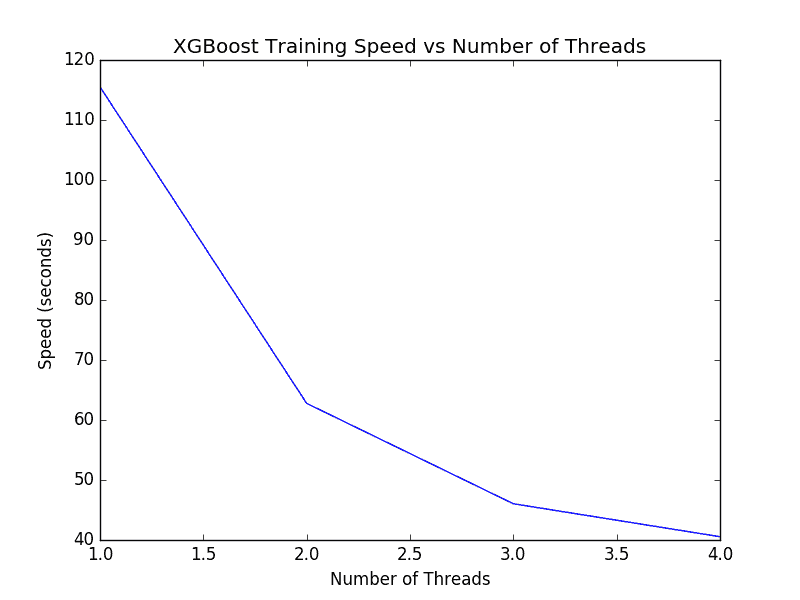

# 在 Python 中如何调优 XGBoost 的多线程支持

> 原文： [https://machinelearningmastery.com/best-tune-multithreading-support-xgboost-python/](https://machinelearningmastery.com/best-tune-multithreading-support-xgboost-python/)

为梯度提升（gradient boosting）而设计的 XGBoost 库具有高效的多核并行处理功能。

它能够在训练时有效地使用系统中的所有 CPU 核心。

在这篇文章中，您将了解在 Python 中使用 XGBoost 的并行处理能力。

阅读之后您会学习到：

*   如何确认 XGBoost 多线程功能可以在您的系统上运行。
*   如何在增加 XGBoost 上的线程数之后评估其效果。
*   如何在使用交叉验证和网格搜索(grid search)时充分利用多线程的 XGBoost。

让我们开始吧。

*   **2017 年 1 月更新**：对应 scikit-learn API 版本 0.18.1 中的更改​​。


在 Python 中如何调优 XGBoost 的多线程支持
照片由 [Nicholas A. Tonelli](https://www.flickr.com/photos/nicholas_t/14946860658/) 拍摄，保留部分版权。

## 问题描述：Otto Dataset

在本教程中，我们将使用 [Otto Group 产品分类挑战赛](https://www.kaggle.com/c/otto-group-product-classification-challenge)数据集。

数据集可从 Kaggle 获得（您需要注册 Kaggle 以获取下载权限）。从[数据页面（Data page）](https://www.kaggle.com/c/otto-group-product-classification-challenge/data)下载训练数据集 **train.zip** ，并将解压之后的 **trian.csv** 文件放入您的工作目录。

该数据集描述了超过 61,000 件产品的 93 个模糊细节。这些产品被分为 10 个类别（例如时尚，电子等）。填入属性(input attributes)是该种类对不同事件的计数。

任务目标是对新产品进行预测，在一个数组中给出分属 10 个类别的概率。评估模型将使用多类对数损失（multiclass logarithmic loss）（也称为交叉熵）。

这个竞赛已在 2015 年 5 月结束，该数据集对 XGBoost 来说是一个很好的挑战，因为有相当大规模的范例以及较大的问题难度，并且需要很少的数据准备（除了将字符串类型变量编码为整数）。

## 线程数的影响

XGBoost 是由 C++ 实现的，显式地使用 [OpenMP API](https://en.wikipedia.org/wiki/OpenMP) 来进行并行处理。

梯度提升中的并行性可以应用于单树（individual trees）的构建，而不是像随机森林并行创建树。这是因为在提升(boosting)中，树是被顺序添加到模型中。 XGBoost 的速度改观既体现在构造单树（individual trees）时添加并行性，也体现在有效地准备输入数据，以帮助加快树的构建。

根据您系统的平台，您可能需要专门编译 XGBoost 以支持多线程。详细信息请参阅 [XGBoost 安装说明](https://github.com/dmlc/xgboost/blob/master/doc/build.md)。

XGBoost 的 **XGBClassifier** 和 **XGBRegressor** 包装类给 scikit-learn 的使用提供了 **nthread** 参数，用于指定 XGBoost 在训练期间可以使用的线程数。

默认情况下，此参数设置为-1 以使用系统中的所有核心。

```py
model = XGBClassifier(nthread=-1)
```

通常，您应该从 XGBoost 安装中直接获得多线程支持，而无需任何额外的工作。

根据您的 Python 环境（例如 Python 3），可能需要显式启用 XGBoost 的多线程支持。如果您需要帮助， [XGBoost 库提供了一个示例](https://github.com/dmlc/xgboost/blob/master/demo/guide-python/sklearn_parallel.py)。

您可以通过构建一定数量的不同的 XGBoost 模型来确认 XGBoost 多线程支持是否正常工作，指定线程数并计算构建每个模型所需的时间。这一过程将向您表明启用了多线程支持，并显示构建模型时的时长效果。

例如，如果您的系统有 4 个核心，您可以训练 8 个不同的模型，并计算创建每个模型所需的时间（以秒为单位），然后比较时长。

```py
# evaluate the effect of the number of threads
results = []
num_threads = [1, 2, 3, 4]
for n in num_threads:
	start = time.time()
	model = XGBClassifier(nthread=n)
	model.fit(X_train, y_train)
	elapsed = time.time() - start
	print(n, elapsed)
	results.append(elapsed)
```

我们可以在 Otto 数据集上使用这种方法。为说明的完备性，下面给出完整示例。

您可以更改 **num_threads** 数组以符合您系统的核心数。

```py
# Otto, tune number of threads
from pandas import read_csv
from xgboost import XGBClassifier
from sklearn.preprocessing import LabelEncoder
import time
from matplotlib import pyplot
# load data
data = read_csv('train.csv')
dataset = data.values
# split data into X and y
X = dataset[:,0:94]
y = dataset[:,94]
# encode string class values as integers
label_encoded_y = LabelEncoder().fit_transform(y)
# evaluate the effect of the number of threads
results = []
num_threads = [1, 2, 3, 4]
for n in num_threads:
	start = time.time()
	model = XGBClassifier(nthread=n)
	model.fit(X, label_encoded_y)
	elapsed = time.time() - start
	print(n, elapsed)
	results.append(elapsed)
# plot results
pyplot.plot(num_threads, results)
pyplot.ylabel('Speed (seconds)')
pyplot.xlabel('Number of Threads')
pyplot.title('XGBoost Training Speed vs Number of Threads')
pyplot.show()
```

运行这段示例代码将记录不同配置下的训练执行时间（以秒为单位），例如：

```py
(1, 115.51652717590332)
(2, 62.7727689743042)
(3, 46.042901039123535)
(4, 40.55334496498108)
```

下图给出这些时间的直观说明。



单个模型的 XGBoost 调节线程数

随着线程数量的增加，我们可以看到执行时间减少的优越趋势。

如果您没有看到增加每个新线程的运行时间有所改善，可能需要检查怎样在安装过程中或运行过程中启用 XGBoost 多线程支持。

我们可以在具有更多核心的机器上运行相同的代码。例如大型的 Amazon Web Services EC2 具有 32 个核心。我们可以调整上面的代码来计算具有 1 到 32 个核心的模型所需的训练时间。结果如下图。


XGBoost 在 1 到 32 个核心上训练模型所需的时间

值得注意的是，在多于 16 个线程（大约 7 秒）的情况下，我们没有看到太多进步。我想其原因是Amazon仅在硬件中提供 16 个内核，而另外的16个核心是通过超线程提供额外。结果表明，如果您的计算机具有超线程能力，则可能需要将 **num_threads** 设置为等于计算机中物理 CPU 核心的数量。

使用 OpenMP 进行 XGBoost 的低层面最优执行能压缩像这样大型计算机的每一次最后一个周期（last cycle）。

## 交叉验证 XGBoost 模型时的并行性

scikit-learn 中的 k-fold 交叉验证也同样支持多线程。

例如， 当使用 k-fold 交叉验证评估数据集上的模型，**cross_val_score（）**函数的 **n_jobs** 参数允许您指定要运行的并行作业数。

默认情况下，此值设置为 1，但可以设置为-1 以使用系统上的所有 CPU 核心。这其实也是一个很好地实践。例如：

```py
results = cross_val_score(model, X, label_encoded_y, cv=kfold, scoring='log_loss', n_jobs=-1, verbose=1)
```

这就提出了如何配置交叉验证的问题：

*   禁用 XGBoost 中的多线程支持，并允许交叉验证在所有核心上运行。
*   禁用交叉验证中的多线程支持，并允许 XGBoost 在所有核心上运行。
*   同时启用 XGBoost 和交叉验证的多线程支持。

我们可以通过简单计算在每种情况下评估模型所需的时间来得到这个问题的答案。

在下面的示例中，我们使用 10 次交叉验证来评估 Otto 训练数据集上的默认 XGBoost 模型。上述每种情况都得到了评估，并记录了所花费的时间。

完整的代码示例如下所示。

```py
# Otto, parallel cross validation
from pandas import read_csv
from xgboost import XGBClassifier
from sklearn.model_selection import StratifiedKFold
from sklearn.model_selection import cross_val_score
from sklearn.preprocessing import LabelEncoder
import time
# load data
data = read_csv('train.csv')
dataset = data.values
# split data into X and y
X = dataset[:,0:94]
y = dataset[:,94]
# encode string class values as integers
label_encoded_y = LabelEncoder().fit_transform(y)
# prepare cross validation
kfold = StratifiedKFold(n_splits=10, shuffle=True, random_state=7)
# Single Thread XGBoost, Parallel Thread CV
start = time.time()
model = XGBClassifier(nthread=1)
results = cross_val_score(model, X, label_encoded_y, cv=kfold, scoring='neg_log_loss', n_jobs=-1)
elapsed = time.time() - start
print("Single Thread XGBoost, Parallel Thread CV: %f" % (elapsed))
# Parallel Thread XGBoost, Single Thread CV
start = time.time()
model = XGBClassifier(nthread=-1)
results = cross_val_score(model, X, label_encoded_y, cv=kfold, scoring='neg_log_loss', n_jobs=1)
elapsed = time.time() - start
print("Parallel Thread XGBoost, Single Thread CV: %f" % (elapsed))
# Parallel Thread XGBoost and CV
start = time.time()
model = XGBClassifier(nthread=-1)
results = cross_val_score(model, X, label_encoded_y, cv=kfold, scoring='neg_log_loss', n_jobs=-1)
elapsed = time.time() - start
print("Parallel Thread XGBoost and CV: %f" % (elapsed))
```

运行这段示例代码将会print以下结果：

```py
Single Thread XGBoost, Parallel Thread CV: 359.854589
Parallel Thread XGBoost, Single Thread CV: 330.498101
Parallel Thread XGBoost and CV: 313.382301
```

我们可以看到，并行化 XGBoost 较之并行化交叉验证会带来提升。这是说得通的，因为 10 个单列快速任务将比（10 除以 num_cores）慢任务表现优秀。

有趣的是，我们可以看到通过在 XGBoost 和交叉验证中同时启用多线程实现了最佳结果。这是令人惊讶的，因为它代表并行 XGBoost 模型的 num_cores 数在与创建模型中相同的 num_cores 数进行竞争。然而，这实现了最快的结果，它是进行交叉验证的 XGBoost 优选使用方法。

因为网格搜索（grid search）使用相同的基础方法来实现并行性，所以我们期望同样的结论可用于优化 XGBoost 的超参数。

## 总结

在这篇文章中，您了解到了 XGBoost 的多线程功能。

所学到的要点是：

*   如何检查您的系统中是否启用了 XGBoost 中的多线程支持。
*   增加线程数会如何影响训练 XGBoost 模型的性能。
*   如何在 Python 中最优配置 XGBoost 和交叉验证以获取最短的运行时间。

您对 XGBoost 的多线程功能或者这篇文章有任何疑问吗？请在评论中提出您的问题，我将会尽力回答。
