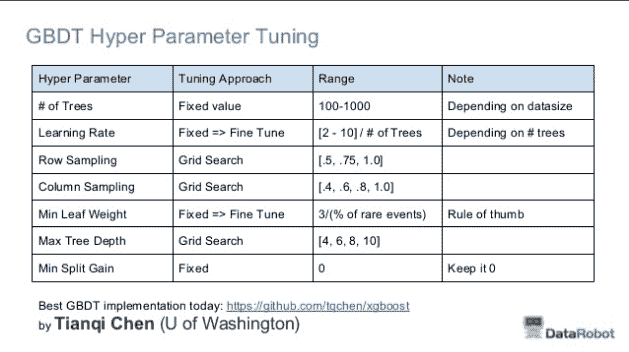
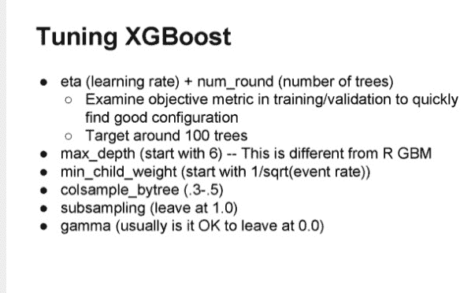

# 如何配置梯度提升算法

> 原文： [https://machinelearningmastery.com/configure-gradient-boosting-algorithm/](https://machinelearningmastery.com/configure-gradient-boosting-algorithm/)

渐变助推是应用机器学习最强大的技术之一，因此很快成为最受欢迎的技术之一。

但是，如何为您的问题配置梯度提升？

在这篇文章中，您将了解如何通过查看书籍，论文和竞赛结果中报告的配置来配置机器学习问题的梯度提升。

阅读这篇文章后，你会知道：

*   如何根据原始来源配置梯度增强。
*   从标准实现中的默认值和建议配置算法的想法。
*   从顶级Kaggle竞争对手配置梯度提升和XGBoost的经验法则。

让我们开始吧。

如何配置梯度提升算法
照片来自 [Chris Sorge](https://www.flickr.com/photos/stone65/7925550064/) ，保留一些权利。

## 如何配置梯度增压机

在1999年的论文“[贪婪函数逼近：梯度增强机](https://statweb.stanford.edu/~jhf/ftp/trebst.pdf)”中，Jerome Friedman评论了树木数量（M）和学习率（v）之间的权衡：

> v-M的权衡显而易见;较小的v值会产生较大的最佳M值。它们还提供更高的准确度，v &lt;1的回报递减。 0.125。对于M&gt; 1，错误分类错误率非常平坦。 200，因此它的最佳M值是不稳定的。 ......这些结果的定性性质相当普遍。

他建议首先为树木数量设置一个较大的值，然后调整收缩参数以获得最佳结果。本文的研究优选收缩值为0.1，树木的数量在100到500之间，树木中的终端节点数在2到8之间。

在1999年的论文“ [Stochastic Gradient Boosting](https://statweb.stanford.edu/~jhf/ftp/stobst.pdf) ”中，弗里德曼重申了对收缩参数的偏好：

> “收缩”参数0 &lt; v＆lt; 1控制程序的学习率。根据经验......，发现小值（v​​ &lt;= 0.1）导致更好的泛化误差。

在论文中，弗里德曼介绍并实证研究了随机梯度增强（基于行的子采样）。他发现几乎所有的子采样百分比都比所谓的确定性提升更好，或许30％到50％是一个很好的选择一些问题的价值和50％到80％的其他问题。

> ...采样分数的最佳值...约为40％（f = 0.4）......然而，在每次迭代中仅采样30％甚至20％的数据比没有采样有相当大的改进，并且具有相应的计算速度 - 因子分别为3和5。

他还研究了树木中终端节点数量的影响，发现像3和6这样的值比11,21和41等更大的值更好。

> 在两种情况下，平均超过100个目标的最佳树大小是L = 6.通过使用较大的树来增加基础学习者的容量通过“过度拟合”降低性能。

在H2O中题为“[梯度提升机器学习](https://www.youtube.com/watch?v=wPqtzj5VZus)”的演讲中，Trevor Hastie评论说，一般梯度提升比随机森林表现更好，后者反过来比单个决策树表现更好。

> 随机森林＆gt;套袋＆gt;单树

第10章标题为“[统计学习要素：数据挖掘，推理和预测](http://www.amazon.com/dp/0387848576?tag=inspiredalgor-20)”中的“提升和加性树”专门用于提升。在其中，它们提供了用于配置梯度增强的启发式方法以及一些实证研究。

他们评论说树中的节点数（J）的值很好，约为6，通常在4到8的范围内有良好的值。

> 虽然在许多应用中J = 2是不够的，但是J&gt;不可能。将需要10。到目前为止的经验表明4＆lt; = J＆lt; = 8在增强的情况下工作良好，结果对该范围内的特定选择相当不敏感。

他们建议监控验证数据集的性能，以便校准树的数量，并在验证数据集的性能开始降低后使用早期停止程序。

正如在弗里德曼的第一个梯度增强论文中，他们评论了树木数量（M）和学习率（v）之间的权衡，并建议学习率的一个小值＆lt; 0.1。

> 对于相同的训练风险，较小的v值导致较大的M值，因此在它们之间存在折衷。 ......实际上，最好的策略似乎是将v设置得非常小（v &lt;0.1），然后通过提前停止选择M.

此外，正如弗里德曼的随机梯度增强纸一样，他们建议采用二次采样百分比（n）而不更换值约为50％。

> n的典型值可以是1/2，但是对于大的N，n可以基本上小于1/2。

## R中梯度增强的配置

梯度提升算法在R中实现为 [gbm包](https://cran.r-project.org/web/packages/gbm/index.html)。

回顾[软件包文档](https://cran.r-project.org/web/packages/gbm/gbm.pdf)，gbm（）函数指定合理的默认值：

*   n.trees = 100（树木数量）。
*   interaction.depth = 1（叶数）。
*   n.minobsinnode = 10（树终端节点中的最小样本数）。
*   收缩率= 0.001（学习率）。

值得注意的是，使用较小的收缩因子并且树桩是默认值。接下来，里奇韦解释了小的收缩。

在R中使用gbm软件包的标题为“ [Generalized Boosted Models：gbm软件包的指南](http://www.saedsayad.com/docs/gbm2.pdf)”中，Greg Ridgeway提供了一些使用启发式方法。他建议第一次将学习率（lambda）设置为尽可能小，然后使用交叉验证调整树的数量（迭代或T）。

> 在实践中，我将lambda设置为尽可能小，然后通过交叉验证选择T.当lambda尽可能小的性能时，性能最佳，并且对于越来越小的lambda，边际效用越来越小。

他评论了他将默认收缩率设置为0.001而不是0.1的小值的基本原理。

> 重要的是要知道较小的收缩值（几乎）总能提高预测性能。也就是说，设置收缩率= 0.001几乎肯定会导致模型具有比设置收缩率= 0.01更好的样本外预测性能。 ...收缩率= 0.001的模型可能需要十倍于具有收缩率= 0.01的模型的迭代次数

Ridgeway还使用了大量的树（这里称为迭代），数千而不是数百

> 我通常瞄准3,000到10,000次迭代，收缩率在0.01到0.001之间。

## 在scikit-learn中配置梯度提升

Python库提供了用于分类的梯度提升的实现，称为 [GradientBoostingClassifier](http://scikit-learn.org/stable/modules/generated/sklearn.ensemble.GradientBoostingClassifier.html) 类，并且回归称为 [GradientBoostingRegressor](http://scikit-learn.org/stable/modules/generated/sklearn.ensemble.GradientBoostingRegressor.html) 类。

查看此库中算法的默认配置很有用。

有许多参数，但下面是几个关键的默认值。

*   learning_rate = 0.1（收缩）。
*   n_estimators = 100（树的数量）。
*   MAX_DEPTH = 3。
*   min_samples_split = 2。
*   min_samples_leaf = 1。
*   子样本= 1.0。

有趣的是，默认收缩与Friedman匹配，并且树深度未设置为R包之类的树桩。树深度为3（如果创建的树是对称的）将具有8个叶节点，匹配Friedman研究中的首选终端节点数的上限（可以设置max_leaf_nodes）。

在标题为“ [Gradient Tree Boosting](http://scikit-learn.org/stable/modules/ensemble.html#gradient-tree-boosting) ”的部分下的scikit-learn用户指南中，作者评论说，设置最大叶节点与将最大深度设置为减去最大叶节点的效果类似，但结果表现更差。

> 我们发现max_leaf_nodes = k给出了与max_depth = k-1相当的结果，但是以稍高的训练误差为代价训练得更快。

在一项小型研究中，证明了梯度增强的正则化方法“[梯度增强正则化](http://scikit-learn.org/stable/auto_examples/ensemble/plot_gradient_boosting_regularization.html)”，结果显示了使用收缩和二次采样的好处。

## 在XGBoost中配置梯度提升

XGBoost库专用于梯度增强算法。

它也指定了值得注意的默认参数，首先是 [XGBoost参数页面](https://github.com/dmlc/xgboost/blob/master/doc/parameter.md)：

*   eta = 0.3（收缩率或学习率）。
*   MAX_DEPTH = 6。
*   子样本= 1。

与大多数研究和其他图书馆相比，这显示出更高的学习率和更大的最大深度。同样，我们可以在 [Python API参考](https://xgboost.readthedocs.io/en/latest/python/python_api.html)中总结XGBoost的默认参数。

*   MAX_DEPTH = 3。
*   learning_rate = 0.1。
*   n_estimators = 100。
*   子样本= 1。

这些默认值通常更符合scikit-learn默认值和论文推荐。

在与TechEd Europe的一次题为“ [xgboost：用于快速和准确梯度提升](https://www.youtube.com/watch?v=0IhraqUVJ_E)的R包”的谈话中，当被问及如何配置XGBoost时，Tong He建议调整三个最重要的参数：

*   树木数量。
*   树深度。
*   步长（学习率）。

他还为新问题提供了简洁的配置策略：

1.  运行默认配置（并且可能会查看学习曲线？）。
2.  如果系统过度学习，请减慢学习速度（使用收缩？）。
3.  如果系统学习不足，可以加快学习速度（使用收缩？）。

在Owen Zhang于2015年与NYC数据科学学院进行的题为“[获奖数据科学竞赛](https://www.youtube.com/watch?v=LgLcfZjNF44)”的谈话中，他提供了一些使用XGBoost配置梯度增强的一般技巧。 Owen是梯度增强的重要用户。

> 我的忏悔：我（过）使用GBM。如有疑问，请使用GBM。

他提供了一些配置梯度增强的技巧：

*   学习率+树木数量：定位500到1000棵树并调整学习率。
*   叶子中的样本数量：获得良好平均估计值所需的观察数量。
*   互动深度：10+。

在同一个谈话的[更新幻灯片中，他总结了他用于XGBoost的常见参数：](http://www.slideshare.net/ShangxuanZhang/winning-data-science-competitions-presented-by-owen-zhang)

Owen Zhang超级参数调整XGBoost的建议表

我们可以在这张表中看到一些有趣的东西。

*   将学习率与树木数量的关系简化为近似比例：学习率= [2-10] /树。
*   探索随机梯度增强的行和列采样的值。
*   探索与弗里德曼（4-10）报道的最大深度相同的范围。
*   调整最小叶重量，作为罕见事件数量百分比的近似比率为3。

欧文在2015年波士顿ODSC题为“[开源工具和数据科学竞赛](https://www.youtube.com/watch?v=7YnVZrabTA8)”的类似演讲中，他再次总结了他使用的常用参数：

Owen Zhang关于调整XGBoost的建议

我们可以看到一些可能相关的细微差别。

*   目标100而不是1000棵树并调整学习率。
*   最小孩子体重在事件率的平方根上为1。
*   没有行的子采样。

最后，Abhishek Thakur在题为“[接近（几乎）任何机器学习问题](https://www.linkedin.com/pulse/approaching-almost-any-machine-learning-problem-abhishek-thakur)”的帖子中提供了一个类似的表格，列出了关键的XGBoost参数和调整建议。

Abhishek Thakur对调整XGBoost的建议

点差确实涵盖了上面建议的一般默认值以及更多。

值得注意的是，Abhishek确实提供了一些调整alpha和beta模型惩罚术语以及行采样的建议。

## 摘要

在这篇文章中，您深入了解了如何为您自己的机器学习问题配置梯度增强。

特别是你学到了：

*   关于树木数量的折衷以及子采样的收缩和良好的默认值。
*   关于限制树大小的不同想法以及树深度和终端节点数量的良好默认值。
*   顶级Kaggle比赛获胜者使用的网格搜索策略。

您对配置梯度增强或关于此帖子有任何疑问吗？在评论中提出您的问题。