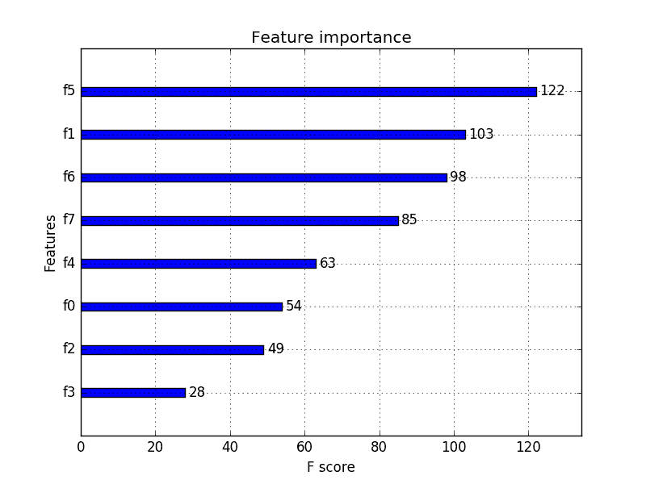

# 功能重要性和功能选择使用Python中的XGBoost

> 原文： [https://machinelearningmastery.com/feature-importance-and-feature-selection-with-xgboost-in-python/](https://machinelearningmastery.com/feature-importance-and-feature-selection-with-xgboost-in-python/)

使用诸如梯度增强之类的决策树方法的集合的好处是它们可以从训练的预测模型自动提供特征重要性的估计。

在本文中，您将了解如何使用Python中的XGBoost库来估计功能对预测建模问题的重要性。

阅读这篇文章后你会知道：

*   如何使用梯度增强算法计算特征重要性。
*   如何在XGBoost模型计算的Python中绘制要素重要性。
*   如何使用XGBoost计算的要素重要性来执行要素选择。

让我们开始吧。

*   **2017年1月更新**：已更新，以反映scikit-learn API版本0.18.1中的更改​​。
*   **更新March / 2018** ：添加了备用链接以下载数据集，因为原始图像已被删除。


功能重要性和功能选择使用Python中的XGBoost
照片由 [Keith Roper](https://www.flickr.com/photos/keithroper/15476027141/) ，保留一些权利。

## 梯度提升中的特征重要性

使用梯度增强的好处是，在构建增强树之后，检索每个属性的重要性分数是相对简单的。

通常，重要性提供分数，该分数指示每个特征在模型内的增强决策树的构造中的有用性或有价值。使用决策树做出关键决策的属性越多，其相对重要性就越高。

对于数据集中的每个属性，明确计算此重要性，允许对属性进行排名并相互比较。

通过每个属性分割点改进性能度量的量来计算单个决策树的重要性，并由节点负责的观察数量加权。性能度量可以是用于选择分裂点的纯度（基尼指数）或另一个更具体的误差函数。

然后，在模型中的所有决策树中对要素重要性进行平均。

有关如何在提升的决策树中计算特征重要性的更多技术信息，请参阅本书[统计学习要素：数据挖掘，推理，第10.53.1节“_预测变量的相对重要性_”。和预测](http://www.amazon.com/dp/0387848576?tag=inspiredalgor-20)，第367页。

另外，请参阅Matthew Drury对StackOverflow问题的回答“ [Boosting](http://stats.stackexchange.com/questions/162162/relative-variable-importance-for-boosting) 的相对变量重要性”，他提供了非常详细和实用的答案。

## 手动绘制功能重要性

经过训练的XGBoost模型可自动计算预测建模问题的特征重要性。

这些重要性分数可在训练模型的 **feature_importances_** 成员变量中找到。例如，它们可以直接打印如下：

```
print(model.feature_importances_)
```

我们可以直接在条形图上绘制这些分数，以直观地显示数据集中每个要素的相对重要性。例如：

```
# plot
pyplot.bar(range(len(model.feature_importances_)), model.feature_importances_)
pyplot.show()
```

我们可以通过在 [Pima印第安人糖尿病数据集](https://archive.ics.uci.edu/ml/datasets/Pima+Indians+Diabetes)上训练XGBoost模型并根据计算的特征重要性创建条形图来证明这一点（更新：[从这里下载](https://raw.githubusercontent.com/jbrownlee/Datasets/master/pima-indians-diabetes.data.csv)）。

```
# plot feature importance manually
from numpy import loadtxt
from xgboost import XGBClassifier
from matplotlib import pyplot
# load data
dataset = loadtxt('pima-indians-diabetes.csv', delimiter=",")
# split data into X and y
X = dataset[:,0:8]
y = dataset[:,8]
# fit model no training data
model = XGBClassifier()
model.fit(X, y)
# feature importance
print(model.feature_importances_)
# plot
pyplot.bar(range(len(model.feature_importances_)), model.feature_importances_)
pyplot.show()
```

运行此示例首先输出重要性分数：

```
[ 0.089701    0.17109634  0.08139535  0.04651163  0.10465116  0.2026578 0.1627907   0.14119601]
```

我们还得到了相对重要性的条形图。


XGBoost功能重要性的手动条形图

这个图的缺点是功能按输入索引而不是它们的重要性排序。我们可以在绘图之前对功能进行排序。

值得庆幸的是，有一个内置的绘图功能来帮助我们。

## 使用内置的XGBoost功能重要性图

XGBoost库提供了一个内置函数来绘制按其重要性排序的特征。

该函数称为 **plot_importance（）**，可以按如下方式使用：

```
# plot feature importance
plot_importance(model)
pyplot.show()
```

例如，下面是一个完整的代码清单，使用内置的 **plot_importance（）**函数绘制Pima Indians数据集的特征重要性。

```
# plot feature importance using built-in function
from numpy import loadtxt
from xgboost import XGBClassifier
from xgboost import plot_importance
from matplotlib import pyplot
# load data
dataset = loadtxt('pima-indians-diabetes.csv', delimiter=",")
# split data into X and y
X = dataset[:,0:8]
y = dataset[:,8]
# fit model no training data
model = XGBClassifier()
model.fit(X, y)
# plot feature importance
plot_importance(model)
pyplot.show()
```

运行该示例为我们提供了更有用的条形图。



XGBoost功能重要性条形图

您可以看到功能是根据它们在F0到F7的输入数组（X）中的索引自动命名的。

在问题描述中手动将这些指数映射到[名称，我们可以看到该图显示F5（体重指数）具有最高重要性，F3（皮肤折叠厚度）具有最低重要性。](https://github.com/jbrownlee/Datasets/blob/master/pima-indians-diabetes.names)

## 使用XGBoost功能重要性分数进行特征选择

特征重要性分数可用于scikit-learn中的特征选择。

这是使用 [SelectFromModel](http://scikit-learn.org/stable/modules/generated/sklearn.feature_selection.SelectFromModel.html) 类完成的，该类采用模型并可以将数据集转换为具有所选特征的子集。

该课程可以采用预训练的模型，例如在整个训练数据集上训练的模型。然后，它可以使用阈值来决定选择哪些功能。当您在 **SelectFromModel** 实例上调用 **transform（）**方法以在训练数据集和测试数据集上始终选择相同的特征时，将使用此阈值。

在下面的示例中，我们首先分别训练并评估整个训练数据集和测试数据集上的XGBoost模型。

使用从训练数据集计算的要素重要性，然后我们将模型包装在SelectFromModel实例中。我们使用它来选择训练数据集上的特征，从所选特征子集训练模型，然后根据相同的特征选择方案评估测试集上的模型。

例如：

```
# select features using threshold
selection = SelectFromModel(model, threshold=thresh, prefit=True)
select_X_train = selection.transform(X_train)
# train model
selection_model = XGBClassifier()
selection_model.fit(select_X_train, y_train)
# eval model
select_X_test = selection.transform(X_test)
y_pred = selection_model.predict(select_X_test)
```

为了兴趣，我们可以测试多个阈值，以按功能重要性选择要素。具体而言，每个输入变量的特征重要性，基本上允许我们按重要性测试每个特征子集，从所有特征开始，以具有最重要特征的子集结束。

完整的代码清单如下。

```
# use feature importance for feature selection
from numpy import loadtxt
from numpy import sort
from xgboost import XGBClassifier
from sklearn.model_selection import train_test_split
from sklearn.metrics import accuracy_score
from sklearn.feature_selection import SelectFromModel
# load data
dataset = loadtxt('pima-indians-diabetes.csv', delimiter=",")
# split data into X and y
X = dataset[:,0:8]
Y = dataset[:,8]
# split data into train and test sets
X_train, X_test, y_train, y_test = train_test_split(X, Y, test_size=0.33, random_state=7)
# fit model on all training data
model = XGBClassifier()
model.fit(X_train, y_train)
# make predictions for test data and evaluate
y_pred = model.predict(X_test)
predictions = [round(value) for value in y_pred]
accuracy = accuracy_score(y_test, predictions)
print("Accuracy: %.2f%%" % (accuracy * 100.0))
# Fit model using each importance as a threshold
thresholds = sort(model.feature_importances_)
for thresh in thresholds:
	# select features using threshold
	selection = SelectFromModel(model, threshold=thresh, prefit=True)
	select_X_train = selection.transform(X_train)
	# train model
	selection_model = XGBClassifier()
	selection_model.fit(select_X_train, y_train)
	# eval model
	select_X_test = selection.transform(X_test)
	y_pred = selection_model.predict(select_X_test)
	predictions = [round(value) for value in y_pred]
	accuracy = accuracy_score(y_test, predictions)
	print("Thresh=%.3f, n=%d, Accuracy: %.2f%%" % (thresh, select_X_train.shape[1], accuracy*100.0))
```

运行此示例将输出以下输出：

```
Accuracy: 77.95%
Thresh=0.071, n=8, Accuracy: 77.95%
Thresh=0.073, n=7, Accuracy: 76.38%
Thresh=0.084, n=6, Accuracy: 77.56%
Thresh=0.090, n=5, Accuracy: 76.38%
Thresh=0.128, n=4, Accuracy: 76.38%
Thresh=0.160, n=3, Accuracy: 74.80%
Thresh=0.186, n=2, Accuracy: 71.65%
Thresh=0.208, n=1, Accuracy: 63.78%
```

我们可以看到模型的性能通常随着所选特征的数量而减少。

在这个问题上，需要权衡测试集合精度的特征，我们可以决定采用较不复杂的模型（较少的属性，如n = 4），并接受估计精度的适度降低，从77.95％降至76.38％。

这可能是对这么小的数据集的一种洗涤，但对于更大的数据集并且使用交叉验证作为模型评估方案可能是更有用的策略。

## 摘要

在这篇文章中，您发现了如何在训练有素的XGBoost梯度增强模型中访问特征和使用重要性。

具体来说，你学到了：

*   重要的是什么，一般如何在XGBoost中计算。
*   如何从XGBoost模型访问和绘制要素重要性分数。
*   如何使用XGBoost模型中的要素重要性来选择要素。

您对XGBoost或此帖中的功能重要性有任何疑问吗？在评论中提出您的问题，我会尽力回答。