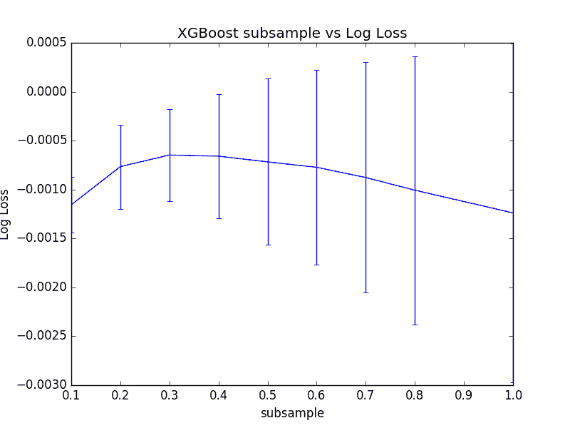
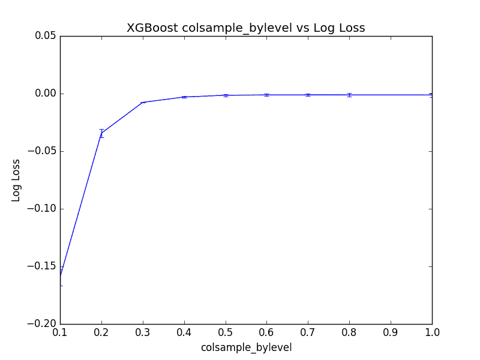

# 使用XGBoost进行随机梯度提升和Python中的scikit-learn

> 原文： [https://machinelearningmastery.com/stochastic-gradient-boosting-xgboost-scikit-learn-python/](https://machinelearningmastery.com/stochastic-gradient-boosting-xgboost-scikit-learn-python/)

用于集合决策树的简单技术涉及在训练数据集的子样本上训练树。

可以采用训练数据中的行的子集来训练称为装袋的单个树。当在计算每个分裂点时也获取训练数据的行的子集时，这被称为随机森林。

这些技术也可以在称为随机梯度增强的技术中用于梯度树增强模型。

在这篇文章中，您将发现随机梯度增强以及如何使用XGBoost和Python中的scikit-learn来调整采样参数。

阅读这篇文章后你会知道：

*   在数据的子样本上训练树的原理以及如何在梯度增强中使用它。
*   如何使用scikit-learn调整XGBoost中基于行的子采样。
*   如何在XGBoost中通过树和分割点调整基于列的子采样。

让我们开始吧。

*   **2017年1月更新**：已更新，以反映scikit-learn API版本0.18.1中的更改​​。


随机梯度提升XGBoost和scikit-Python
摄影：[HenningKlokkeråsen](https://www.flickr.com/photos/photohenning/379603235/)，保留一些权利。

## 随机梯度提升

渐变助推是一个贪婪的程序。

将新决策树添加到模型中以校正现有模型的残差。

使用贪婪搜索过程创建每个决策树，以选择最佳地最小化目标函数的分割点。这可能导致树一次又一次地使用相同的属性甚至相同的分裂点。

[Bagging](http://machinelearningmastery.com/bagging-and-random-forest-ensemble-algorithms-for-machine-learning/) 是一种技术，其中创建决策树的集合，每个决策树来自训练数据的不同行的随机子集。结果是，从树集合中获得了更好的性能，因为样本中的随机性允许创建略微不同的树，从而增加了集合预测的方差。

通过允许在选择分割点时对特征（列）进行二次采样，随机森林更进一步，向树集合添加进一步的方差。

这些相同的技术可用于在称为随机梯度增强的变化中的梯度增强中的决策树的构造中。

通常使用训练数据的积极子样本，例如40％至80％。

## 教程概述

在本教程中，我们将研究不同子采样技术在梯度增强中的效果。

我们将调整Python中XGBoost库支持的三种不同风格的随机梯度增强，具体来说：

1.  在创建每个树时，对数据集中的行进行子采样。
2.  在创建每个树时对数据集中的列进行子采​​样。
3.  在创建每个树时，对数据集中每个拆分的列进行子采​​样。

## 问题描述：Otto Dataset

在本教程中，我们将使用 [Otto Group产品分类挑战](https://www.kaggle.com/c/otto-group-product-classification-challenge)数据集。

此数据集可从Kaggle免费获得（您需要注册Kaggle才能下载此数据集）。您可以从[数据页面](https://www.kaggle.com/c/otto-group-product-classification-challenge/data)下载训练数据集 **train.csv.zip** ，并将解压缩的 **train.csv** 文件放入您的工作目录。

该数据集描述了超过61,000种产品的93个模糊细节，这些产品分为10个产品类别（例如时装，电子产品等）。输入属性是某种不同事件的计数。

目标是对新产品进行预测，因为10个类别中的每个类别都有一组概率，并且使用多类对数损失（也称为交叉熵）来评估模型。

这个竞赛在2015年5月完成，这个数据集对XGBoost来说是一个很好的挑战，因为它有很多例子，问题的难度以及需要很少数据准备的事实（除了将字符串类变量编码为整数）。

## 在XGBoost中调整行子采样

行子采样涉及选择训练数据集的随机样本而无需替换。

行子采样可以在**子样本**参数中的XGBoost类的scikit-learn包装器中指定。默认值为1.0，不进行子采样。

我们可以使用scikit-learn内置的网格搜索功能来评估Otto数据集中0.1到1.0的不同子样本值的影响。

```
[0.1, 0.2, 0.3, 0.4, 0.5, 0.6, 0.7, 0.8, 1.0]
```

子样本有9种变体，每种模型将使用10倍交叉验证进行评估，这意味着需要训练和测试9×10或90个模型。

完整的代码清单如下。

```
# XGBoost on Otto dataset, tune subsample
from pandas import read_csv
from xgboost import XGBClassifier
from sklearn.model_selection import GridSearchCV
from sklearn.model_selection import StratifiedKFold
from sklearn.preprocessing import LabelEncoder
import matplotlib
matplotlib.use('Agg')
from matplotlib import pyplot
# load data
data = read_csv('train.csv')
dataset = data.values
# split data into X and y
X = dataset[:,0:94]
y = dataset[:,94]
# encode string class values as integers
label_encoded_y = LabelEncoder().fit_transform(y)
# grid search
model = XGBClassifier()
subsample = [0.1, 0.2, 0.3, 0.4, 0.5, 0.6, 0.7, 0.8, 1.0]
param_grid = dict(subsample=subsample)
kfold = StratifiedKFold(n_splits=10, shuffle=True, random_state=7)
grid_search = GridSearchCV(model, param_grid, scoring="neg_log_loss", n_jobs=-1, cv=kfold)
grid_result = grid_search.fit(X, label_encoded_y)
# summarize results
print("Best: %f using %s" % (grid_result.best_score_, grid_result.best_params_))
means = grid_result.cv_results_['mean_test_score']
stds = grid_result.cv_results_['std_test_score']
params = grid_result.cv_results_['params']
for mean, stdev, param in zip(means, stds, params):
	print("%f (%f) with: %r" % (mean, stdev, param))
# plot
pyplot.errorbar(subsample, means, yerr=stds)
pyplot.title("XGBoost subsample vs Log Loss")
pyplot.xlabel('subsample')
pyplot.ylabel('Log Loss')
pyplot.savefig('subsample.png')
```

运行此示例将打印每个已测试配置的最佳配置以及日志丢失。

我们可以看到，获得的最佳结果是0.3，或使用30％的训练数据集样本训练树。

```
Best: -0.000647 using {'subsample': 0.3}
-0.001156 (0.000286) with: {'subsample': 0.1}
-0.000765 (0.000430) with: {'subsample': 0.2}
-0.000647 (0.000471) with: {'subsample': 0.3}
-0.000659 (0.000635) with: {'subsample': 0.4}
-0.000717 (0.000849) with: {'subsample': 0.5}
-0.000773 (0.000998) with: {'subsample': 0.6}
-0.000877 (0.001179) with: {'subsample': 0.7}
-0.001007 (0.001371) with: {'subsample': 0.8}
-0.001239 (0.001730) with: {'subsample': 1.0}
```

我们可以绘制这些平均值和标准差对数损失值，以更好地理解性能如何随子采样值变化。



XGBoost中调整行采样率的图

我们可以看到确实有30％的人具有最佳的平均表现，但我们也可以看到，随着比率的增加，表现的差异也会显着增加。

值得注意的是，所有**子样本**值的平均性能优于没有子采样的平均性能（**子样本= 1.0** ）。

## 按树在XGBoost中调整列子采样

我们还可以在增强模型中创建每个决策树之前创建要使用的特征（或列）的随机样本。

在用于scikit-learn的XGBoost包装器中，这由 **colsample_bytree** 参数控制。

默认值为1.0，表示在每个决策树中使用所有列。我们可以评估 **colsample_bytree** 的值在0.1和1.0之间递增0.1。

```
[0.1, 0.2, 0.3, 0.4, 0.5, 0.6, 0.7, 0.8, 1.0]
```

完整的代码清单如下。

```
# XGBoost on Otto dataset, tune colsample_bytree
from pandas import read_csv
from xgboost import XGBClassifier
from sklearn.model_selection import GridSearchCV
from sklearn.model_selection import StratifiedKFold
from sklearn.preprocessing import LabelEncoder
import matplotlib
matplotlib.use('Agg')
from matplotlib import pyplot
# load data
data = read_csv('train.csv')
dataset = data.values
# split data into X and y
X = dataset[:,0:94]
y = dataset[:,94]
# encode string class values as integers
label_encoded_y = LabelEncoder().fit_transform(y)
# grid search
model = XGBClassifier()
colsample_bytree = [0.1, 0.2, 0.3, 0.4, 0.5, 0.6, 0.7, 0.8, 1.0]
param_grid = dict(colsample_bytree=colsample_bytree)
kfold = StratifiedKFold(n_splits=10, shuffle=True, random_state=7)
grid_search = GridSearchCV(model, param_grid, scoring="neg_log_loss", n_jobs=-1, cv=kfold)
grid_result = grid_search.fit(X, label_encoded_y)
# summarize results
print("Best: %f using %s" % (grid_result.best_score_, grid_result.best_params_))
means = grid_result.cv_results_['mean_test_score']
stds = grid_result.cv_results_['std_test_score']
params = grid_result.cv_results_['params']
for mean, stdev, param in zip(means, stds, params):
	print("%f (%f) with: %r" % (mean, stdev, param))
# plot
pyplot.errorbar(colsample_bytree, means, yerr=stds)
pyplot.title("XGBoost colsample_bytree vs Log Loss")
pyplot.xlabel('colsample_bytree')
pyplot.ylabel('Log Loss')
pyplot.savefig('colsample_bytree.png')
```

Running this example prints the best configuration as well as the log loss for each tested configuration.

我们可以看到该模型的最佳性能是 **colsample_bytree = 1.0** 。这表明对此问题的子采样列不会增加价值。

```
Best: -0.001239 using {'colsample_bytree': 1.0}
-0.298955 (0.002177) with: {'colsample_bytree': 0.1}
-0.092441 (0.000798) with: {'colsample_bytree': 0.2}
-0.029993 (0.000459) with: {'colsample_bytree': 0.3}
-0.010435 (0.000669) with: {'colsample_bytree': 0.4}
-0.004176 (0.000916) with: {'colsample_bytree': 0.5}
-0.002614 (0.001062) with: {'colsample_bytree': 0.6}
-0.001694 (0.001221) with: {'colsample_bytree': 0.7}
-0.001306 (0.001435) with: {'colsample_bytree': 0.8}
-0.001239 (0.001730) with: {'colsample_bytree': 1.0}
```

绘制结果，我们可以看到模型平台的性能（至少在这个尺度上），其值在0.5到1.0之间。


在XGBoost中调整每树列采样的图

## 通过拆分调整XGBoost中的列子采样

我们可以在决策树中的每个拆分中对它们进行二次采样，而不是对每个树进行一次子采样。原则上，这是随机森林中使用的方法。

我们可以在XGBoost包装器类的 **colsample_bylevel** 参数中为scikit-learn设置每个拆分使用的列样本的大小。

和以前一样，我们将比例从10％变为默认的100％。

The full code listing is provided below.

```
# XGBoost on Otto dataset, tune colsample_bylevel
from pandas import read_csv
from xgboost import XGBClassifier
from sklearn.model_selection import GridSearchCV
from sklearn.model_selection import StratifiedKFold
from sklearn.preprocessing import LabelEncoder
import matplotlib
matplotlib.use('Agg')
from matplotlib import pyplot
# load data
data = read_csv('train.csv')
dataset = data.values
# split data into X and y
X = dataset[:,0:94]
y = dataset[:,94]
# encode string class values as integers
label_encoded_y = LabelEncoder().fit_transform(y)
# grid search
model = XGBClassifier()
colsample_bylevel = [0.1, 0.2, 0.3, 0.4, 0.5, 0.6, 0.7, 0.8, 1.0]
param_grid = dict(colsample_bylevel=colsample_bylevel)
kfold = StratifiedKFold(n_splits=10, shuffle=True, random_state=7)
grid_search = GridSearchCV(model, param_grid, scoring="neg_log_loss", n_jobs=-1, cv=kfold)
grid_result = grid_search.fit(X, label_encoded_y)
# summarize results
print("Best: %f using %s" % (grid_result.best_score_, grid_result.best_params_))
means = grid_result.cv_results_['mean_test_score']
stds = grid_result.cv_results_['std_test_score']
params = grid_result.cv_results_['params']
for mean, stdev, param in zip(means, stds, params):
	print("%f (%f) with: %r" % (mean, stdev, param))
# plot
pyplot.errorbar(colsample_bylevel, means, yerr=stds)
pyplot.title("XGBoost colsample_bylevel vs Log Loss")
pyplot.xlabel('colsample_bylevel')
pyplot.ylabel('Log Loss')
pyplot.savefig('colsample_bylevel.png')
```

Running this example prints the best configuration as well as the log loss for each tested configuration.

我们可以看到通过将 **colsample_bylevel** 设置为70％来实现最佳结果，导致（反向）日志丢失-0.001062，这比将每树列采样设置为-0.001239更好。 100％。

如果每个树的结果建议使用100％的列，那么建议不要放弃列子采样，而是尝试按每个拆分列子采样。

```
Best: -0.001062 using {'colsample_bylevel': 0.7}
-0.159455 (0.007028) with: {'colsample_bylevel': 0.1}
-0.034391 (0.003533) with: {'colsample_bylevel': 0.2}
-0.007619 (0.000451) with: {'colsample_bylevel': 0.3}
-0.002982 (0.000726) with: {'colsample_bylevel': 0.4}
-0.001410 (0.000946) with: {'colsample_bylevel': 0.5}
-0.001182 (0.001144) with: {'colsample_bylevel': 0.6}
-0.001062 (0.001221) with: {'colsample_bylevel': 0.7}
-0.001071 (0.001427) with: {'colsample_bylevel': 0.8}
-0.001239 (0.001730) with: {'colsample_bylevel': 1.0}
```

我们可以绘制每个 **colsample_bylevel** 变体的性能。结果显示相对较低的方差，并且在此规模的值为0.3之后，表现似乎是性能的平台。



在XGBoost中调整每分割列采样的图

## 摘要

在这篇文章中，您发现了使用Python中的XGBoost进行随机梯度提升。

具体来说，你学到了：

*   关于随机增强以及如何对训练数据进行二次采样以改进模型的泛化
*   如何在Python和scikit-learn中使用XGBoost调整行子采样。
*   如何使用每个树和每个拆分的XGBoost调整列子采样。

您对随机梯度增强或关于这篇文章有任何疑问吗？在评论中提出您的问题，我会尽力回答。