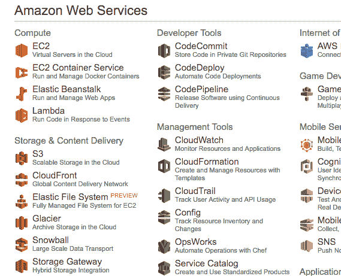
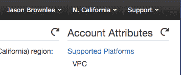
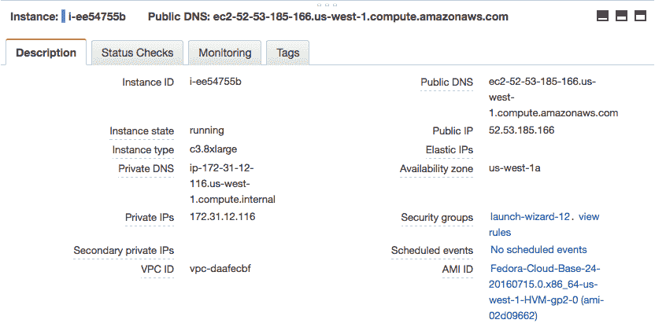

# 如何使用Amazon Web Services在云中训练XGBoost模型

> 原文： [https://machinelearningmastery.com/train-xgboost-models-cloud-amazon-web-services/](https://machinelearningmastery.com/train-xgboost-models-cloud-amazon-web-services/)

XGBoost库提供了针对速度和性能而设计的梯度增强实现。

它的实现是为了充分利用您的计算资源，包括所有CPU内核和内存。

在这篇文章中，您将了解如何在亚马逊的云服务上设置服务器，以便快速，廉价地创建非常大的模型。

阅读这篇文章后你会知道：

*   如何设置和配置Amazon EC2服务器实例以与XGBoost一起使用。
*   如何确认XGBoost的并行功能正在您的服务器上运行。
*   如何将数据和代码传输到您的服务器并训练一个非常大的模型。

让我们开始吧。


如何使用亚马逊网络服务在云中训练XGBoost模型
照片由 [Dennis Jarvis](https://www.flickr.com/photos/archer10/4272153040/) 拍摄，保留一些权利。

## 教程概述

这个过程非常简单。以下是我们将在本教程中完成的步骤的概述。

1.  设置您的AWS账户（如果需要）。
2.  启动您的AWS实例。
3.  登录并运行您的代码。
4.  训练XGBoost模型。
5.  关闭您的AWS实例。

**注意，在Amazon** 上使用虚拟服务器实例需要花钱。临时模型开发的成本非常低（例如每小时不到一美元），这就是为什么它如此吸引人，但它不是免费的。

服务器实例运行Linux。尽管不需要您知道如何导航Linux或类Unix环境，但这是可取的。我们只是运行我们的Python脚本，因此不需要高级技能。

## 1.设置您的AWS账户（如果需要）

您需要在Amazon Web Services上拥有一个帐户。

*   1.您可以通过单击“登录到控制台”，使用Amazon Web Services门户创建帐户。从那里，您可以使用现有的亚马逊帐户登录或创建新帐户。


AWS登录按钮

*   2.如果要创建帐户，您需要提供您的详细信息以及亚马逊可以收取的有效信用卡。如果您已经是亚马逊客户并且已将您的信用卡存档，那么此过程会快得多。

**注意**：如果您已经创建了一个新帐户，则可能需要向Amazon支持请求才能获得批准在本教程的其余部分中使用更大（非免费）的服务器实例。

## 2.启动服务器实例

现在您已拥有AWS账户，您希望启动可在其上运行XGBoost的EC2虚拟服务器实例。

启动实例就像选择要加载和启动虚拟服务器的映像一样简单。

我们将使用现有的Fedora Linux映像并手动安装Python和XGBoost。

*   1.如果您尚未登录 [AWS控制台](https://console.aws.amazon.com/console/home)，请登录。



AWS控制台

*   2.单击EC2以启动新的虚拟服务器。
*   3.选择“N.加州“从右上角的下拉菜单开始。这很重要，否则您可能无法找到我们计划使用的图像（称为AMI）。



选择N California

*   4.单击“启动实例”按钮。
*   5.单击“社区AMI”。 AMI是亚马逊机器映像。它是服务器的冻结实例，您可以在新虚拟服务器上进行选择和实例化。


社区AMI

*   6.在“搜索社区AMI”搜索框中输入AMI：“ **ami-02d09662** ”，然后按Enter键。您应该看到一个结果。

这是 [Fedora Linux](https://getfedora.org/) 24版本的基础安装图像。这是一个非常易于使用的Linux发行版。


选择64位Fedora Linux AMI

*   7.单击“选择”以在搜索结果中选择AMI。
*   8.现在您需要选择运行映像的硬件。向下滚动并选择“c3.8xlarge”硬件。

这是一个包含32个CPU核心，60 GB RAM和2个大型SSD磁盘的大型实例。


选择c3.8xlarge实例类型

*   9.单击“查看并启动”以完成服务器实例的配置。

您将看到类似“您的实例配置不符合免费使用套餐”的警告。这只是表明您将在此服务器上收取费用。我们知道这一点，忽略这个警告。


您的实例配置不符合免费使用套餐的条件

*   10.单击“启动”按钮。
*   11.选择SSH密钥对。
    *   如果您之前使用过EC2，则选择“选择现有密钥对”并从列表中选择密钥对。然后检查“我确认......”。
    *   如果您没有密钥对，请选择“创建新密钥对”选项并输入“密钥对名称”，例如“xgboost-keypair”。单击“下载密钥对”按钮。
*   12.打开终端并将目录更改为您下载密钥对的位置。
*   13.如果尚未执行此操作，请限制密钥对文件的访问权限。这是SSH访问服务器的一部分。例如，在您的控制台上，您可以键入：

```
cd Downloads
chmod 600 xgboost-keypair.pem
```

*   14.单击“启动实例”。

**注意**：如果这是您第一次使用AWS，亚马逊可能需要验证您的请求，这可能需要2个小时（通常只需几分钟）。

*   15.单击“查看实例”以查看实例的状态。



检查您的运行实例并记下其IP地址

您的服务器现在正在运行，可以登录。

## 3.登录和配置

现在您已经启动了服务器实例，现在可以登录并配置它以供使用。

每次启动服务器时都需要配置服务器。因此，批处理所有工作是个好主意，这样您就可以充分利用已配置的服务器。

配置服务器不会花费很长时间，总共可能需要10分钟。

*   1.如果您还没有，请单击Amazon EC2控制台中的“查看实例”。
*   2.将“公共IP”（在“描述”中的屏幕底部）复制到剪贴板。

在此示例中，我的IP地址为52.53.185.166。
**请勿使用此IP地址，您的IP地址会有所不同**。

*   3.打开终端并将目录更改为您下载密钥对的位置。使用SSH登录您的服务器，例如您可以输入：

```
ssh -i xgboost-keypair.pem fedora@52.53.185.166
```

*   4.第一次登录服务器实例时可能会提示您警告。您可以忽略此警告，只需键入“是”并按Enter键即可。

您现在已登录到您的服务器。

通过键入，仔细检查实例上的CPU核心数

```
cat /proc/cpuinfo | grep processor | wc -l
```

你应该看到：

```
32
```

### 3A。安装支持包

第一步是安装所有软件包以支持XGBoost。

这包括GCC，Python和SciPy堆栈。我们将使用Fedora包管理器 [dnf](https://en.wikipedia.org/wiki/DNF_(software)) （新的yum）。

这是一行：

```
sudo dnf install gcc gcc-c++ make git unzip python python2-numpy python2-scipy python2-scikit-learn python2-pandas python2-matplotlib
```

输入“y”并在提示时按Enter确认要安装的软件包。

这将需要几分钟时间来下载并安装所有必需的软件包。

完成后，我们可以确认环境已成功安装。

#### i）检查GCC

类型：

```
gcc --version
```

You should see:

```
gcc (GCC) 6.1.1 20160621 (Red Hat 6.1.1-3)
Copyright (C) 2016 Free Software Foundation, Inc.
This is free software; see the source for copying conditions.  There is NO
warranty; not even for MERCHANTABILITY or FITNESS FOR A PARTICULAR PURPOSE.
```

#### ii）检查Python

Type:

```
python --version
```

You should see:

```
Python 2.7.12
```

#### iii）检查SciPy

Type:

```
python -c "import scipy;print(scipy.__version__)"
python -c "import numpy;print(numpy.__version__)"
python -c "import pandas;print(pandas.__version__)"
python -c "import sklearn;print(sklearn.__version__)"
```

你应该看到类似的东西：

```
0.16.1
1.11.0
0.18.0
0.17.1
```

**注意**：如果其中任何一项检查失败，请停止并更正任何错误。在继续之前，您必须拥有完整的工作环境。

我们现在准备安装XGBoost。

### 3B。构建并安装XGBoost

XGBoost 的[安装说明已完成，我们可以直接关注它们。](https://xgboost.readthedocs.io/en/latest/build.html#python-package-installation)

首先，我们需要在服务器上下载项目。

```
git clone --recursive https://github.com/dmlc/xgboost
cd xgboost
```

接下来我们需要编译它。 -j参数可用于指定期望的核心数。对于AWS实例上的32个核心，我们可以将其设置为32。

如果您选择了不同的AWS硬件，则可以适当地进行设置。

```
make -j32
```

XGBoost项目应该成功构建（例如没有错误）。

我们现在准备安装该库的Python版本。

```
cd python-package
sudo python setup.py install
```

这就对了。

我们可以输入以下内容确认安装是否成功：

```
python -c "import xgboost;print(xgboost.__version__)"
```

这应该打印如下：

```
0.4
```

## 4.训练XGBoost模型

让我们通过运行带有大量内核的XGBoost来测试您的大型AWS实例。

在本教程中，我们将使用 [Otto Group产品分类挑战](https://www.kaggle.com/c/otto-group-product-classification-challenge)数据集。

此数据集可从Kaggle免费获得（您需要注册Kaggle才能下载此数据集）。它描述了超过61,000种产品的93个模糊细节，这些产品分为10个产品类别（例如时装，电子产品等）。输入变量是某种不同事件的计数。

目标是对新产品进行预测，因为10个类别中的每个类别都有一组概率，并且使用多类对数损失（也称为交叉熵）来评估模型。

这个竞赛在2015年5月完成，这个数据集对XGBoost来说是一个很好的挑战，因为它有很多例子，问题的难度以及需要很少数据准备的事实（除了将字符串类变量编码为整数）。

在工作站上创建一个名为 **work /** 的新目录。

您可以从[数据页面](https://www.kaggle.com/c/otto-group-product-classification-challenge/data)下载训练数据集 **train.csv.zip** 并将其放在工作站上的**工作/** 目录中。

我们将使用不同数量的核心评估在此数据集上训练XGBoost所花费的时间。

我们将尝试1个核心，一半核心16和所有32个核心。我们可以通过在 **XGBClassifier** 类（XGBoost的scikit-learn包装器）中设置 **nthread** 参数来指定XGBoost算法使用的核心数。

下面列出了完整的示例。将其保存在名为 **work / script.py** 的文件中。

```
# Otto multi-core test
from pandas import read_csv
from xgboost import XGBClassifier
from sklearn.preprocessing import LabelEncoder
import time
# load data
data = read_csv('train.csv')
dataset = data.values
# split data into X and y
X = dataset[:,0:94]
y = dataset[:,94]
# encode string class values as integers
label_encoded_y = LabelEncoder().fit_transform(y)
# evaluate the effect of the number of threads
results = []
num_threads = [1, 16, 32]
for n in num_threads:
	start = time.time()
	model = XGBClassifier(nthread=n)
	model.fit(X, label_encoded_y)
	elapsed = time.time() - start
	print(n, elapsed)
	results.append(elapsed)
```

现在，我们可以将您的**工作/** 目录与数据和脚本一起复制到您的AWS服务器。

从**工作/** 目录所在的当前目录中的工作站，键入：

```
scp -r -i xgboost-keypair.pem work fedora@52.53.185.166:/home/fedora/
```

当然，您需要使用密钥文件和服务器的IP地址。

这将在服务器的主目录中创建一个新的**工作/** 目录。

重新登录到您的服务器实例（如果需要）：

```
ssh -i xgboost-keypair.pem fedora@52.53.185.166
```

将目录更改为工作目录并解压缩训练数据。

```
cd work
unzip ./train.csv.data
```

现在我们可以运行脚本并训练我们的XGBoost模型并计算使用不同数量的核心所需的时间：

```
python script.py
```

您应该看到如下输出：

```
(1, 84.26896095275879)
(16, 6.597043037414551)
(32, 7.6703619956970215)
```

您可以看到16到32个核心之间的差别很小。我相信这样做的原因是AWS可以通过超线程访问16个物理内核，从而提供额外的虚拟内核。不过，在7秒内构建一个大型XGBoost模型非常棒。

您可以将此作为模板用于将自己的数据和脚本复制到AWS实例。

一个好的建议是将脚本作为后台进程运行，并将任何输出转发到文件。这是为了防止您与服务器的连接中断或者您要关闭它并让服务器整晚运行您的代码。

您可以将代码作为后台进程运行，并通过键入以下内容将输出重定向到文件：

```
nohup python script.py >script.py.out 2>&1 &
```

现在我们完成了，我们可以关闭AWS实例。

## 5.关闭您的AWS实例

完成工作后，您必须关闭实例。

请记住，您需要按照使用该实例的时间收费。它很便宜，但如果你不使用它，你不想留下实例。

*   1.在终端注销您的实例，例如您可以输入：

```
exit
```

*   2.使用Web浏览器登录AWS账户。
*   3.单击EC2。
*   4.单击左侧菜单中的“Instances”。
*   5.从列表中选择正在运行的实例（如果您只有一个正在运行的实例，则可能已选中该实例）。
*   6.单击“操作”按钮并选择“实例状态”，然后选择“终止”。确认您要终止正在运行的实例。

实例可能需要几秒钟才能关闭并从实例列表中删除。

而已。

## 摘要

在这篇文章中，您了解了如何在Amazon云基础架构上训练大型XGBoost模型。

具体来说，你学到了：

*   如何在Amazon EC2上为XGBoost启动和配置Linux服务器实例。
*   如何安装在Python中运行XGBoost库所需的所有必需软件。
*   如何将数据和代码传输到服务器并使用服务器上的所有核心训练大型模型。

您对在Amazon Web Services或此帖子上培训XGBoost模型有任何疑问吗？在评论中提出您的问题，我会尽力回答。