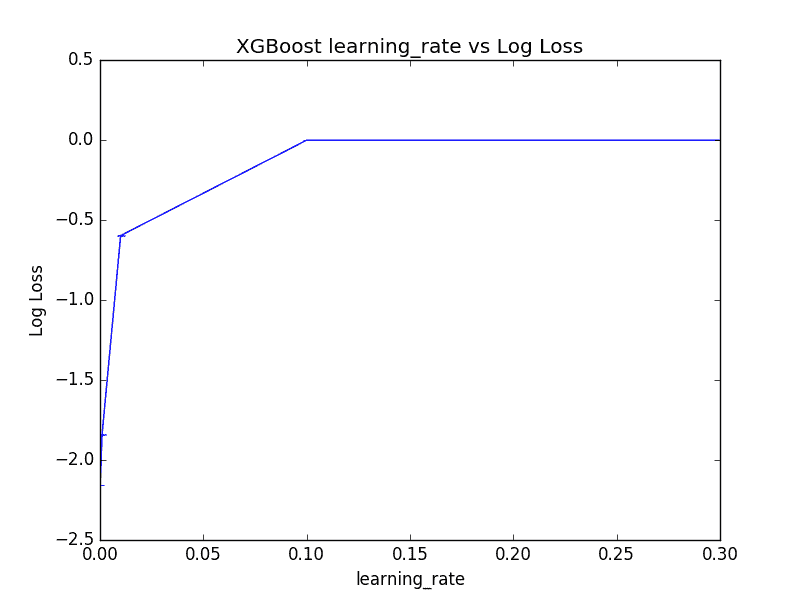
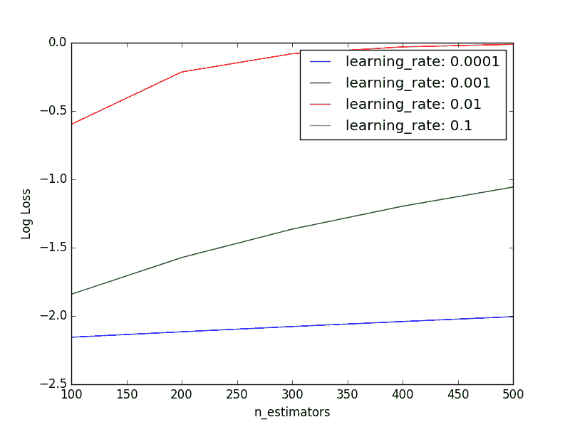
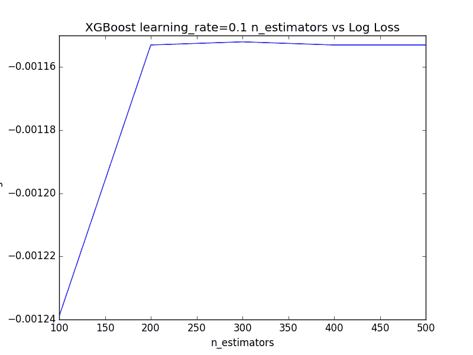

# 在Python中使用XGBoost调整梯度提升的学习率

> 原文： [https://machinelearningmastery.com/tune-learning-rate-for-gradient-boosting-with-xgboost-in-python/](https://machinelearningmastery.com/tune-learning-rate-for-gradient-boosting-with-xgboost-in-python/)

梯度提升决策树的问题在于它们快速学习和过度训练数据。

在梯度增强模型中减慢学习速度的一种有效方法是使用学习速率，也称为收缩（或XGBoost文档中的eta）。

在这篇文章中，您将发现渐变提升中学习速率的影响以及如何使用Python中的XGBoost库将其调整到机器学习问题上。

阅读这篇文章后你会知道：

*   效果学习率对梯度增强模型有影响。
*   如何在您的机器上调整学习率来学习您的问题。
*   如何调整提升树木数量和问题学习率之间的权衡。

让我们开始吧。

*   **2017年1月更新**：已更新，以反映scikit-learn API版本0.18.1中的更改​​。


在Python中使用XGBoost调整梯度提升的学习率
照片由 [Robert Hertel](https://www.flickr.com/photos/roberthertel/14890278255/) 拍摄，保留一些权利。

## 缓慢学习渐变提升与学习率

梯度提升涉及按顺序为模型创建和添加树。

创建新树以从现有树序列中校正预测中的残差。

效果是模型可以快速拟合，然后过度拟合训练数据集。

在梯度增强模型中减慢学习的技术是在添加到模型时应用新树的校正的加权因子。

这种加权称为收缩因子或学习率，取决于文献或工具。

天然梯度增强与收缩时的梯度增强相同，其中收缩系数设定为1.0。设置值小于1.0会对添加到模型中的每个树进行较少的更正。这反过来导致必须将更多树添加到模型中。

通常具有0.1至0.3范围内的小值，以及小于0.1的值。

让我们研究一下学习率对标准机器学习数据集的影响。

## 问题描述：Otto Dataset

在本教程中，我们将使用 [Otto Group产品分类挑战](https://www.kaggle.com/c/otto-group-product-classification-challenge)数据集。

此数据集可从Kaggle免费获得（您需要注册Kaggle才能下载此数据集）。您可以从[数据页面](https://www.kaggle.com/c/otto-group-product-classification-challenge/data)下载训练数据集 **train.csv.zip** ，并将解压缩的 **train.csv** 文件放入您的工作目录。

该数据集描述了超过61,000种产品的93个模糊细节，这些产品分为10个产品类别（例如时装，电子产品等）。输入属性是某种不同事件的计数。

目标是对新产品进行预测，因为10个类别中的每个类别都有一组概率，并且使用多类对数损失（也称为交叉熵）来评估模型。

这个竞赛在2015年5月完成，这个数据集对XGBoost来说是一个很好的挑战，因为它有很多例子，问题的难度以及需要很少数据准备的事实（除了将字符串类变量编码为整数）。

## 在XGBoost中调整学习率

使用scikit-learn包装器创建具有XGBoost的梯度增强模型时，可以设置 **learning_rate** 参数来控制添加到模型中的新树的权重。

我们可以使用scikit-learn中的网格搜索功能来评估训练具有不同学习速率值的梯度增强模型的对数损失的影响。

我们将树的数量保持为默认值100，并评估Otto数据集上学习率的标准值套件。

```
learning_rate = [0.0001, 0.001, 0.01, 0.1, 0.2, 0.3]
```

要测试的学习率有6种变化，每种变化将使用10倍交叉验证进行评估，这意味着总共需要训练和评估6×10或60个XGBoost模型。

将打印每个学习率的对数损失以及导致最佳性能的值。

```
# XGBoost on Otto dataset, Tune learning_rate
from pandas import read_csv
from xgboost import XGBClassifier
from sklearn.model_selection import GridSearchCV
from sklearn.model_selection import StratifiedKFold
from sklearn.preprocessing import LabelEncoder
import matplotlib
matplotlib.use('Agg')
from matplotlib import pyplot
# load data
data = read_csv('train.csv')
dataset = data.values
# split data into X and y
X = dataset[:,0:94]
y = dataset[:,94]
# encode string class values as integers
label_encoded_y = LabelEncoder().fit_transform(y)
# grid search
model = XGBClassifier()
learning_rate = [0.0001, 0.001, 0.01, 0.1, 0.2, 0.3]
param_grid = dict(learning_rate=learning_rate)
kfold = StratifiedKFold(n_splits=10, shuffle=True, random_state=7)
grid_search = GridSearchCV(model, param_grid, scoring="neg_log_loss", n_jobs=-1, cv=kfold)
grid_result = grid_search.fit(X, label_encoded_y)
# summarize results
print("Best: %f using %s" % (grid_result.best_score_, grid_result.best_params_))
means = grid_result.cv_results_['mean_test_score']
stds = grid_result.cv_results_['std_test_score']
params = grid_result.cv_results_['params']
for mean, stdev, param in zip(means, stds, params):
	print("%f (%f) with: %r" % (mean, stdev, param))
# plot
pyplot.errorbar(learning_rate, means, yerr=stds)
pyplot.title("XGBoost learning_rate vs Log Loss")
pyplot.xlabel('learning_rate')
pyplot.ylabel('Log Loss')
pyplot.savefig('learning_rate.png')
```

运行此示例将打印每个评估学习速率的最佳结果以及日志丢失。

```
Best: -0.001156 using {'learning_rate': 0.2}
-2.155497 (0.000081) with: {'learning_rate': 0.0001}
-1.841069 (0.000716) with: {'learning_rate': 0.001}
-0.597299 (0.000822) with: {'learning_rate': 0.01}
-0.001239 (0.001730) with: {'learning_rate': 0.1}
-0.001156 (0.001684) with: {'learning_rate': 0.2}
-0.001158 (0.001666) with: {'learning_rate': 0.3}
```

有趣的是，我们可以看到最佳学习率为0.2。

这是一个很高的学习率，它表明，100的默认树数可能太低，需要增加。

我们还可以绘制（倒置的）对数损失分数的学习率的影响，尽管所选择的learning_rate值的log10样扩展意味着大多数被压缩在接近零的图的左侧。



在XGBoost中调整学习率

接下来，我们将研究在改变学习率的同时改变树的数量。

## 调整学习率和XGBoost中的树数

较小的学习率通常需要将更多树添加到模型中。

我们可以通过评估参数对的网格来探索这种关系。决策树的数量将在100到500之间变化，学习率在log10范围内从0.0001变化到0.1。

```
n_estimators = [100, 200, 300, 400, 500]
learning_rate = [0.0001, 0.001, 0.01, 0.1]
```

**n_estimators** 有5种变体， **learning_rate** 有4种变体。每个组合将使用10倍交叉验证进行评估，因此总共需要培训和评估4x5x10或200个XGBoost模型。

期望的是，对于给定的学习率，随着树木数量的增加，性能将提高然后稳定。完整的代码清单如下。

```
# XGBoost on Otto dataset, Tune learning_rate and n_estimators
from pandas import read_csv
from xgboost import XGBClassifier
from sklearn.model_selection import GridSearchCV
from sklearn.model_selection import StratifiedKFold
from sklearn.preprocessing import LabelEncoder
import matplotlib
matplotlib.use('Agg')
from matplotlib import pyplot
import numpy
# load data
data = read_csv('train.csv')
dataset = data.values
# split data into X and y
X = dataset[:,0:94]
y = dataset[:,94]
# encode string class values as integers
label_encoded_y = LabelEncoder().fit_transform(y)
# grid search
model = XGBClassifier()
n_estimators = [100, 200, 300, 400, 500]
learning_rate = [0.0001, 0.001, 0.01, 0.1]
param_grid = dict(learning_rate=learning_rate, n_estimators=n_estimators)
kfold = StratifiedKFold(n_splits=10, shuffle=True, random_state=7)
grid_search = GridSearchCV(model, param_grid, scoring="neg_log_loss", n_jobs=-1, cv=kfold)
grid_result = grid_search.fit(X, label_encoded_y)
# summarize results
print("Best: %f using %s" % (grid_result.best_score_, grid_result.best_params_))
means = grid_result.cv_results_['mean_test_score']
stds = grid_result.cv_results_['std_test_score']
params = grid_result.cv_results_['params']
for mean, stdev, param in zip(means, stds, params):
	print("%f (%f) with: %r" % (mean, stdev, param))
# plot results
scores = numpy.array(means).reshape(len(learning_rate), len(n_estimators))
for i, value in enumerate(learning_rate):
    pyplot.plot(n_estimators, scores[i], label='learning_rate: ' + str(value))
pyplot.legend()
pyplot.xlabel('n_estimators')
pyplot.ylabel('Log Loss')
pyplot.savefig('n_estimators_vs_learning_rate.png')
```

运行该示例将打印每个已评估对的最佳组合以及日志丢失。

```
Best: -0.001152 using {'n_estimators': 300, 'learning_rate': 0.1}
-2.155497 (0.000081) with: {'n_estimators': 100, 'learning_rate': 0.0001}
-2.115540 (0.000159) with: {'n_estimators': 200, 'learning_rate': 0.0001}
-2.077211 (0.000233) with: {'n_estimators': 300, 'learning_rate': 0.0001}
-2.040386 (0.000304) with: {'n_estimators': 400, 'learning_rate': 0.0001}
-2.004955 (0.000373) with: {'n_estimators': 500, 'learning_rate': 0.0001}
-1.841069 (0.000716) with: {'n_estimators': 100, 'learning_rate': 0.001}
-1.572384 (0.000692) with: {'n_estimators': 200, 'learning_rate': 0.001}
-1.364543 (0.000699) with: {'n_estimators': 300, 'learning_rate': 0.001}
-1.196490 (0.000713) with: {'n_estimators': 400, 'learning_rate': 0.001}
-1.056687 (0.000728) with: {'n_estimators': 500, 'learning_rate': 0.001}
-0.597299 (0.000822) with: {'n_estimators': 100, 'learning_rate': 0.01}
-0.214311 (0.000929) with: {'n_estimators': 200, 'learning_rate': 0.01}
-0.080729 (0.000982) with: {'n_estimators': 300, 'learning_rate': 0.01}
-0.030533 (0.000949) with: {'n_estimators': 400, 'learning_rate': 0.01}
-0.011769 (0.001071) with: {'n_estimators': 500, 'learning_rate': 0.01}
-0.001239 (0.001730) with: {'n_estimators': 100, 'learning_rate': 0.1}
-0.001153 (0.001702) with: {'n_estimators': 200, 'learning_rate': 0.1}
-0.001152 (0.001704) with: {'n_estimators': 300, 'learning_rate': 0.1}
-0.001153 (0.001708) with: {'n_estimators': 400, 'learning_rate': 0.1}
-0.001153 (0.001708) with: {'n_estimators': 500, 'learning_rate': 0.1}
```

我们可以看到观察到的最佳结果是有300棵树的学习率为0.1。

很难从原始数据和小的负日志损失结果中挑选出趋势。下面是每个学习率的图表，显示了树木数量变化时的对数损失性能。



调整XGBoost中的学习率和树数

我们可以看到预期的总趋势成立，其中性能（反向对数损失）随着树木数量的增加而提高。

对于较小的学习率，性能通常较差，这表明可能需要更多的树木。我们可能需要将树的数量增加到数千，这可能在计算上非常昂贵。

由于图的大y轴比例， **learning_rate = 0.1** 的结果变得模糊。我们可以只为 **learning_rate = 0.1** 提取性能测量并直接绘制它们。

```
# Plot performance for learning_rate=0.1
from matplotlib import pyplot
n_estimators = [100, 200, 300, 400, 500]
loss = [-0.001239, -0.001153, -0.001152, -0.001153, -0.001153]
pyplot.plot(n_estimators, loss)
pyplot.xlabel('n_estimators')
pyplot.ylabel('Log Loss')
pyplot.title('XGBoost learning_rate=0.1 n_estimators vs Log Loss')
pyplot.show()
```

运行此代码会显示随着树木数量的增加而提高的性能，其次是400和500棵树的性能平稳。



学习率的曲线= 0.1并且改变XGBoost中的树数

## 摘要

在这篇文章中，您发现了为梯度提升模型加权添加新树的效果，称为收缩或学习率。

具体来说，你学到了：

*   增加学习速率旨在减慢模型对训练数据的适应性。
*   如何评估机器学习问题的一系列学习率值。
*   如何评估改变树木数量和学习率的关系。

您对梯度增强或此帖的收缩有任何疑问吗？在评论中提出您的问题，我会尽力回答。